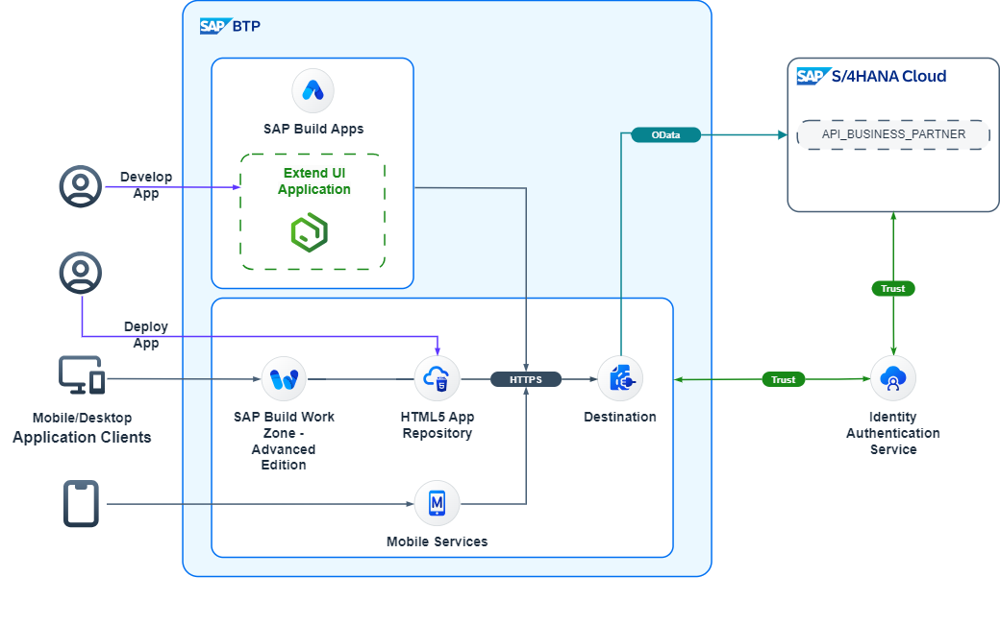
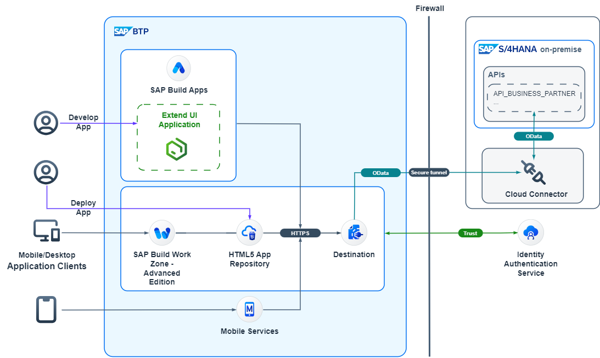

# Use SAP Build Apps to Build Side-by-Side UI Extensions for SAP S/4HANA

The main focus of this mission is to develop a custom UI application, which consumes an OData service from an SAP S/4HANA system.

We will create a simple custom UI application using no-code tool **SAP Build Apps**, push the code to the HTML5 repository and show different options on how to expose this application - as a stand-alone or with the different SAP Build Work Zone environments.

You can find this scenario as a mission in [SAP Discovery Center](https://discovery-center.cloud.sap/missiondetail/4024/4228/).

## Business Scenario

As a sample scenario, Jane a sales executive of ACME Corporation regularly meets different customers. She needs access to the latest customer information on the go. She needs a simplified web application, which can run on a portable device like smartphone or a tablet.

ACME Corporation implements the application as an SAP S/4HANA extension on SAP Business Technology Platform (SAP BTP). This application is created with SAP Build Apps, a no-code user interface development tool.

This scenario covers:

* Building application with SAP Build Apps
* Set up connectivity between SAP BTP and SAP S/4HANA Cloud or SAP S/4HANA on-premise
* Deploying the application on SAP BTP, Cloud Foundry environment

## Solution Architecture

**SAP S/4HANA Cloud**

 

**SAP S/4HANA on-premise**

 

## Discover

* [The Mission Story](discover/business-story.md)
* [Learn the Basics of SAP BTP](https://github.com/SAP-samples/cloud-extension-html5-sample/blob/mission/mission/discover/BTP.md)
* [Learn About SAP S/4HANA](https://github.com/SAP-samples/cloud-extension-html5-sample/blob/mission/mission/discover/S4H.md)
* [Learn About SAP S/4HANA Cloud](./discover/S4HC.md)
* [Learn About HTML5 Applications](https://github.com/SAP-samples/cloud-extension-html5-sample/blob/mission/mission/discover/HTML5.md)
* [Learn About SAP Build Apps](./discover/AppGyver.md)
* [Learn About SAP Cloud Identity Services](https://github.com/SAP-samples/cloud-extension-html5-sample/blob/mission/mission/discover/IAS.md)
* [Learn About SAP Work Zone](https://github.com/SAP-samples/cloud-extension-html5-sample/blob/mission/mission/discover/Launchpad.md)

## Prepare
  - [Prerequisites and Required Systems](./prepare/README.md)
  - [Get Started with SAP Build Apps - Quick Account Setup](./prepare/QUICKSETUP.md)
  - [Launch SAP Build Apps](./prepare/StartBuildApps.md)
  - [Optional - Set up SAP Build Apps in SAP BTP Trial](https://github.com/SAP-samples/btp-s4hana-nocode-extension/blob/main/setup/btp/SAPBUILD_trial.md)
  - [Optional - Set up your SAP BTP account using Terraform scripts](https://github.com/SAP-samples/btp-terraform-samples/blob/main/released/discovery_center/mission_4024/README.md)
  

## Landscape Setup for SAP BTP and SAP S/4HANA Cloud
  - [Onboard SAP S/4HANA Cloud System](./setup/s4hc-onboarding/README.md)
  - [Configure Communication Settings in SAP S/4HANA Cloud](./setup/s4hc-setup/setup-s4hc-system.md)
  - [Configure End-to-End Communication from SAP BTP to SAP S/4HANA Cloud System](./connectivity/end-to-end-connection.md)
  
## Landscape Setup for SAP BTP and SAP S/4HANA on-premise
  - [OPTIONAL: Create an SAP S/4HANA Test System using the SAP Cloud Appliance Library](https://github.com/SAP-samples/cloud-extension-ecc-business-process/blob/mission/mission/cal-setup/CALS4H.md)
  - [Set up the SAP S/4HANA on-premise System](https://github.com/SAP-samples/cloud-extension-html5-sample/blob/mission/mission/s4h-setup/README.md)
  - [Set up the SAP Cloud Connector & Trust to the SAP S/4HANA System](https://github.com/SAP-samples/cloud-extension-html5-sample/blob/mission/mission/cloud-connector/README.md)
  - [Configure End-to-End Connectivity from SAP BTP to SAP S/4HANA System](./connectivity/s4hpp-connection.md)
  - [Configure Single Sign-On between SAP S/4HANA and SAP BTP](https://github.com/SAP-samples/cloud-extension-html5-sample/blob/mission/mission/custom-idp/README.md)
  
  
## Landscape Setup for SAP BTP and Mock Server

If you don't have an SAP S/4HANA system, you can use a mock server setup instead.

  - [Install Mock Server](./setup/mock/README.md)

## Implementation of an SAP Build Apps Extension Application

Once you have set up the landscape, you can develop, test, and run a simple UI application. We will show the steps to implement the simple UI application using the SAP BTP-managed HTML5 repository. This is a kind of PoC to see if and how the whole landscape setup is working.

### Develop a simple UI application:
  * [Create a No-Code Application with SAP Build Apps](./create-application/develop/README.md)
  * [Create a Business Partner List Page](./create-application/develop/ListPage/README.md)
  * [Create a Business Partner Details Page](./create-application/develop/DetailsPage/README.md)
  * [Build and Deploy Your SAP Build Apps Application to SAP BTP](./create-application/deploy/README.md)
  * [Integrate the Application with SAP Build Work Zone, standard edition](./create-application/workzone/README.md)
  * [Build Your App and Install it on a Mobile Device](./create-application/mobile_services/README.md)

## How to Obtain Support

[Create an issue](https://github.com/SAP-samples/btp-s4hana-nocode-extension/issues) in this repository if you find a bug or have questions about the content.

For additional support, [ask a question in SAP Community](https://answers.sap.com/questions/ask.html).

## Contributing

If you wish to contribute code, offer fixes or improvements, please send a pull request. Due to legal reasons, contributors will be asked to accept a DCO when they create the first pull request to this project. This happens in an automated fashion during the submission process. SAP uses [the standard DCO text of the Linux Foundation](https://developercertificate.org/).

## License

Copyright (c) 2022 SAP SE or an SAP affiliate company. All rights reserved. This project is licensed under the Apache Software License, version 2.0 except as noted otherwise in the [LICENSE](LICENSE) file.
