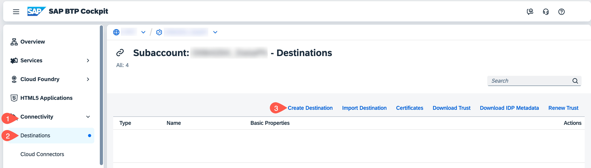
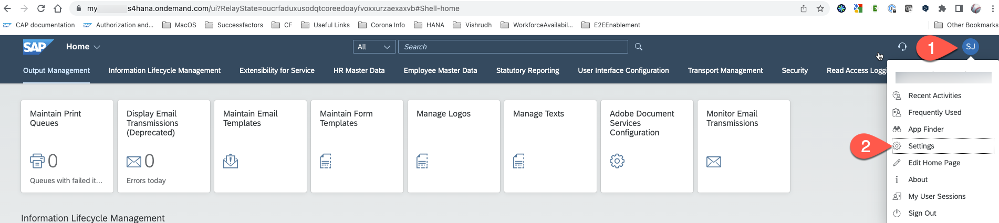
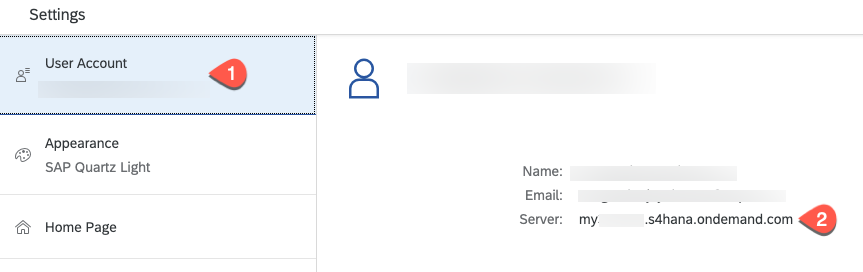
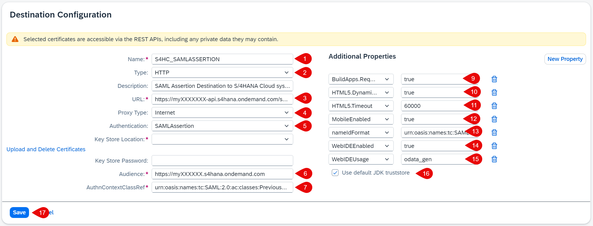
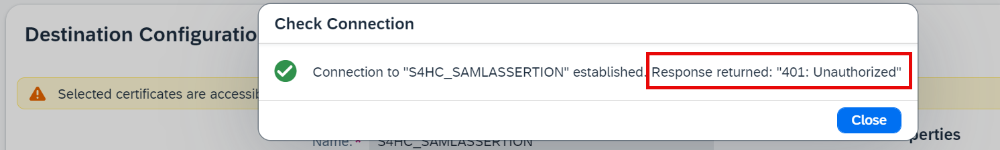

# Configure End-to-End Communication from SAP BTP to SAP S/4HANA Cloud

## Introduction

In this section, you wil configure the end-to-end communication between the SAP S/4HANA Cloud system and the SAP BTP subaccount so that a UI5 application running in the SAP BTP subaccount can consume an OData service running on the SAP S/4HANA system. Having already configured the SAP S/4HANA Cloud system, all you need to do is define an appropriate destination on SAP BTP. 
You can propagate the user from the SAP BTP custom Identity Provider to SAP S/4HANA system, be sure that the user principal (e.g: email address) is the same in both systems - Custom Identity provider and the SAP S/4HANA system.

## Create a Destination on SAP BTP

1. In **SAP BTP Cockpit**, navigate to your subaccount.

2. From your left-side subaccount menu, navigate to **Connectivity** &rarr; **Destinations**.

   

3. Choose **New Destination** to create a new destination or you can choose **Import Destination** to import the sample destination file [s4hCloudOauth](./images/s4hanacloudsaml).

4. Configure the **Destination** by entering or adjusting the following values, you will need your SAP S/4HANA system URL. To find this, login to your SAP S/4HANA Cloud system. You can find your S/4HANA Cloud server ID by selecting your user icon > Settings > User Account > Server name

   
   
   

   * **Name**: a meaningful name, for example: S4HC_SAMLASSERTION

   * **Type**: HTTP

   * **URL** Enter the value of the OData URL, for example: https://myXXXXXX-api.s4hana.ondemand.com/sap/opu/odata/sap/API_BUSINESS_PARTNER. 
   * **ProxyType** Internet

   * **Authentication** SAMLAssertion

   * **Audience** https://myXXXXXX.s4hana.ondemand.com. This is the URL of your SAP S/4HANA Cloud account (without the -api).

   * **AuthnContextClassRef** urn\:oasis\:names\:tc\:SAML\:2.0\:ac\:classes\:PreviousSession

5. Add the following **Additional Properties** by choosing the **New Property** button. If you have imported the sample destination file, the following properties are automatically added:

   * Name: **BuildApps.RequiresCsrf** - value: **true**
   
   * Name: **HTML5.DynamicDestination** - value: **true**
   
   * Name: **HTML5.Timeout** - value: **60000**

   * Name: **MobileEnabled** - value: **true**

   * Name: **nameIdFormat** - value: **urn\:oasis\:names\:tc\:SAML\:1.1\:nameid-format\:emailAddress**  

   * Name: **WebIDEEnabled** - value: **true**

   * Name: **WebIDEUsage** - value: **odata_gen**

 

6. Check **Use default JDK truststore**.

7. **Save** your settings.

   
   
8. Choose **Check Connection**. You should get a **401 Unauthorized** response.
   
   

## Summary

You have created a destination in the SAP BTP subaccount that can be used by SAP AppGyver to do SSO and user propagation.
