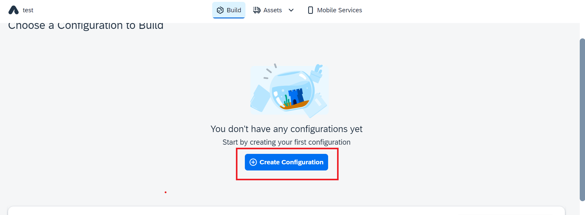
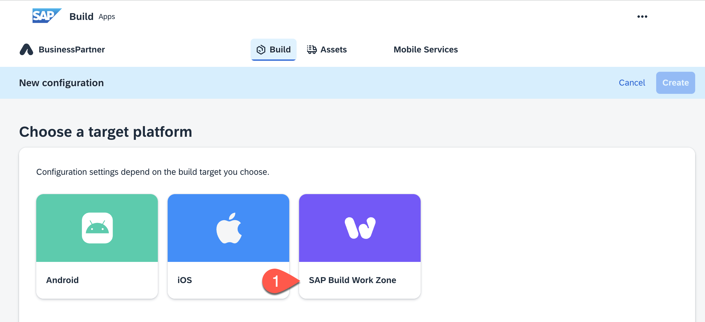
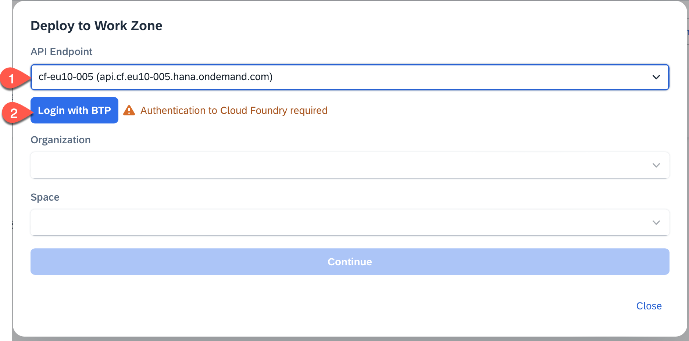
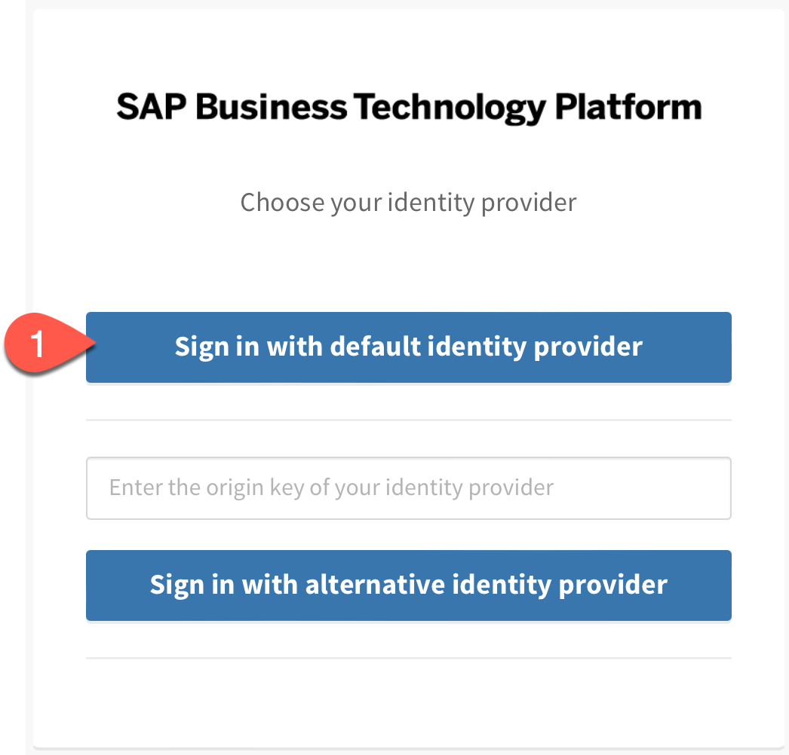
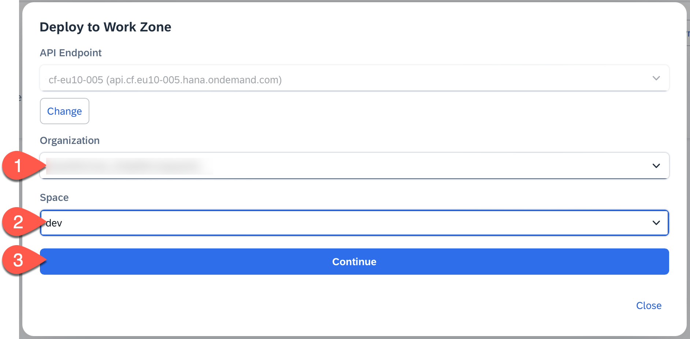
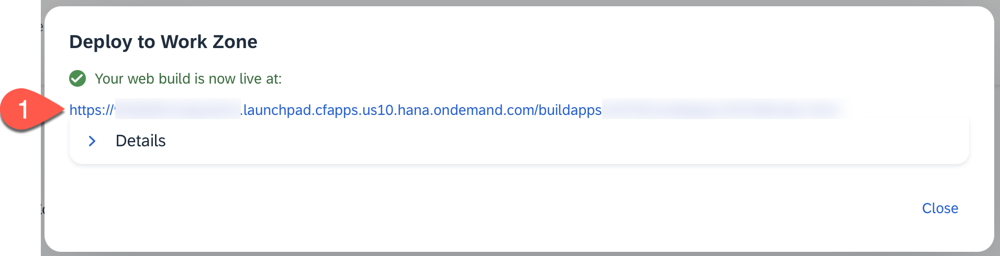

# Build and Deploy Your SAP Build Apps Application to SAP BTP

## Introduction

In this section you will build the application that you created using SAP Build Apps, and then deploy it to the managed approuter from SAP Build Work Zone on your SAP BTP sub account.

**Persona:** Citizen Developer

**Abbreviation:** SAP Business Technology Platform = SAP BTP

## Step-by-Step

### Build

1. In **App Editor** choose **Publish**.

2. Choose **Build and Deploy**.

   

3. Choose **Create Configuration**

   

4. Select **SAP Build Workzone** as a target platform

   

5. Give a Name for the configuration e.g. *web* and choose **Create**

   

6. Back in the configuration page, choose **...** from your newly build configuration and select **Build**

   

7. In the pop-up choose a Build Process Number e.g. **1.0.0** and choose **Build**

   

8. In the Build History you can see your build with the status **Building**

   

9. As soon as your build is status **Delivered** click on line to open Build Details

   

10. Choose **Deploy** to deploy your application
  > Hint: note down the App ID as you can find your application easier in the SAP BTP subaccount later

   

11. In the pop-up, choose the API endpoint of your subaccount

> Hint: You can find the API endpoint in the overview section of your subaccount

12. In case you are not logged in yet, choose **Login with BTP**

   

13. In the pop-up choose **Sign in the the default identity provider**

   

14. Back in the **Deploy to Work Zone** view choose your **Organization** and **Space**

> Hint: You can find the Organization and Space in the overview section of your  of your subaccount

15. Choose **Continue**

   

16. Your application in now being deployed. This can take up to 5 minutes. As soon as the status is 'Your web build is now live at' you can click on the link to open your app.

   

### Check Deployment

1. In **SAP BTP Cockpit**, navigate to your subaccount.

2. From the left-side subaccount menu navigate to **HTML5 Applications**.

3. Under **Managed Application Router provided by SAP Build Work Zone, standard edition**, you will find a list of applications.

4. Use the **App ID** you wrote down earlier to find your deployed application. Select under **Application Name** your project **buildapps<APP ID>**

   

5. Your application opens. Depending on how your subaccount is configured, you might need to choose the IAS and login.

## Summary

You have deployed the application that you developed in SAP Build Apps to SAP BTP that can be consumed using a URL.

### Next Step
[Integrate the Application with SAP Build Work Zone, standard edition](./../workzone/README.md)