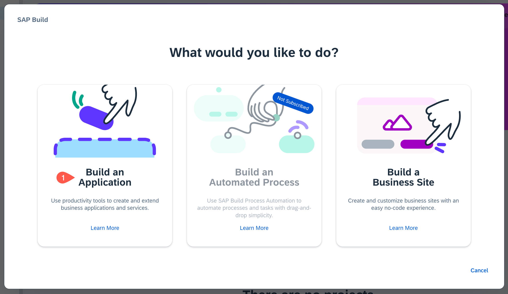
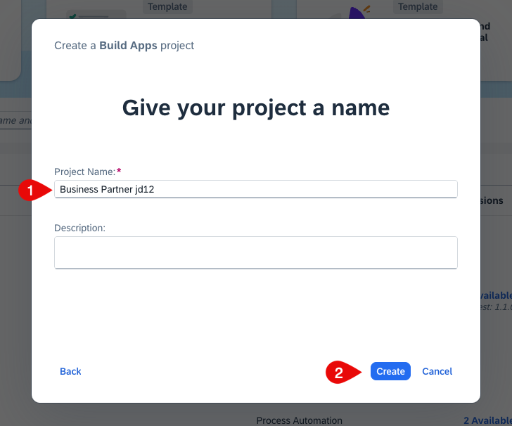
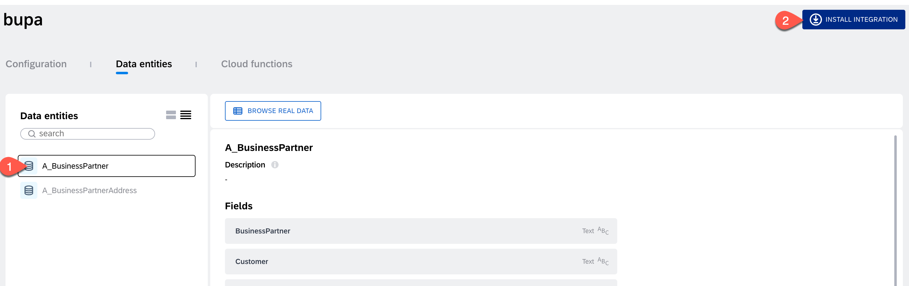
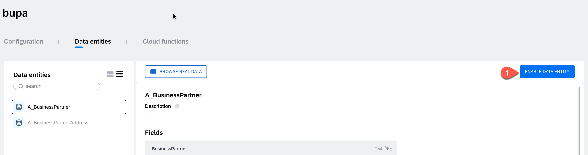
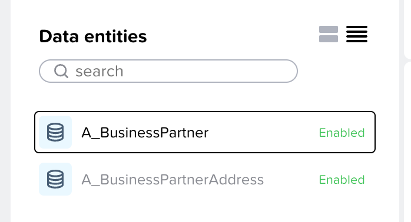

# Create a No-Code Application with SAP Build Apps

In this section, you will create an SAP Build Apps application.

**Persona:** Citizen Developer

**Abbreviation:** SAP Business Technology Platform = SAP BTP

## Open SAP Build Apps

 1. Open the <a href="https://hands-on.eu10.build.cloud.sap/lobby" target="_blank" rel="noopener noreferrer">SAP Build Apps</a>.

 4. You might be prompted with a log in screen of either default Identity Provider or custom Identity Provider depending on what you have configured.

 5. Log in to the Application using your custom Identity Provider credentials.

## Create an Application Using SAP Build Apps

### Create a Project

1. On the SAP Build Lobby choose **Create** 

   

2. Choose **Build an Application** to create a new business application.

   

3. Select **SAP Build Apps**

    
   
5. Choose **Web & Mobile Application**.
   
   

6. Enter a **Project Name**, for example **Business Partner**

7. Enter a **Short Description**.

8. Choose **Create**.

   

9. Your created project will be opened in **App Editor** which is the central place to build your application including a user interface, logic, as well as data integration.

10. Choose **Headline** and change the content from **Headline** to **Extend UI Application**.
   

11. Find the text field in the UI canvas in the center of your screen and choose the trash can icon to remove this component.
   

12. Choose the blank page. On the right side under the **Properties**, choose **Page name**.

13. Change the page name to **Home**.
    

### Add a Data Source

To add a data source, you need to add the following steps to your project.

1. Choose the tab **Integrations** at the top of App Editor.

2. Find section **No systems integrated** and choose **Add Integration**.

   

3. On the next screen select **SAP Systems** -> **BTP Destinations**.

4. Select the destination that you have created in the previous section from the list.

5. Under the **Data entities**, select **Search** and enter **A_BUSINESSPARTNER**.

6. Choose **Install Integration**.

   

7. After installing integration, you'll see **Enable Data Entity**. Select **Enable Data Entity** to enable it.

   

8. Now, search for **A_BusinessPartnerAddress** and choose **Enable Data Entity**.

9. Confirm that both entities have the status _Enabled_

   

10. Choose **Save** at top of the App Editor. This adds the data source to your project. Choose **User Interface** to go back to the UI designer view.

11. Now you have added a data source for your SAP Build Apps application.

### Next Step
[Create a Business Partner List Page](./ListPage/README.md)