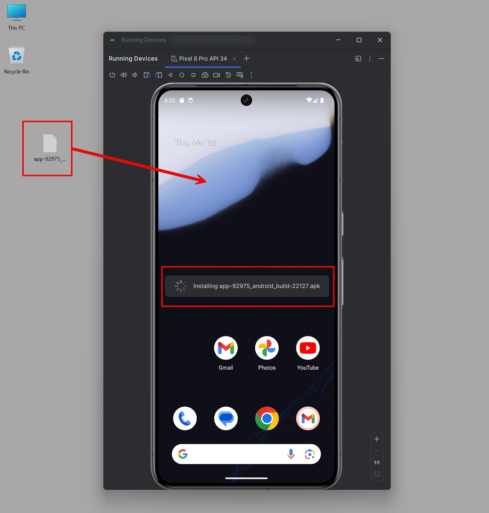
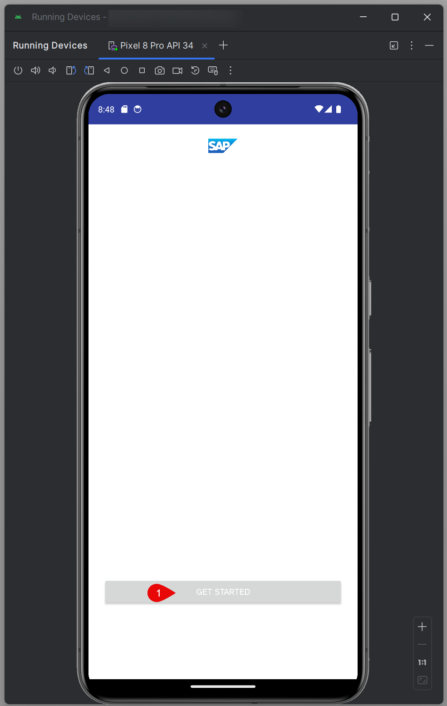
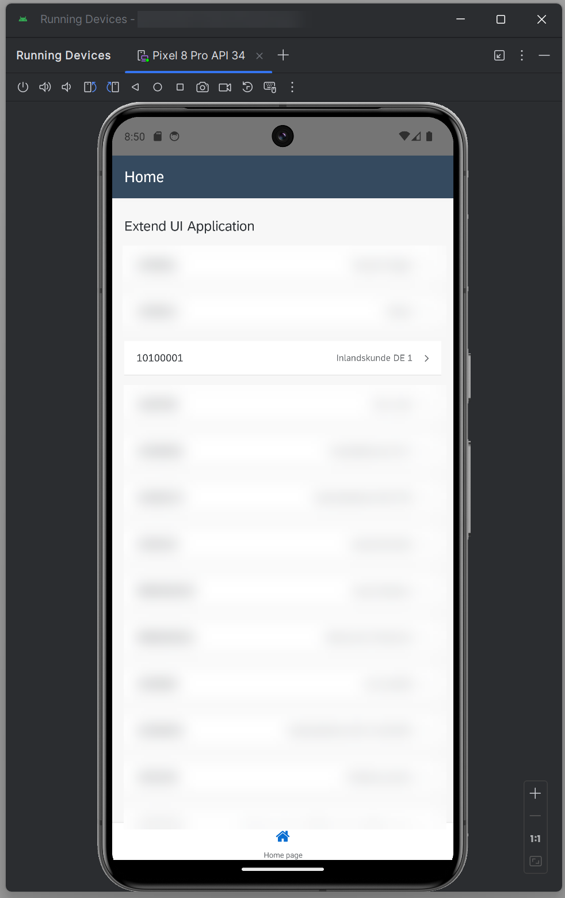

# Build Your App and Install it on a Mobile Device

## Introduction

For apps installed on mobile devices, SAP Build Apps uses SAP Mobile Services for authenticating mobile users with Cloud Identity Services. This allows integration with S4/HANA services via destinations on SAP BTP. In this section, you will use the build service to build an APK file that can be deployed on an Android device for local testing.

* If you want to build and deploy to Google Play, see [Android builds](https://help.sap.com/docs/build-apps/service-guide/android-builds).
* If you want use an iOS device, see [IOS builds](https://help.sap.com/docs/build-apps/service-guide/ios-builds).

## Prerequisites

* A keystore file. [Android builds](https://help.sap.com/docs/build-apps/service-guide/android-builds) explains how to generate one.
* The destination used must have the parameter **MobileEnabled** set to **true**.
* An Android device that you are allowed to install APKs on. If you do not have such a device, it is possible to use an emulator.

## Configure Mobile Services

1. Choose **Publish** at the top section of the App Editor and **Build and Deploy**

    

2. Select tab **Mobile Services** and **Enable SAP Mobile Services**. 
        

3. Select the API Endpoint which you also used in the deployment step and the same organization and space and click on the **Continue** button.
   
      

4. The Mobile Services authentication step may take up to five minutes.
        

5. As a result you should see that the app is connected to mobile services:
        

## Build

1. Switch to the **Build** tab in the header navigation and select **Create Configuration**.

    

2. Choose **Android** as target platform

3. Add a name of the configuration e.g. mobile
       

4. Define a Display Name and a package Identifier.

5. Choose **APK** as target File Type

6. Upload your keystore file and enter the passwords and alias.
    

7. Ignore the Image assets and screenshot settings and select **Create** button.

8. Select  **...** and click on **Build**.

    

10. Choose a version e.g. 1.0.0 and select **Build** button.

11. Wait until the new build has the status **Delivered** and open it with a click on the line
    

12. **Download** the mobile app and save the APK file to your computer.    
    

## Install and Run

1. Install the APK on your Android device.

    This will vary according to the device you are using. If you are using a physical device, you will transfer the APK from your computer to the device (via USB usually). You will then locate the file on the device and start the installation. If you are using an emulator as shown below, simply draging the APK file onto the emulator might start the installation.

    

2. Find the app on your device.

    

3. Start the app.

    

4. Choose **GET STARTED** and follow the instructions. Once you have finished the configuration process, the deployed app should start automatically.

    

The app should behave as before, with live data displayed that is read from the backend system and navigation to the details page by clicking on a record.
