# Integrate the Application with SAP Build Work Zone, standard edition

## Introduction

In this section, the application will be connected with SAP Build Work Zone, standard edition. This allows to have one central entry point to show all of your SAP BTP applications.

###  Integrate with SAP Build Work Zone, standard edition

1. Open your Subaccount and search for **Instances and Subscriptions**.

2. Search for the application **SAP Build Work Zone, standard edition** and choose the icon to open it.

3.  Now you are on the home page of SAP Build Work Zone, standard edition. In the menu on the left side click on the icon for **Content Channels**
4.  Click on the refresh icon to fetch the updated content

    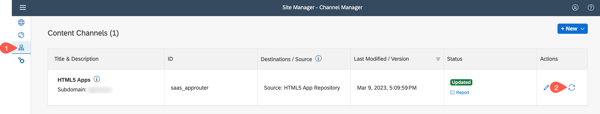
    
5.  Choose **Content Manager** in the menu on the left and choose **Content Explorer** button

    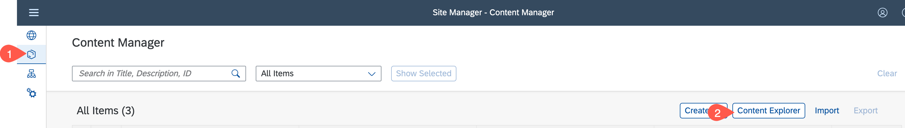

 6. Select the tile **HTML5 Apps** with your respective subdomain name.

    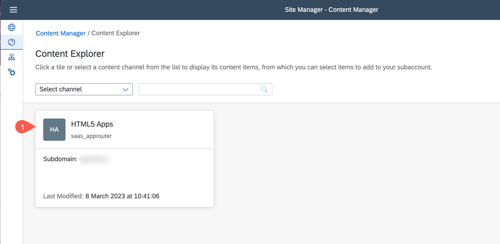

7. In the table, set checkmark for your applications *Business Partner* and choose the **Add** button.

    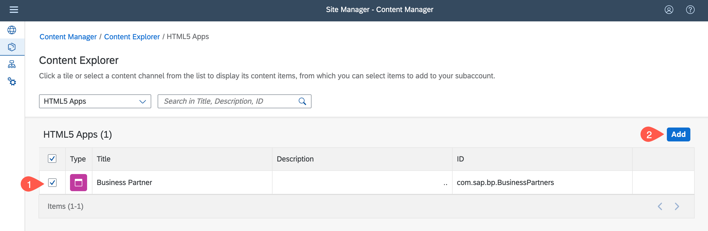

8. Navigate back to **My Content** and choose on role **Everyone** in items table 

    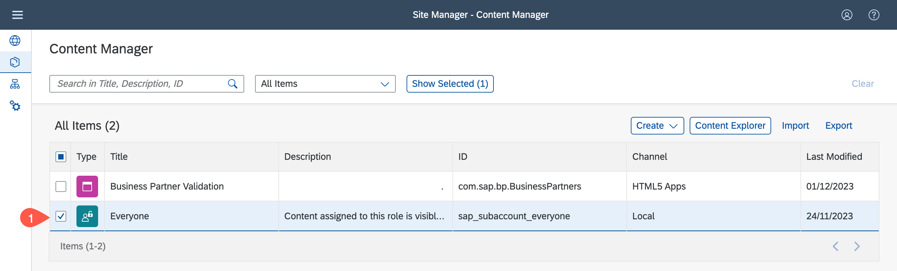

9. Choose **Edit** button

    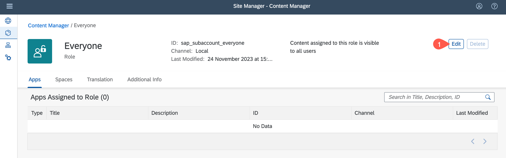

10. Find your application *Business Partner* in the table. In row Assignment Status switch toggle button to on. Choose **Save**

    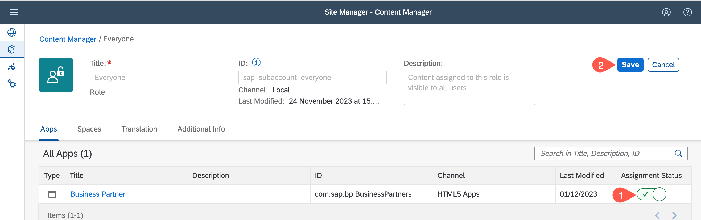

11. Go back to **Content Manager** tab, choose Create button and select **Group** from the dropdown

    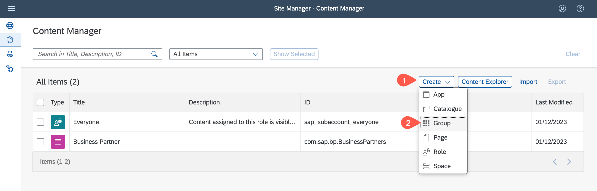

12. Add the title *Business Partner*.

13. Find your application *Business Partner* in the table. In row *Assignment Status* switch toggle button to on.

14. Choose Save.

    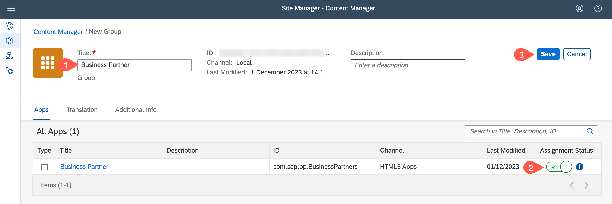

15. In the menu on the left side navigate to **Site Directory**.

16. Choose button **Create Site**.

    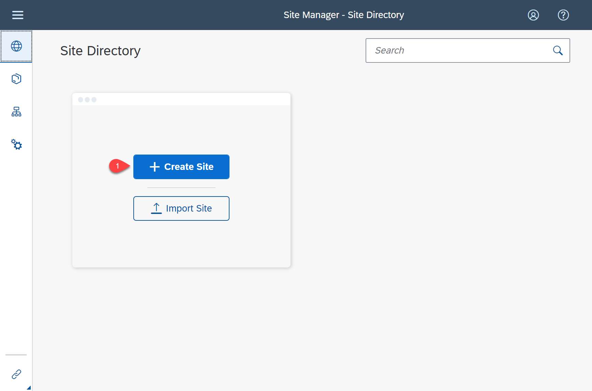

17. Enter the name for the site and choose **Create**.

18. Now, you are forwarded to the site editor.

    

19. Navigate to **Site Directory**.

    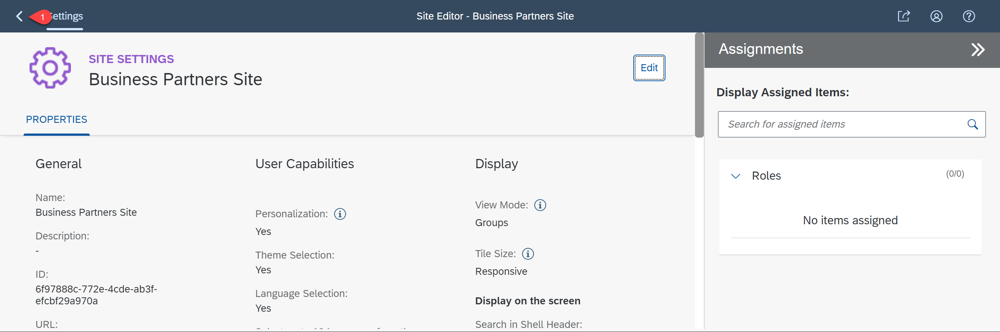

20. Find your created site and open it by choosing **Go to site**.

    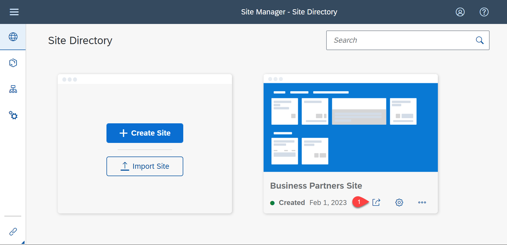

21. Test the application by clicking on the tile.

    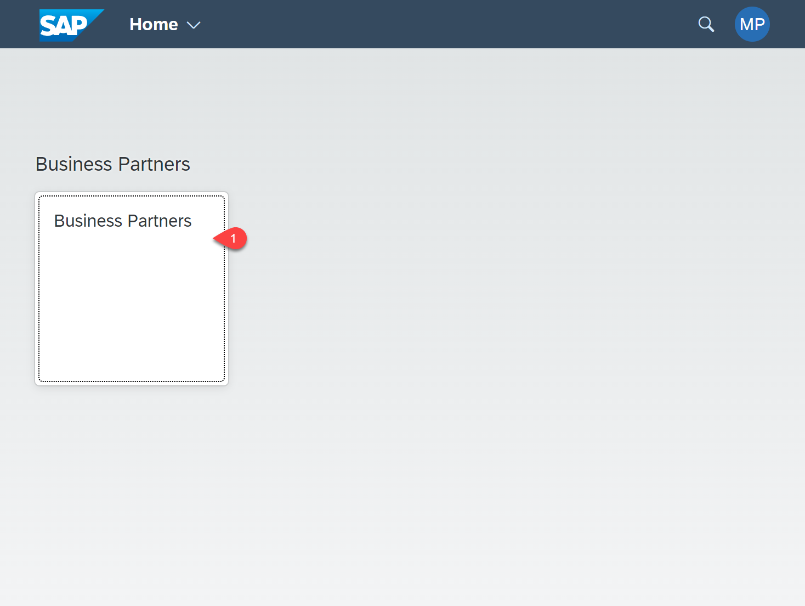

 ## Summary

 Congratulations! You now have finished the development of your application. In this last step you have integrated SAP Build Work Zone, standard edition service, to have one central entry point to show all of your SAP BTP applications.

### Next Step
[Build Your App and Install it on a Mobile Device](./../mobile_services/README.md)