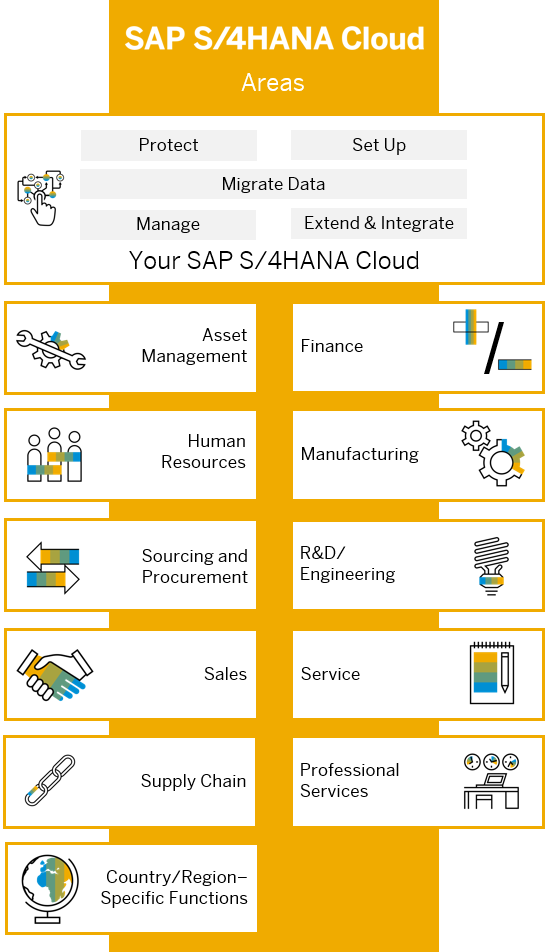

# Learn About SAP S/4HANA Cloud

With SAP S/4HANA Cloud (SAP Business Suite 4 SAP HANA Cloud), SAP is providing a new generation of business applications – simple enterprise software for big data and agility.

SAP S/4HANA Cloud is fully built on the in-memory platform SAP HANA. Using the advanced potential of SAP HANA, SAP S/4HANA Cloud is designed for business and provides an instant insight by using a single source of truth, real-time processes as well as by dynamic planning and analysis. With SAP Fiori user experience and less complex data model it's designed to run simple, and in parallel reduces the data footprint of your company.

SAP S/4HANA Cloud is also already connected to business networks and company-internal collaboration networks and prepared for the Internet of things. With all these aspects, SAP is protecting your investments by facilitating next generation business applications. SAP S/4HANA Cloud is available as software-as-a-service.

### Links

* [SAP S/4HANA Cloud Documentation](https://help.sap.com/docs/SAP_S4HANA_CLOUD?locale=en-US)
* [SAP S/4HANA Cloud Community Page](https://community.sap.com/topics/s4hana-cloud)

