# Enable the Identity Authentication for SAP Build Work Zone

By default **SAP Build Work Zone, advanced edition** uses the SAP Authentication and Trust Management service (XSUAA) for identity authentication. 
This section contains the steps that you have to fulfill  to switch to SAP Cloud Identity Services - Identity Authentication as the authentication mechanism.

**Note:** This is a one-time setup which impact all SAP Build Work Zone assets that are used in the same subaccount.
**But** the steps needs to be made for each SAP BTP subaccount where SAP Build Apps applications are being deployed.

1. Select **Instances and Subscriptions**. Click on the **...** of the **SAP Build Work Zone, standard Edition** and press **Go to Application**. 

   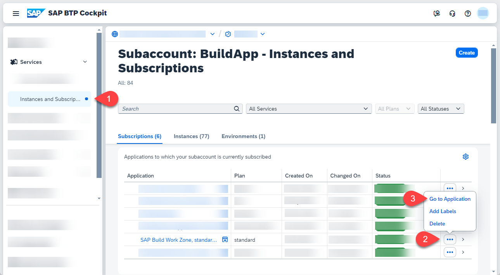
2. This will open the Site Manager. Click on the Settings on the side panel.

   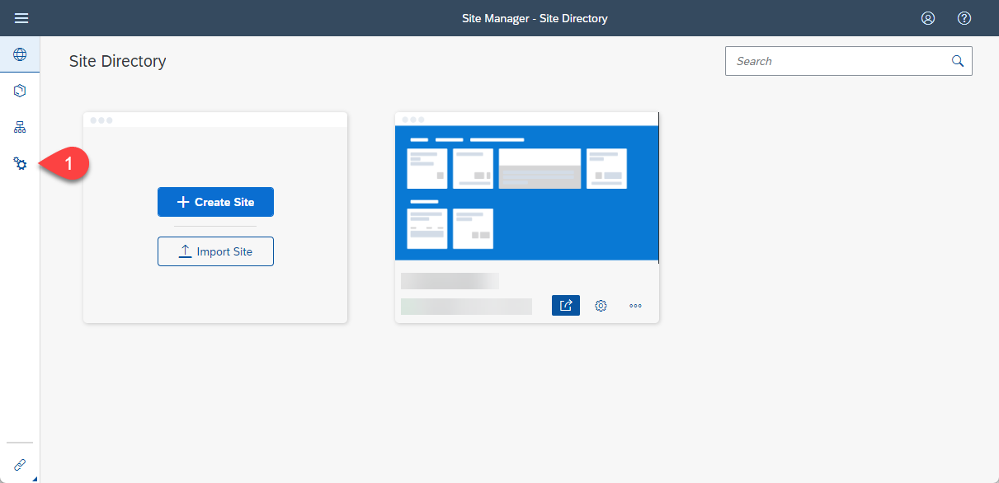
3. Choose the **Identity Authentication** tab. Then **confirm** that your subaccount has an active trust configuration with SAP Cloud Identity Services - Identity Authentication. Press **Enable**.

   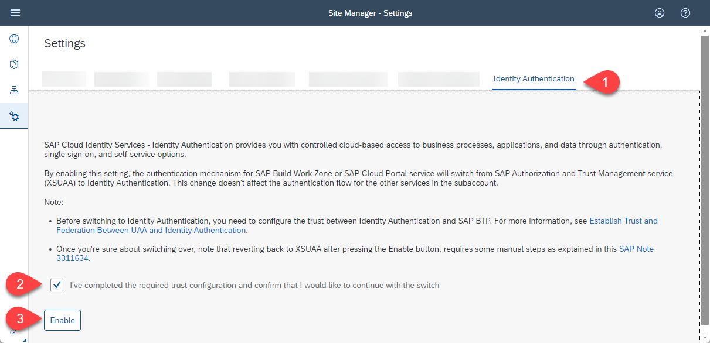
4. The switch can take up to 15 minutes to take effect. 
When the switch is done, you will see a success message.

   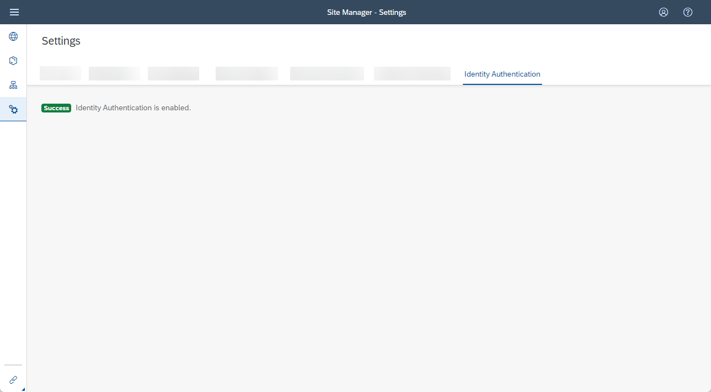

Further information you can find in SAP Help Portal: [Post Booster Configuration](https://help.sap.com/docs/build-work-zone-advanced-edition/sap-build-work-zone-advanced-edition/post-booster-configuration)

## Connect SAP Build Workzone with your SAP Build App Service

1. To open your Cloud Identity Services choose **Trust Configuration** and click on your **Custom IAS tenant**.

   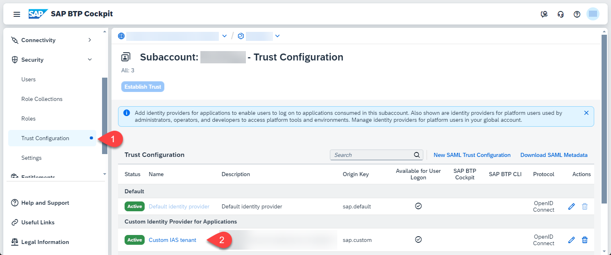
2. Click on your **Identity Authentication Tenant**

   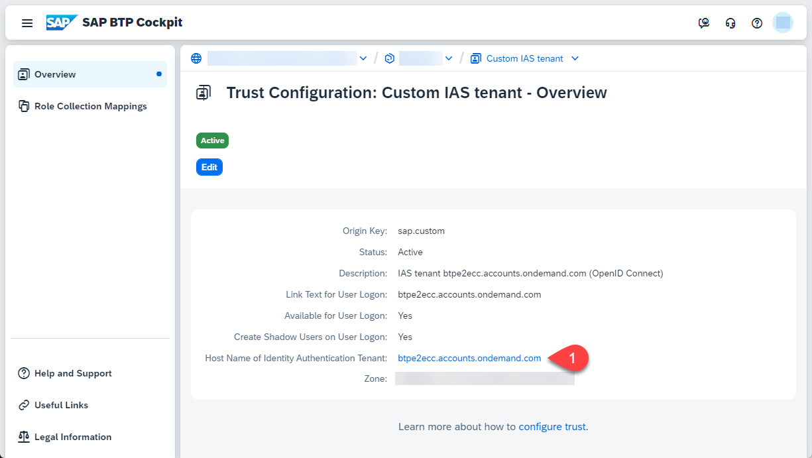
3. This will open your Cloud Identity Services Site. Click on **Applications & Resources** and choose **Applications**.

   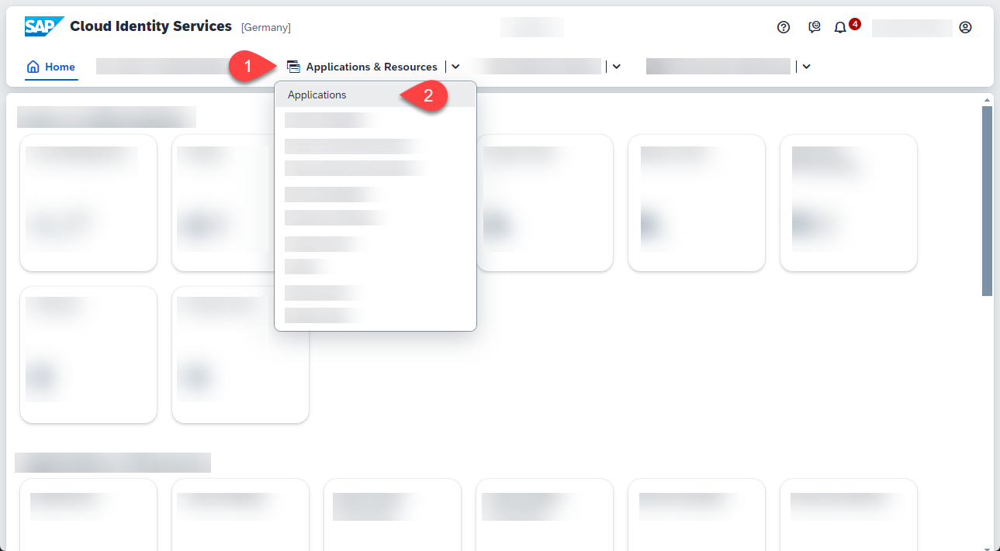
4. Choose  **SAP Build Workzone, standard edition** on the left pane and then **Dependencies**

   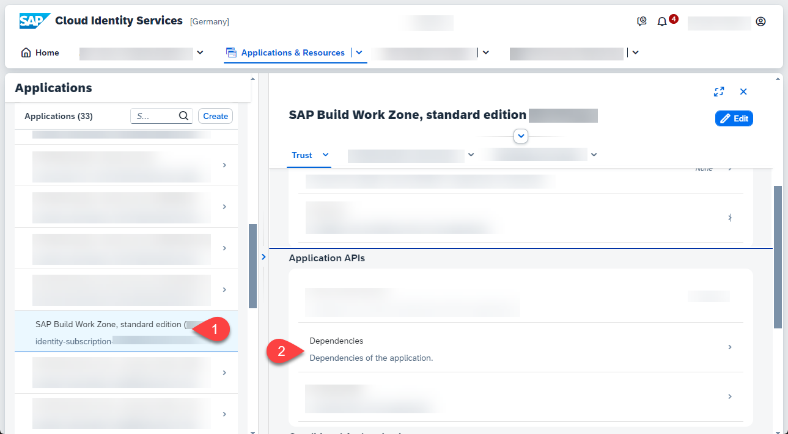
5. Click **Add** to add a new Dependency.

   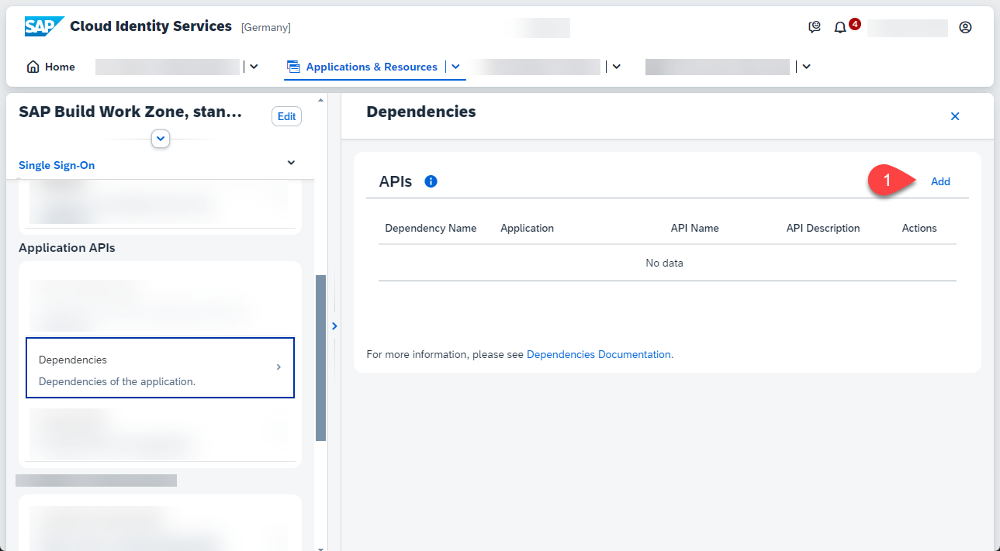
6. Enter **sap-build-apps-api** for the Dependency Name. 
**Important:** the name is case-sensitive. At the end click **Save**.

   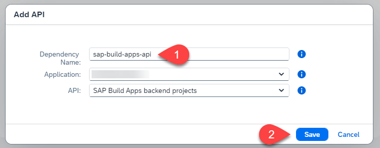

   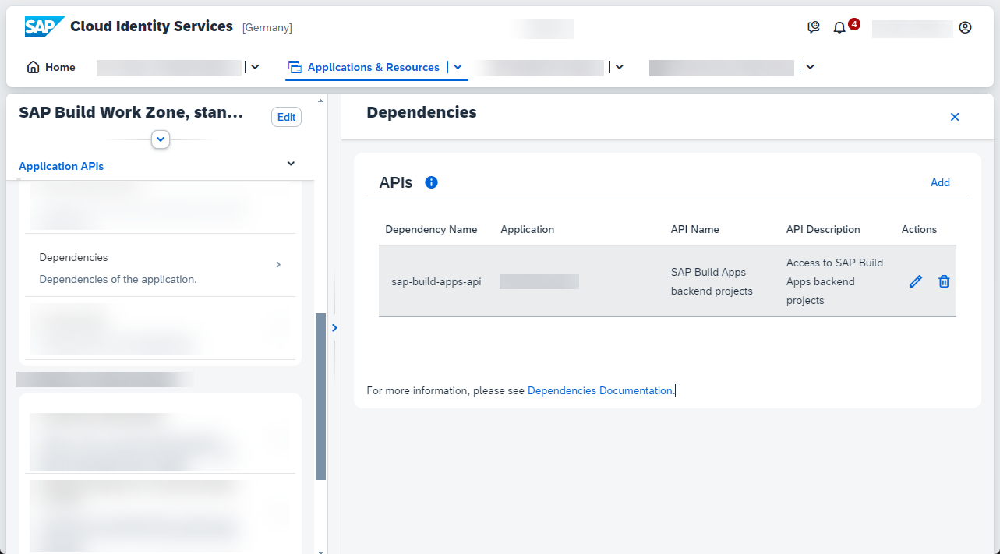

Further information you can find in the SAP Help Portal: [Deployed Applications](https://help.sap.com/docs/build-apps/service-guide/integration-to-app-builder?q=workzone#deployed-applications)