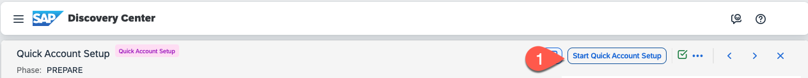
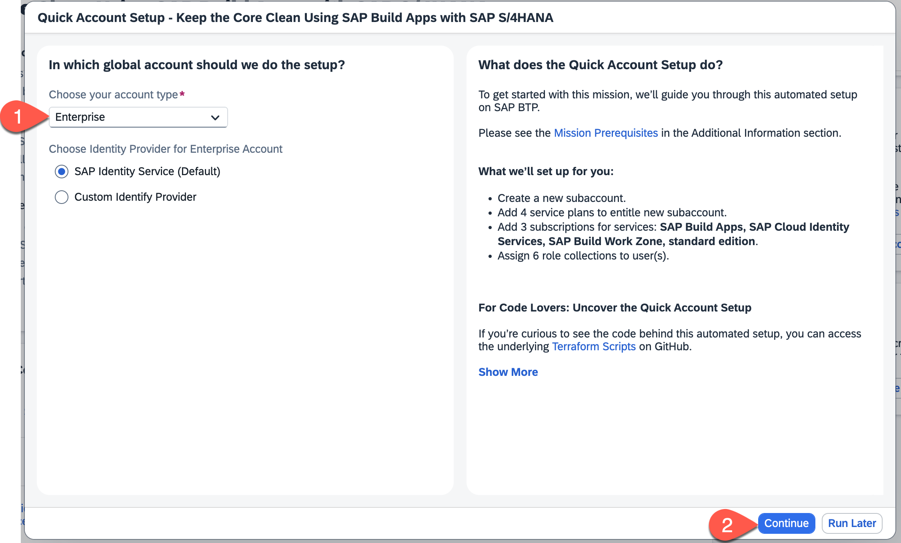
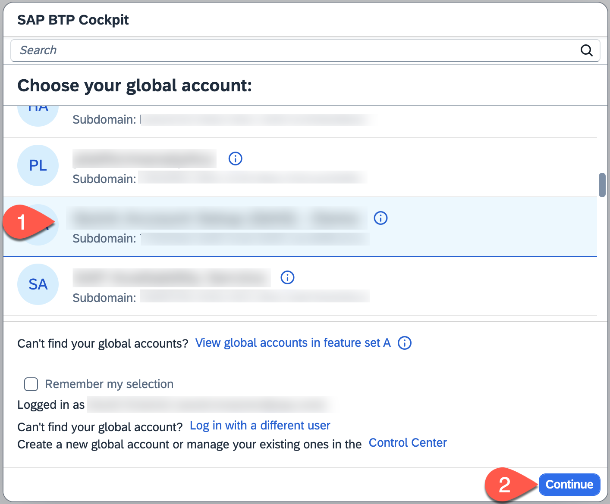
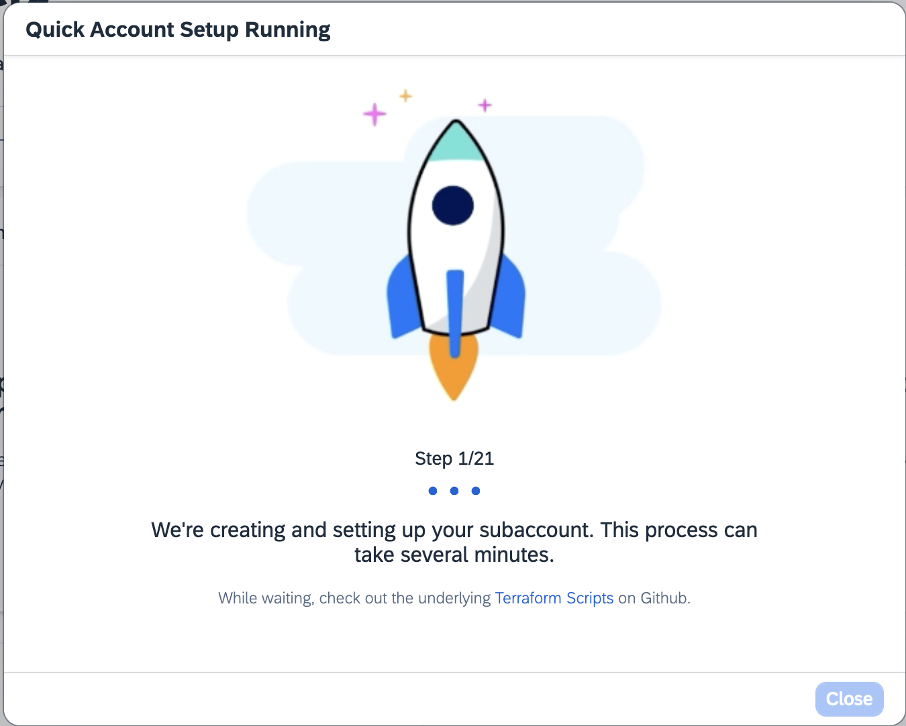
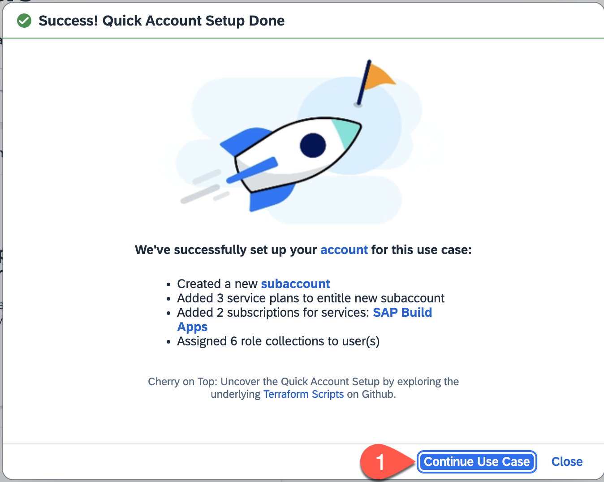

# Get Started with SAP Build Apps - Quick Account Setup

In this mission you have the option to set up your BTP account automatically using the Quick Account Setup with Terraform or manually by following a step-by-step guide.

## Choose one of the two options:
1.	Quick Account Setup (Recommended)
([The Quick Account Setup executes this Terraform script](https://github.com/SAP-samples/btp-terraform-samples/tree/main/released/discovery_center/mission_4024) 
2.	Manual Setup (continue to the next card to find tutorial for manual setup)

## Automated Quick Account Setup (Recommended)
Please make sure that you have fulfilled the prerequisites for the Quick Account Setup (see Prerequisites section on the mission overview page) before you start the Quick Account Setup.

### How to start QAS

1.Choose **Start Quick Account Setup** button on the top right of this card

  

2. Choose your account type **Enterprise** and choose **Continue**

  

3. In the popup select your **Global Account** and choose **Continue**

 

4. Your account will now be created

 

 5. As soon as your account is created choose **Continue to Use Case**

  

## What did the QAS do?
 
What we’ll setup for you (Enterprise):
- Create a new subaccount.
- Add 4 service plans to entitle new subaccount.
- Add a instance for service: SAP Destination service.
- Add 3 subscriptions for services: SAP Build Apps, SAP Cloud Identity Services, SAP Build Work Zone, standard edition.
- Assign 6 role collections to user(s).

### For Code Lovers: Uncover the Quick Account Setup
If you're curious to see the code behind this automated setup, you can access the underlying Terraform scripts on GitHub.
These Terraform scripts can be used to do Infrastructure-as-Code on SAP BTP. You can see all details of the setup, adjust it to your needs, and create the resources on SAP BTP manually yourself.
[Terraform Script for this Mission](https://github.com/SAP-samples/btp-terraform-samples/tree/main/released/discovery_center/mission_4024)

### How to continue after successfully running the Quick Account Setup

After you have sucessfully completed all the required steps, you can continue with the card **Enable the Identity Authentication for SAP Build Work Zone**.

You can skip the next two cards **Optional: Manual Set-up of SAP Build Apps in SAP BTP Productive Account** and **Optional: Manual Set-up of SAP Build Apps in SAP BTP Trial Account**

