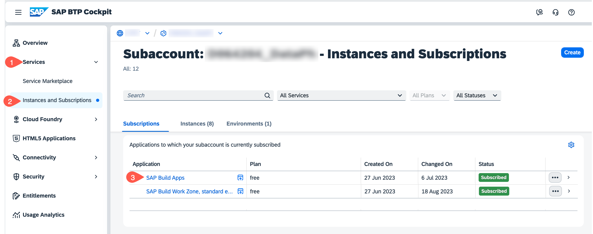
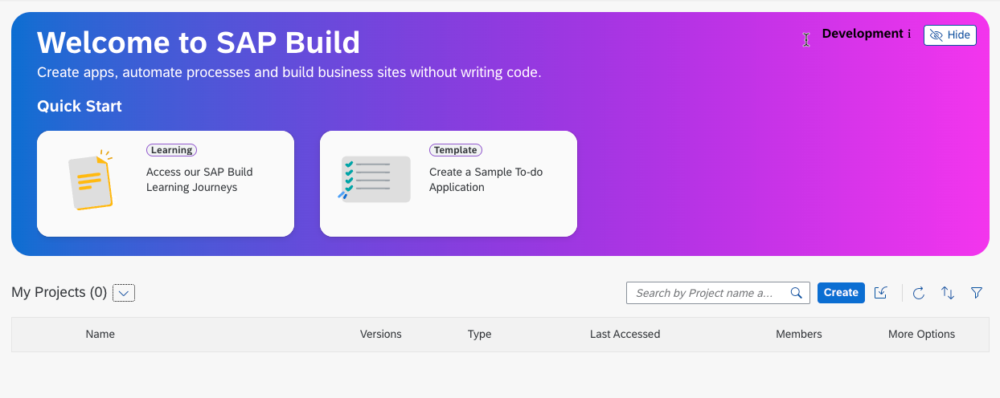

# Launch SAP Build Apps

**Persona:** Citizen Developer

## Open SAP Build Apps

Open the **SAP Build Apps** link if you have it already bookmarked, otherwise open it via the **SAP BTP Cockpit** as described below.

 1. To open **SAP Build Apps** via SAP cockpit, navigate to your SAP BTP subaccount.
 2. From the left side of your subaccount menu, navigate from **Services** &rarr; **Instances and Subscriptions**.

 3. In the tab **Subscriptions**, find **SAP Build Apps** and choose **Go to Application** to open the entry page for Application Development.

     

 4. Log in to the Application using your custom Identity Provider credentials and the SAP Build Lobby shows up.
    > If you have setup trusts to multiple identity providers in the subaccount, then you have to select the Identity Provider you have choosen at the SAP Build Apps setup.
    

## Implement a simple Application
To get an introduction to SAP Build Apps, you can take a look to the first part of this starter tutorial: [Create an Application with SAP Build Apps](https://developers.sap.com/tutorials/appgyver-create-application.html). As you already have a running developer environment you don't need to use the Sandbox account as described in the tutorial.

## Summary
You got a first impression of SAP Build Apps. In the next step you have to choose and set up one of the following backend environments:
1. SAP S/4HANA Cloud 
2. SAP S/4HANA on-premise
3. Mock Server

