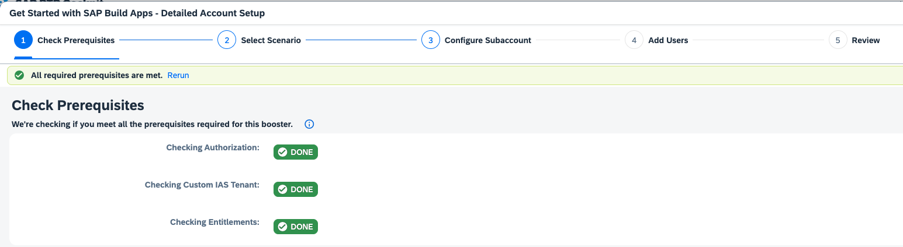
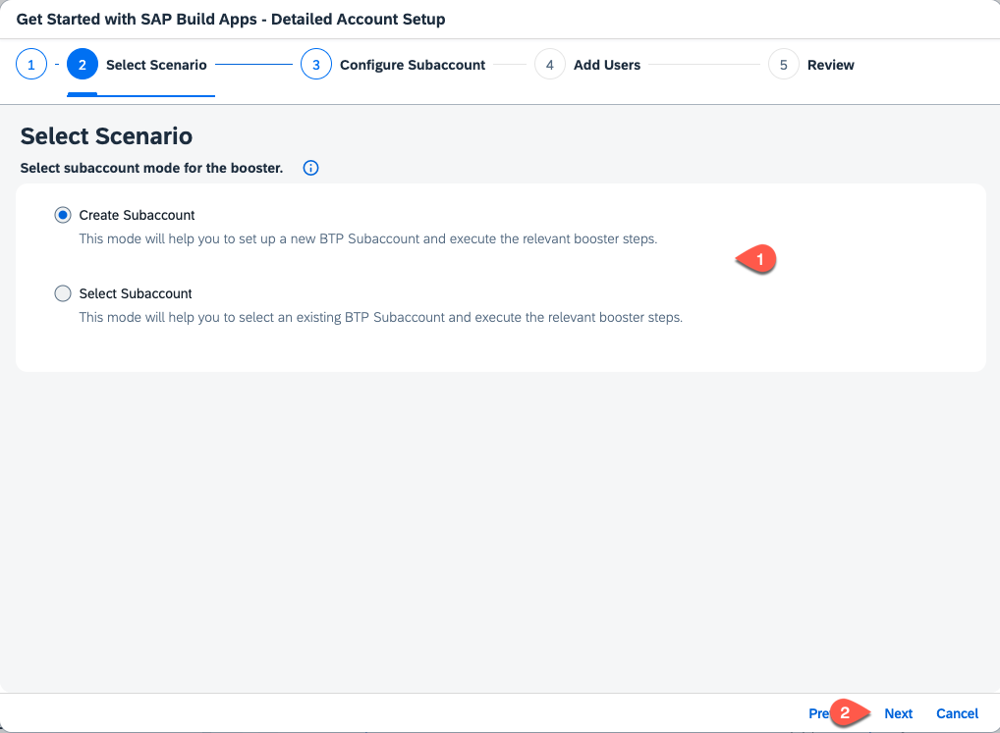
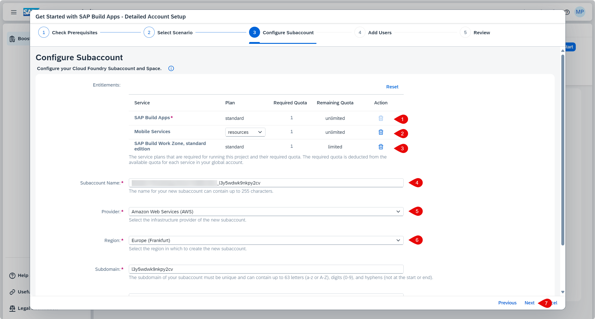
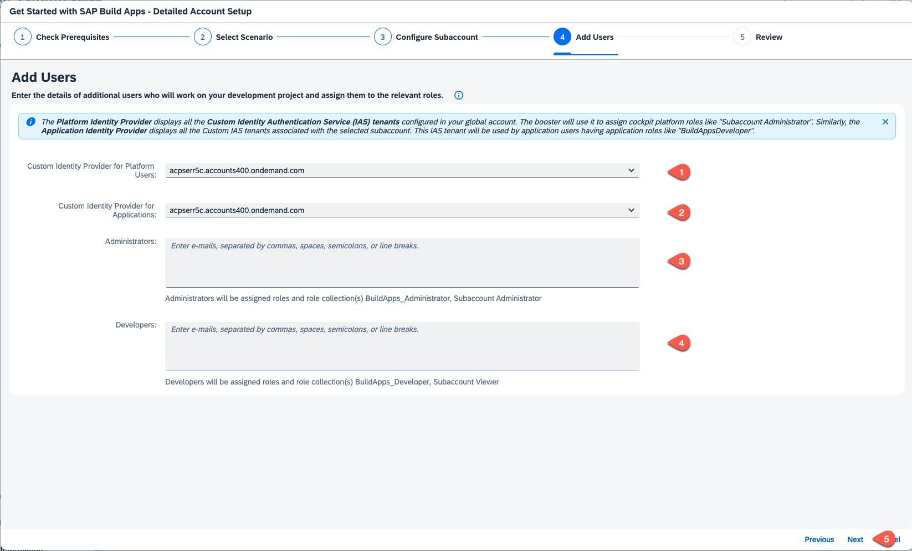

# Setup the SAP Build Apps Service

If you have already set up your SAP BTP account for SAP Build Apps by using the _Get Started with SAP Build Apps - Quick Account Setup_ link the mission overview or in the previous tile, you can skip this tutorial.

Otherwise, use the following steps to set up your account. As an alternative you could also use the provided [Terraform script](https://github.com/SAP-samples/btp-terraform-samples/blob/main/released/discovery_center/mission_4024/README.md).

The quick set up does not offer the **Mobile Services** configuration, so if you intend to build your app and install it on a mobile device, you should use the detailed setup below, and this is also the preferred optionto set it up on your SAP BTP subaccount.

## Manual Setup

1. When the prerequisites are checked successfully, press **Next**.

    

2. Select **Create Subaccount** or choose **Select Subaccount** if you want to set up an existing subaccount and press **Next**.

    

3. Set **SAP Build Apps** and **SAP Build Workzone, standard edition**. For testing purpose you can choose the **free** service plan, for productive usage take the **standard** plan. Set **Mobile Services** with the **resources** plan.

   

4. In the section **Custom Identity Provider for Applications**, select the tenant you want to use. Optionally, add additional administrator and developer users, then press **Next**.

    

5.  Check your settings and press **Finish**.

6. Choose **Navigate to subaccount**, which will open the subaccount on another tab. Come back to this tab and press **Close**.

