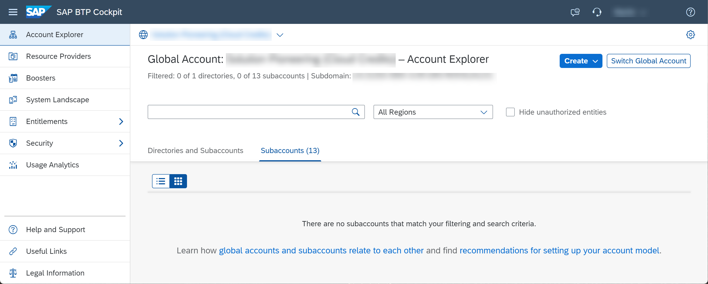
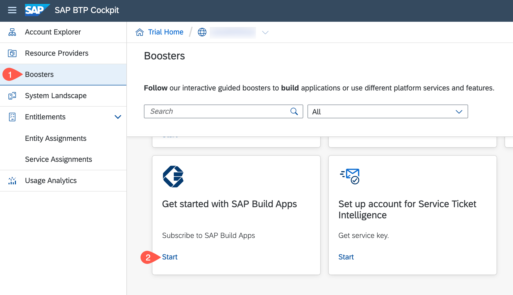
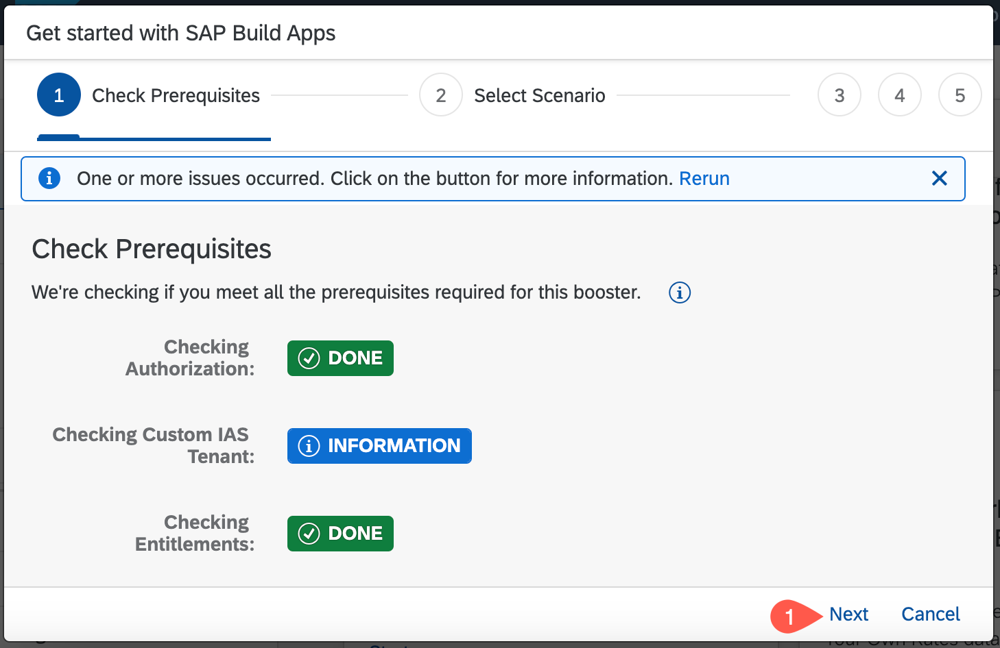
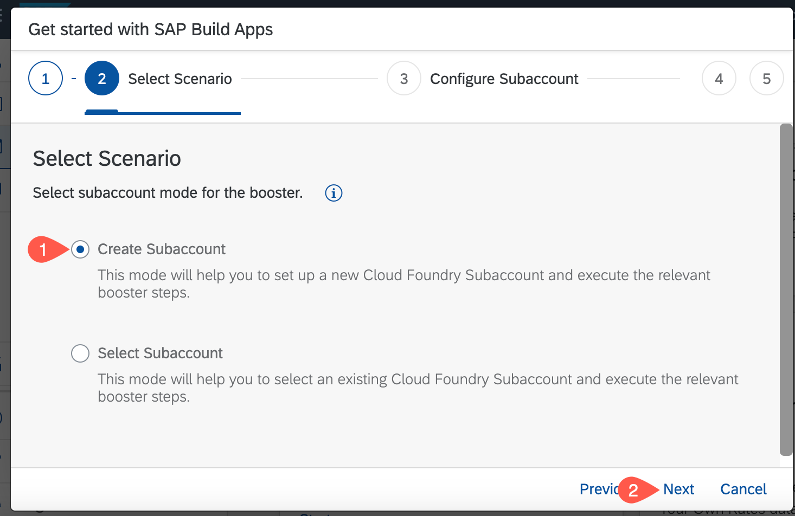
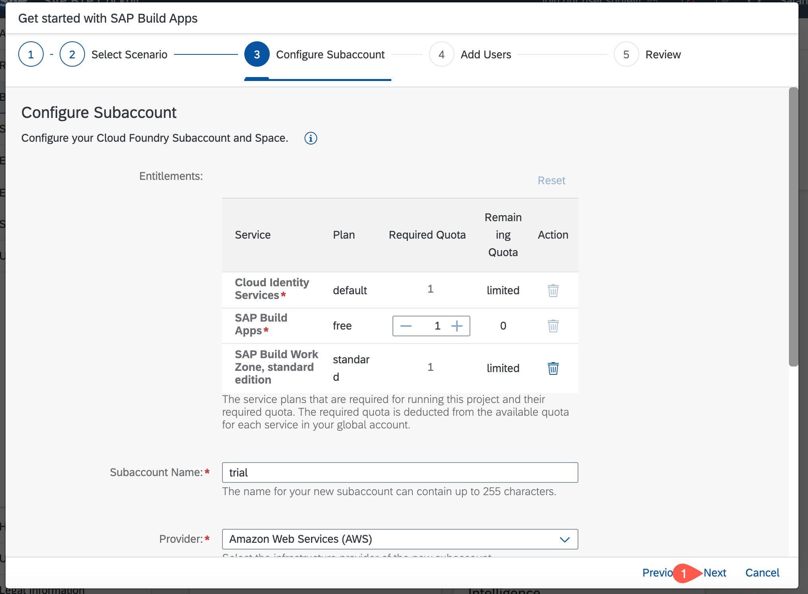
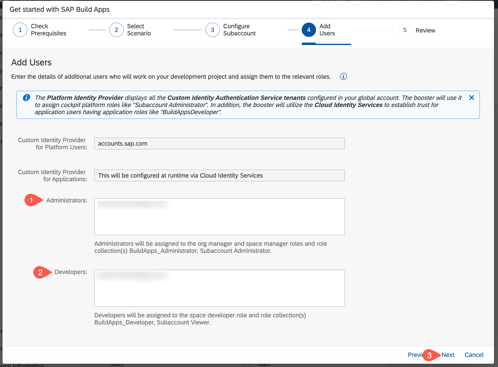
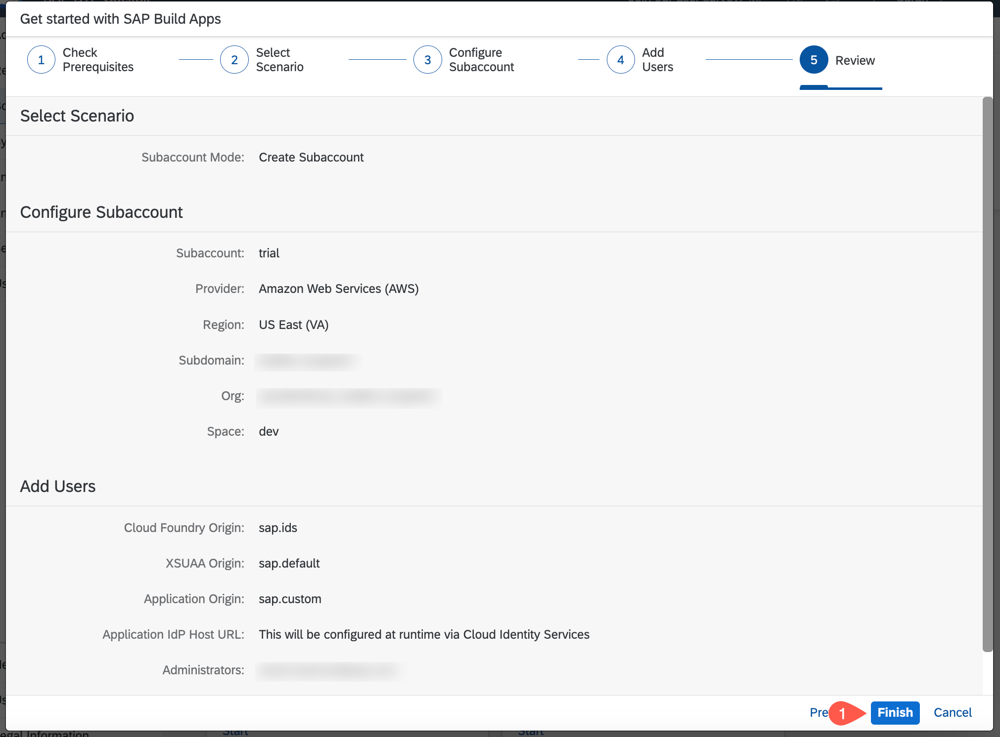
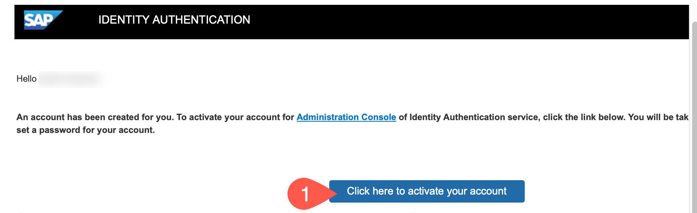
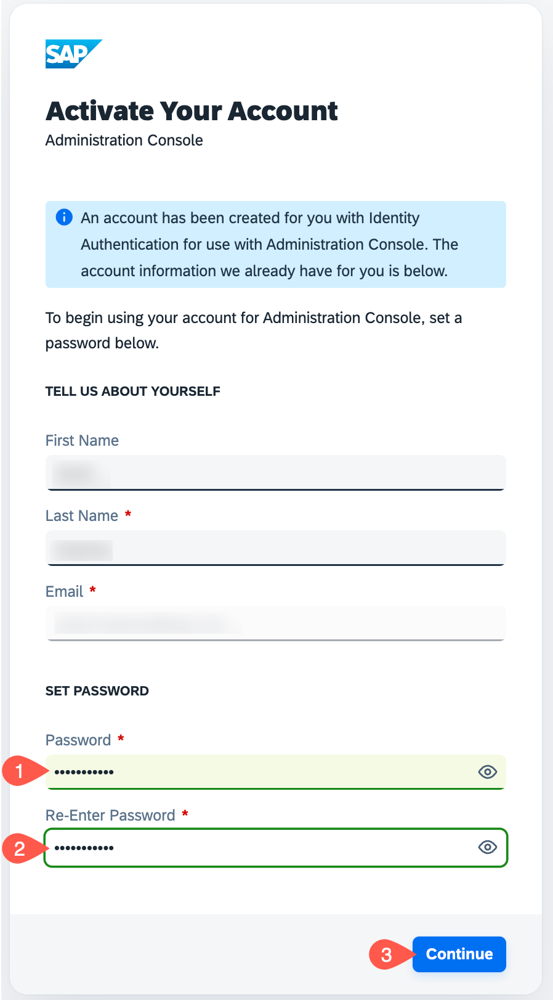
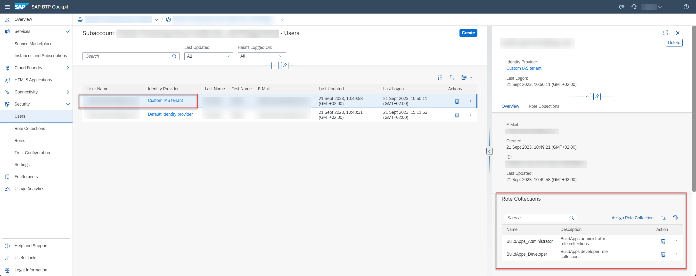

# Setup the SAP Build Apps Service

In this section you will use a booster to setup the landscape for using **SAP Build Apps**. To do this you must be **administrator** of your global SAP BTP account. The process described here will create a new subaccount but you can use the booster to configure an existing subaccount.

Logon to the your trial account

## Run the Booster

Select **Boosters**. Search for SAP Build Apps. Press **Start**.

When the prerequisites are checked successfully, press **Next**.

Select **Create Subaccount** and press **Next**.

Find the coniguration of your account and adjust the remaining fields if necessery and then press **Next**.

In the section **Custom Identity Provider for Applications**, select the tenant you want to use, provide your email, then press **Next**.

Check your settings and press **Finish**

Choose **Navigate to subaccount**, which will open the subaccount on another tab. Come back to this tab and press **Close**.

Go to your email inbox and find the activation mail for your IAS account. Choose **Click here to activate your account**

This will open a new webpage where you can configure your IAS Profile. Set a password, which you can use to access SAP Build Apps. Choose **Continue**

## Result

The subaccount has been configured with a custom IAS tenant and your user has been assigned the relevant role collections.

