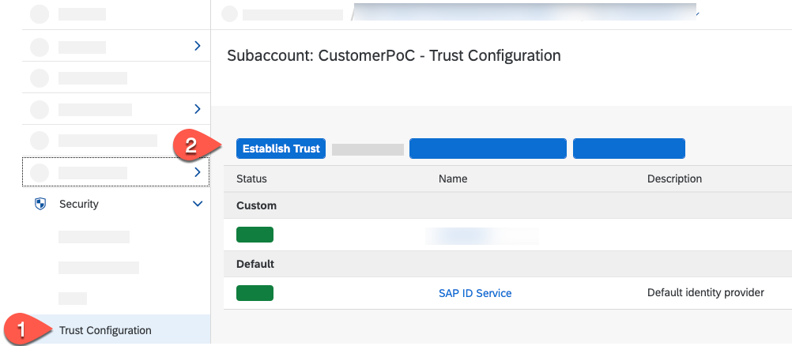
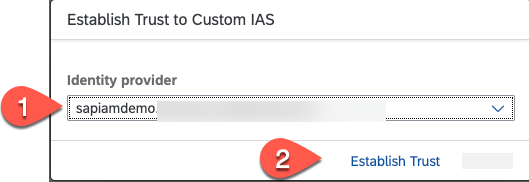
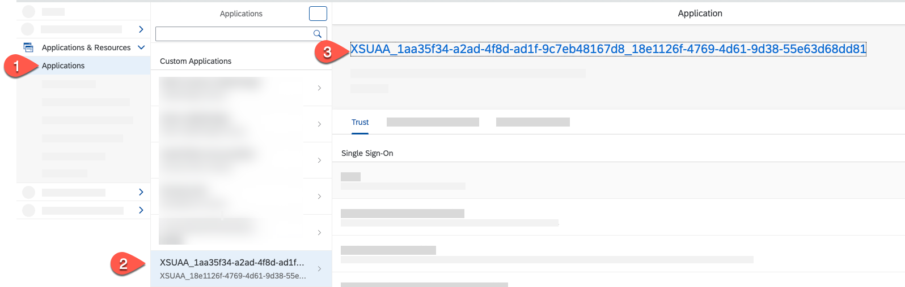
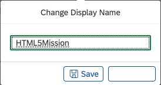
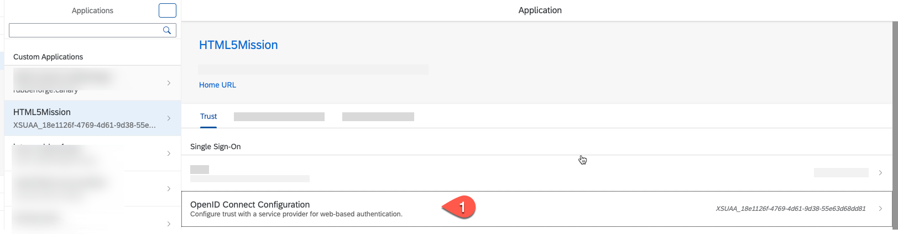
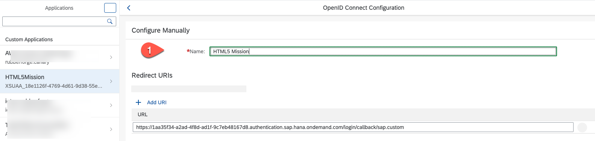

# Configure Custom Identity Provider

## Introduction

In this section, we would configure a custom Identity Provider, which has the users/employees to log in to the SAP Business Technology Platform subaccount. Depending on your global account, you can see the default identity provider, which is configured automatically. This can't be deleted, it can only be enabled or disabled.

**Persona:** Cloud Administrator

**Abbreviation:** SAP Business Technology Platform = SAP BTP

## Step-by-Step Instruction

Use your SAP Identity Authentication service tenant as an identity provider or a proxy to your own identity provider hosting your business users. This method avoids the upload and download of SAML meta data by using Open ID Connect (OIDC) to establish trust.

### Register SAP BTP Subaccount in the Custom Identity Provider

You can manage trust configurations for a global account only if you have created the global account or if you are an SAP BTP Administrator of the account and you are an administrator in your company's Identity and Authentication Tenant (SAP IAS).

Establishing the trust between your company's IDP could be done in an automatic way.

1. In **SAP BTP Cockpit**, navigate to your subaccount.

2. From the left-side subaccount menu, navigate from **Security** &rarr; **Trust Configuration**.

3. Choose **Establish Trust**.

4. In the popup, select your Identity provider.

  **Note:** If your Identity provider is not visible, then the SAP BTP account and the IDP have been created with different Customer IDs.
  In that case, follow the steps for the manual setup with SAML 2.0 in section [Link to Manual Setup Guide](./README.md).

5. Choose **Establish Trust**.

   

    At the **Trust Configuration** screen, you should see your custom IDP tenant.

   

6. Now, open your company's Identity and Authentication Tenant (SAP IAS) and log in to the same.

7. From the left-side menu, navigate from **Application & Resources** &rarr; **Applications**.

8. You find a generated application starting with `XSUAA_`. Select this application.

9. Click on the header of the application configuration to change the name.

     

10. Change the display name to a meaningful entry and choose **Save**.

     

11. Select the **OpenID Connect Configuration** section.

    

12. Change the name and choose **Save**.

    

13. Check if the **Subject Name Identifier** is set to **E-mail**. If not, change it.

    