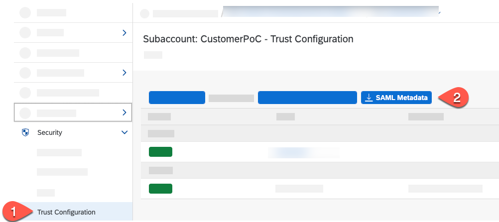
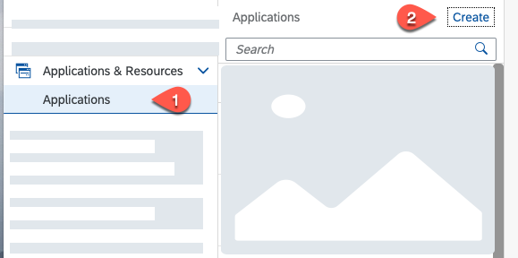
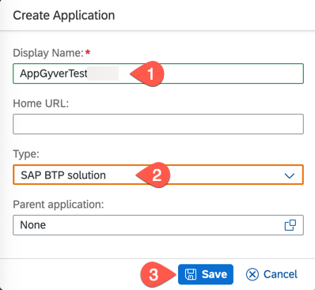
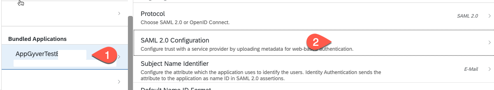
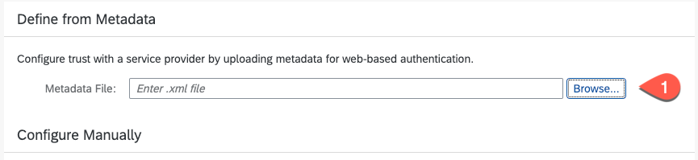
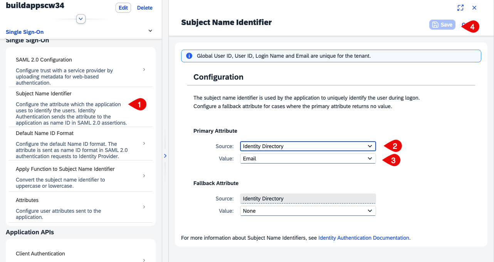
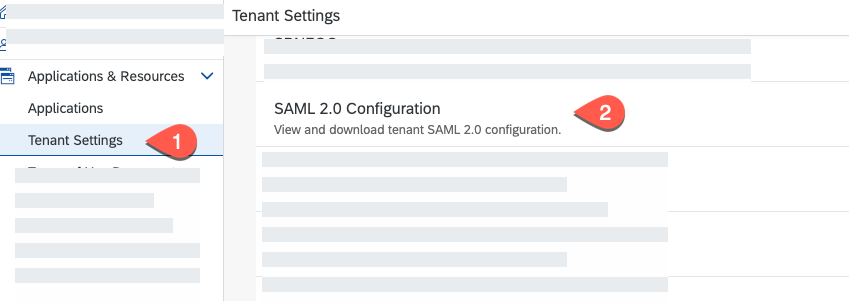
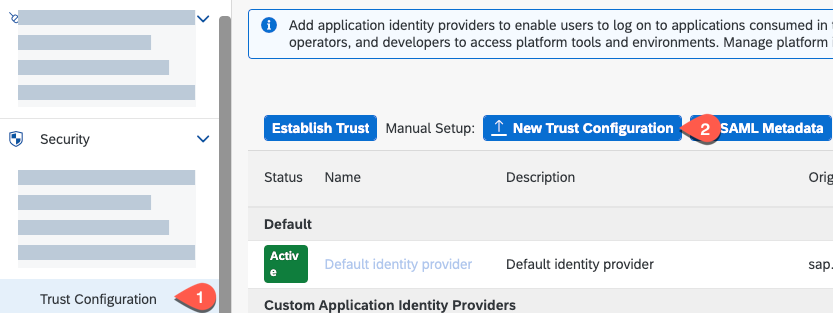
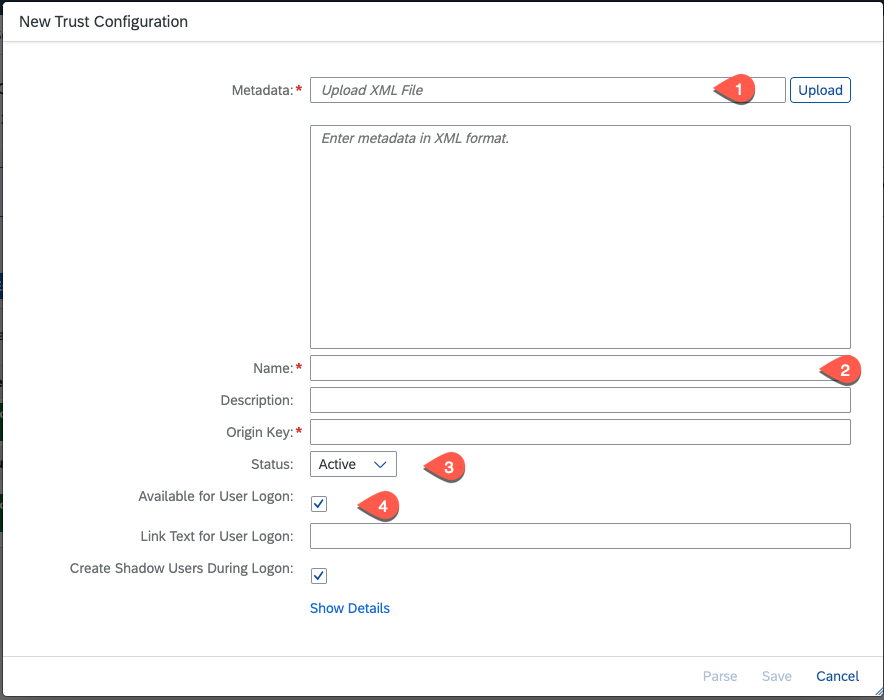

# Configure Single Sign-On Between SAP S/4HANA Cloud and SAP BTP

## Introduction

In this section, you will configure the Identity Provider of your SAP S/4HANA Cloud system, which has the business users to access the application running on SAP BTP subaccount.
Depending on your global account, you can see the default identity provider, which is configured automatically. This cannot be deleted, it can only be enabled or disabled.

**Persona:** SAP BTP Administrator

## Step-by-Step

An SAML service provider interacts with an SAML 2.0 identity provider to authenticate users signing in by means of a single sign-on (SSO) mechanism. In this scenario, the SAP UAA service (User Account and Authentication Service) acts as a service provider representing a single subaccount. To establish trust between an identity provider and a subaccount, you must provide the SAML details for web-based authentication in the identity provider itself. Administrators must configure trust on both sides, in the subaccount of the service provider and in the SAML identity provider. Here we assume that the customer has purchased a tenant for SAP Cloud Identity Authentication service.

There are two ways to establish a trust between the IDP and your SAP BTP account:

* Recommended option: **Automatic trust using Open ID Connect (OIDC)** &rarr; see [Configure Custom Identity Provider](./AutomaticTrust.md) for more details.

* **Set up manual trust with SAML 2.0** &rarr; following the next steps:

### Register SAP BTP Subaccount in the Custom SAML 2.0 Identity Provider

You can manage trust configurations for a global account only if you have created the global account or if you are an SCP Administrator of the account and you are an Administrator in your company's Identity and Authentication Tenant (SAP IAS).

1. In **SAP BTP Cockpit**, navigate to your subaccount.

2. From the left-side subaccount menu navigate from **Security** &rarr; **Trust Configuration**.

3. Choose **SAML Metadata** and download the XML file.

   

4. Now, open your company's Identity and Authentication Tenant (SAP IAS) and log in to the same.

5. From the left-side subaccount menu navigate from **Application & Resources** &rarr; **Application**.

6. Choose **Create**.

   

7. Enter a **Display Name**, for example, **BuildAppTest** and choose **SAP BTP solution** as **Type**.

8. Choose **Save**.

   

9. Choose **SAML 2.0 Configuration** under Trust Tab.

    

10. Choose **Browse** for **Metadata File** upload. Choose the metadata XML file downloaded from previous step 3.

    

11. Choose **Save**.

12. Choose **Subject Name Identifier**. Select Identity Directory and email. Press **Save**.

    

### Establish Trust with your SAP S/4HANA Cloud SAML 2.0 Identity Provider in your SAP BTP Subaccount

Your business users are stored in the SAP Cloud Identity Authentication service. You must establish a trust relationship with your SAML 2.0 identity provider and your subaccount in SAP BTP. The following procedure describes how you establish trust in the SAP Cloud Identity Authentication service.

1. From the left-side subaccount menu navigate from **Application & Resources** &rarr; **Tenant settings**.

2. Choose **SAML 2.0 Configuration**.

   

3. Choose **Download Metadata File**.

   

4. Now, log in again into your Cloud Foundry subaccount and navigate from **Security** &rarr; **Trust Configuration**.

5. Choose **New Trust Configuration**.

   

6. Choose **Upload** to upload the metadata file. Select the tenant metadata file downloaded from previous step.

7. Enter a **Name**, for example: **S4HCloudTenant**. Keep the **Status** as active and enable **Available for User Logon**.

   

8. Choose **Save**.

### References

See section [Manually Establish Trust and Federation Between UAA and Identity Authentication](https://help.sap.com/viewer/65de2977205c403bbc107264b8eccf4b/Cloud/en-US/7c6aa87459764b179aeccadccd4f91f3.html) on SAP Help Portal for more details.
