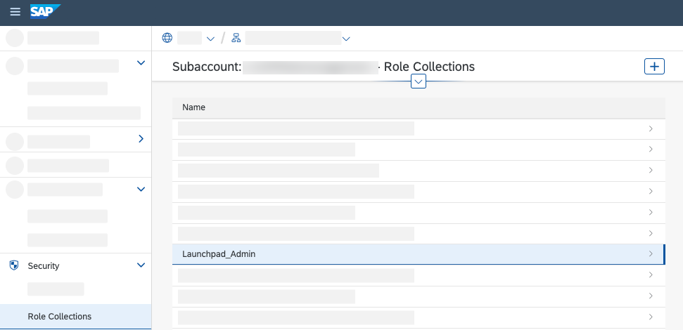
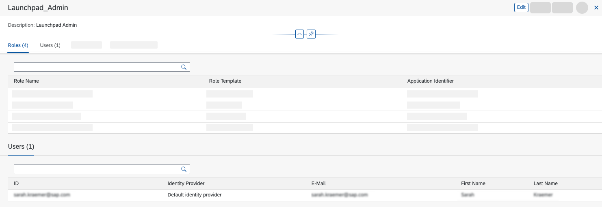

# Assign roles for SAP Build Work Zone, standard edition

## Introduction

In this section, you will learn how to assign your user to the relevant roles for SAP Build Work Zone, standard edition. You need this role to create a company site with the created UI application.

**Persona:** SAP BTP Developer

## Step-by-Step

1. After your account was created, open your created **Subaccount**

2. In the menu on the left, navigate to **Security** &rarr; **Role Collections**.

     

3. In the role collection list, find _Launchpad Admin_ and choose it to open.

4. Choose the **Edit** button and scroll down to **User** section. Enter your e-mail address in the section and select _Custom Identity Provider_ as **Identity Provider**. Repeat the step for all the users who need access to the SAP Build Work Zone.

5. Choose **Save**.

    
