# Install Mock Server

If you don't have access to an SAP S/4HANA system but still want to create an application consuming an OData service with SAP Build Apps, you can use this [mock server application](https://github.com/SAP-samples/cloud-extension-ecc-business-process/blob/mock/README.md). It contains some entities of the SAP S/4HANA API_Business_Partner OData service (A_BusinessPartner & A_BusinessPartnerAddress) with sample data.

For the installation, you could either use [SAP Business Application Studio](#deployment-with-sap-business-application-studio) or your [local system](#local-deployment).

To install the mock server, you need an SAP BTP subaccount with **Cloud Foundry Environment** and **256 MB of Cloud Foundry runtime**.

Also you have to create a [destination](#create-destination-for-mock-server) to the mock service in the same subaccount as your SAP Build Apps subscription.

## Deployment with SAP Business Application Studio

**Prerequisite:** Entitlement and setup of SAP Business Application Studio at your SAP BTP account - see the [Getting Started Guide](https://help.sap.com/docs/SAP%20Business%20Application%20Studio/9d1db9835307451daa8c930fbd9ab264/19611ddbe82f4bf2b493283e0ed602e5.html?locale=en-US).

### Create Workspace

1. Open the SAP Business Application Studio and create a new **Dev Space**

2.  Choose type **Full Stack Cloud Application** and select **Create Dev Space**.

   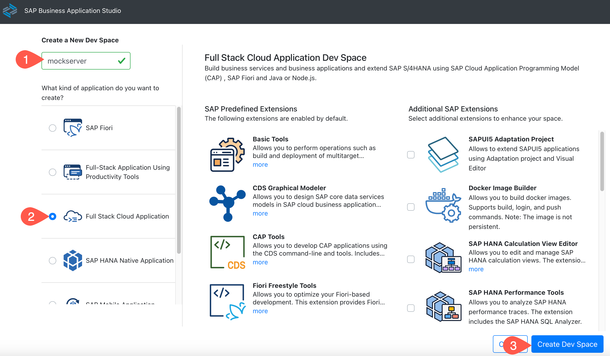

3. Open the newly created space.

4. Choose the burger menu and **Terminal** &rarr; **New Terminal**.

   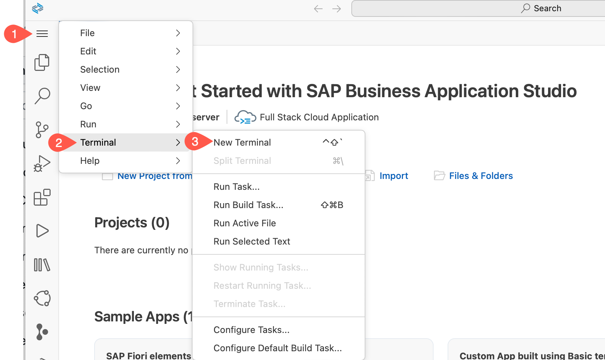

### Log In to Cloud Foundry in SAP Business Application Studio

1. You have opened **SAP Business Application Studio** and created and opened a Dev workspace.

2. In the next step, you will log in to Cloud Foundry in **SAP Business Application Studio**, so let us copy the needed parameters in a text editor of your choice.

3. Switch to the tab in your browser where you have SAP BTP cockpit opened and choose **Overview** of the subaccount. Copy the **Org Name** and **API Endpoint** into a text editor of your choice.

    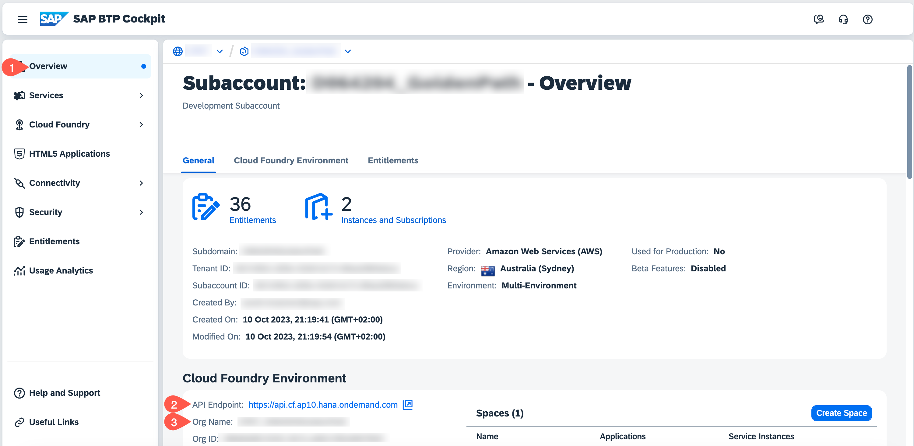

4. From the left-side subaccount menu, navigate to **Cloud Foundry** &rarr; **Spaces** and write down the space name as well to a text editor of your choice.
 
    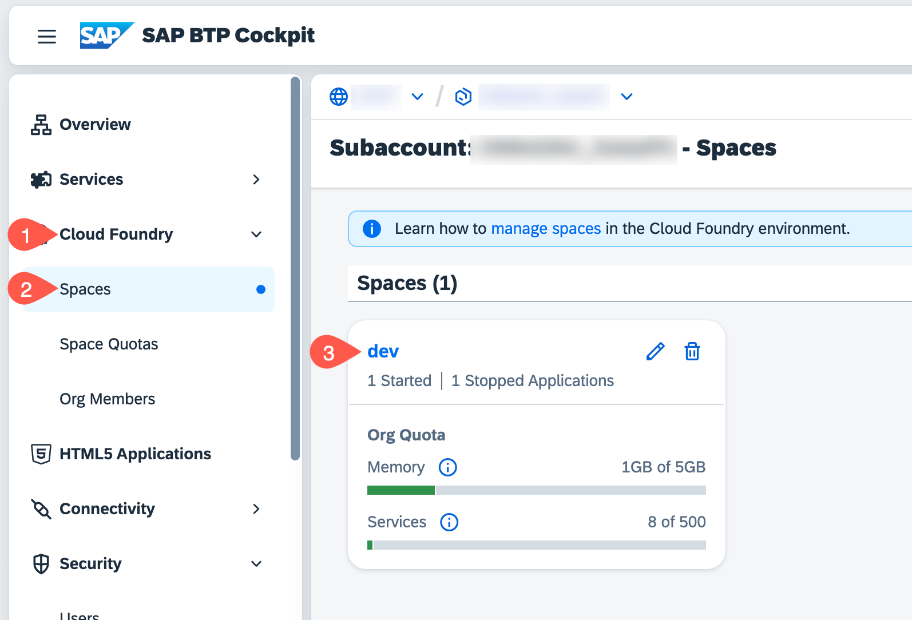

5. Switch to the tab where you have opened **SAP Business Application Studio**. In the tabs, choose **View** and select **Command Palette**.
   

6. Search for **CF Login** and select **CF: Login on to Cloud Foundry**.

    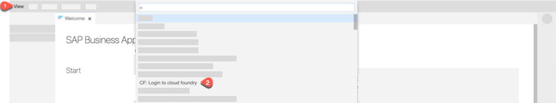

7. Enter the CF API endpoint, which you have copied in step 3 or take the default suggested API endpoint.

8. Enter your SAP BTP account **user ID** and **Password** when prompted. 
   You can find the user ID in the Settings:
      

10. Select your Cloud Foundry **Org**, which you have noted down in step 3.

11. Select the space name, which you have noted down in step 4. Once you have selected the Org and Space, you would log in to Cloud Foundry in SAP Business Application Studio.

12. Now, you have successfully created a workspace and pointed to our desired SAP BTP **Org** and **Space**.

### Build and Deploy

1. In the menu in SAP Business Application Studio, select **Terminal** &rarr; **New Terminal** and navigate to the projects folder using:

   ```bash
      cd projects
   ```

2. Clone the mock server GitHub repository:

   ```bash
      git clone -b mock https://github.com/SAP-samples/cloud-extension-ecc-business-process.git
   ```

3. Choose **File** in the menu on the top and then select **Add Folder to Workspace** from the dropdown menu.

  

4. Open the project by choosing **projects** &rarr; **cloud-extension-ecc-business-process** and choose **OK**.

3. In the project folder, right-click on the `mta.yaml` file and select **Build MTA Project**.

   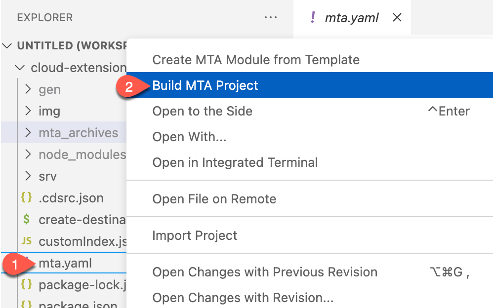

4. When the build was successful, you will see a new folder **mta_archives** in your project with the **Mockserver_1.0.0.mtar** file. Right-click on that file and select **Deploy MTA Archive**.

   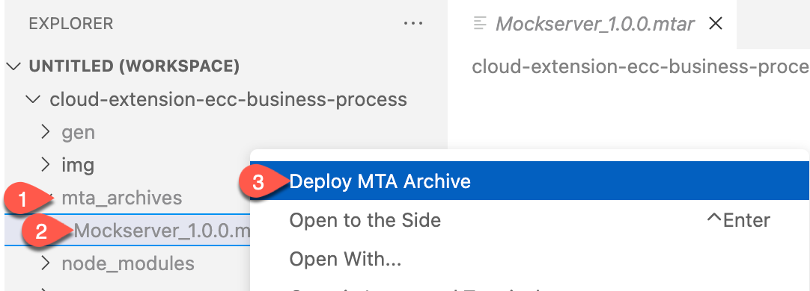

5. The next step is to create a [destination](#create-destination-for-mock-server) to the mock server.

## Local Deployment
### Tools

For building and deploying the mock server, you need to install the following tools on your device:

* [Node.js](https://nodejs.org/en/download/) - find the latest Node.js version supported by [CAP](https://cap.cloud.sap/docs/advanced/troubleshooting#node-version).
* [Cloud Foundry command line interface (v8 version or later)](https://github.com/cloudfoundry/cli/wiki/V8-CLI-Installation-Guide).
* [Cloud MTA Build Tool](https://sap.github.io/cloud-mta-build-tool/) - you can install it using Node.js.

     ```cmd
     npm install -g mbt
     ```

* [Git](https://github.com/git-guides/install-git)

### Deployment

1. Open a terminal or on Windows the command prompt.

2. Clone the mock server GitHub repository:

   ```bash
      git clone -b mock https://github.com/SAP-samples/cloud-extension-ecc-business-process.git
   ```

### Build the Application

Build your application by using the `mta.yaml` build file. With the `-t parameter`, the file will be created in the specified folder.

   ```cmd
   mbt build -t ./mta_archives

   ```


### Log on to Your SAP BTP Subaccount

1. Set the SAP BTP API endpoint. You can find it in overview of your SAP BTP subaccount:

    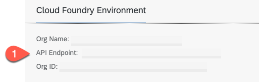

    ```cmd
    cf api <your-api endpoint>
    ```

2. Log in to your subaccount and select your org and space:

   ```cmd
   cf login -u <your-user> -p <your-password>
   ```

### Deploy the mta Archive

Now, you can deploy the application to your subaccount and space by using the created mtar file:

   ```cmd
   cd mta_archives
   cf deploy Mockserver_1.0.0.mtar
   ```

If the deployment was successful, you will see the following log:

   ```cmd
   Starting application "mock-srv"...
   Application "mock-srv" started and available
   ```

## Create Destination for Mock Server

1. In your SAP BTP subaccount, navigate to the space where you have deployed the mock server. In the **Applications** section, select the `mock-srv` application.

    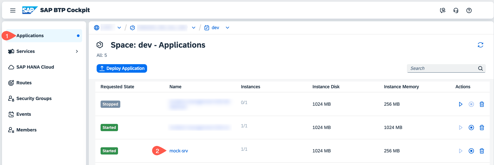


2. In the application overview screen, copy the **Application Route** of the mock server.

    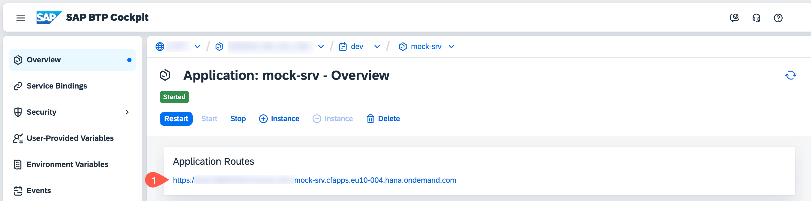


3. Go back to the subaccount overview and select **Connectivity** &rarr; **Destination**. Choose **New Destination**. Enter the following values:

  * **Name** = bupa
  * **Type** = HTTP
  * **URL** = https://\<The application route of the mock server\>/odata/v2/op-api-business-partner-srv
  * **Proxy Type** = Internet
  * **Authentication** = NoAuthentication

  Choose **New Property** at create the following properties:
  * **HTML5.DynamicDestination** = true
  * **WebIDEAdditionalData** = full_url
  * **WebIDEUsage** = odata_gen
  * **WebIDEEnabled** = true

  * Check **Use default JDK truststore**

  * **Save** your settings

   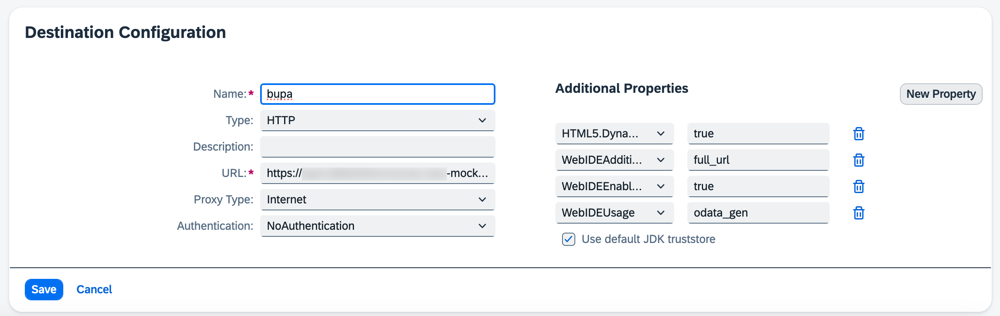

4. Choose **Check Connection** and you should get a `200 OK` message.

## Test the Mock Server

1. Call the **Application Route** from step 2 in the last section. You get the following page:

   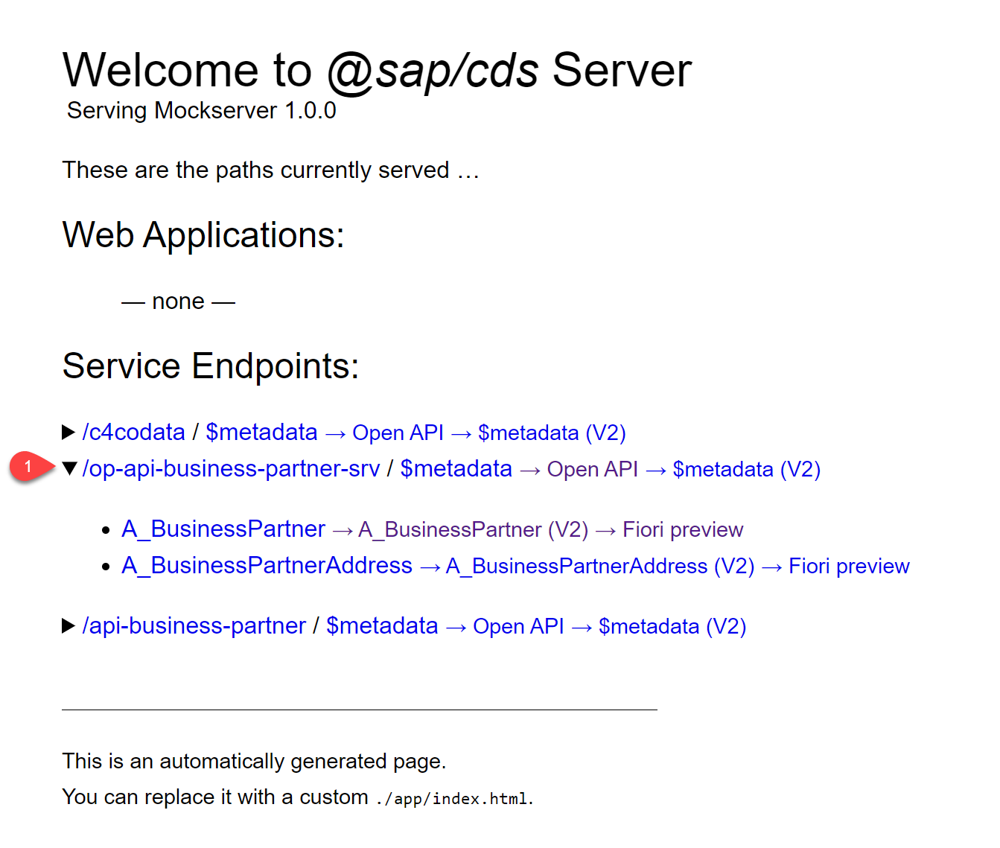

2. There are couple of options to display the data of the mock server. For example, call the **Open API** endpoint and you will get a Swagger UI where you can test the OData services

   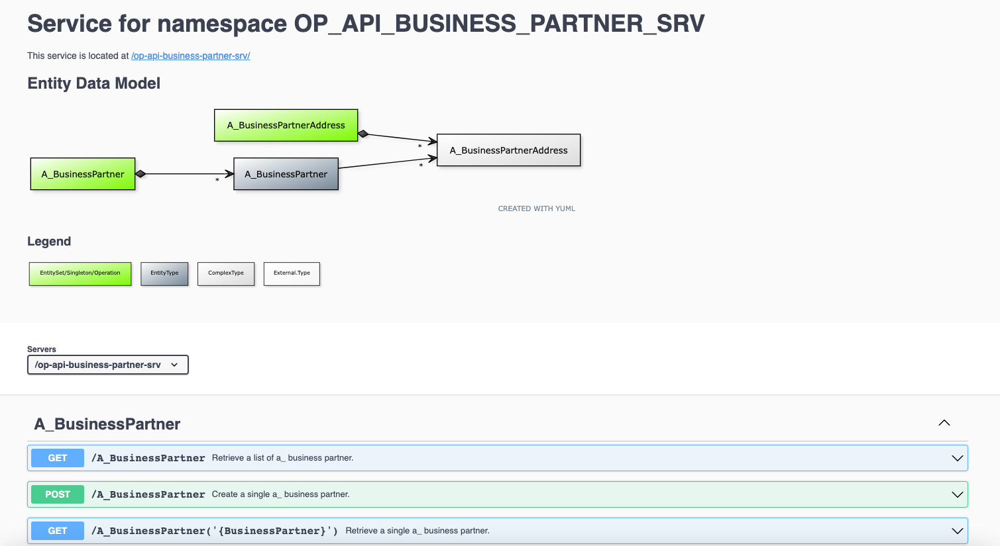


