# Map SAP BTP Role Collections to Identity Authentication Service Users

In this section, you will create some user groups in the Identity Authentication service and map them to role collections in your SAP BTP subaccount.

### Create User Groups

1. Log in to the Identity Authentication Service with your admin user.

2. In the **Application** section, select your SAP BTP subaccount. On the right side, choose **Assertion Attributes**.

   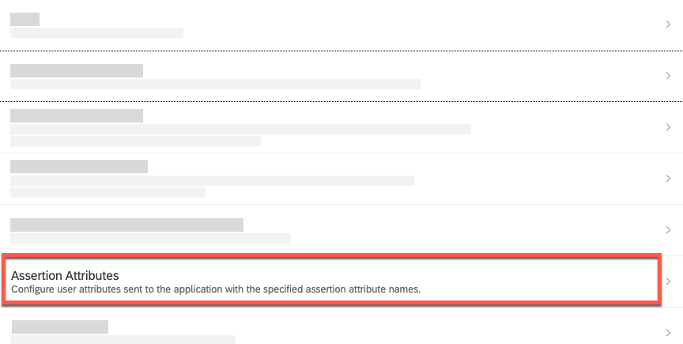

3. Choose **Add** and select the **Groups** attribute. Set the assertion attribute to **Groups** with capital G. Choose **Save**.

   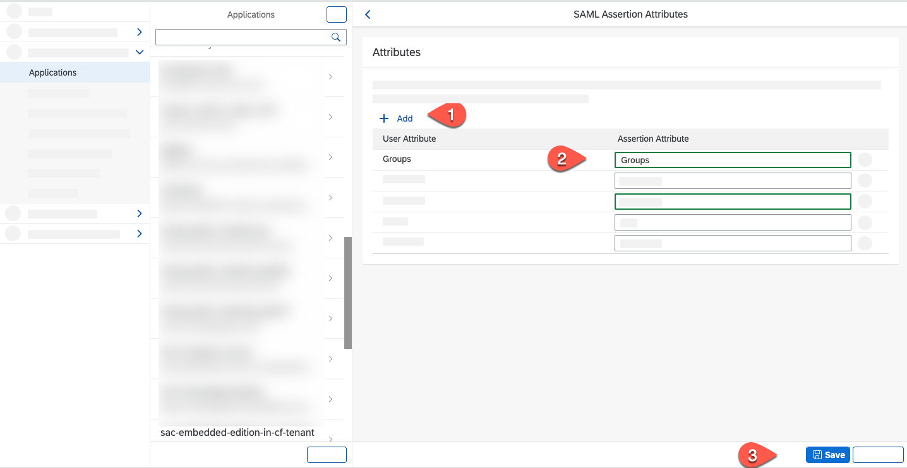

4. In the **Home** view, select **User Groups**.

   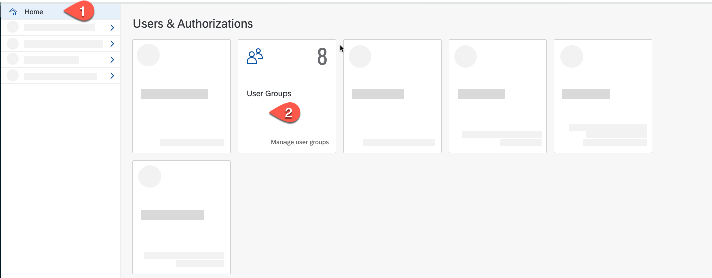

5. Create an SAP AppGyver Developer group:
    * Select **Create**
    * Set **Name** = AppGyverDeveloper
    * Set **Display name** = AppGyverDeveloper
    * Enter a **Description**
    * Choose **Create**

   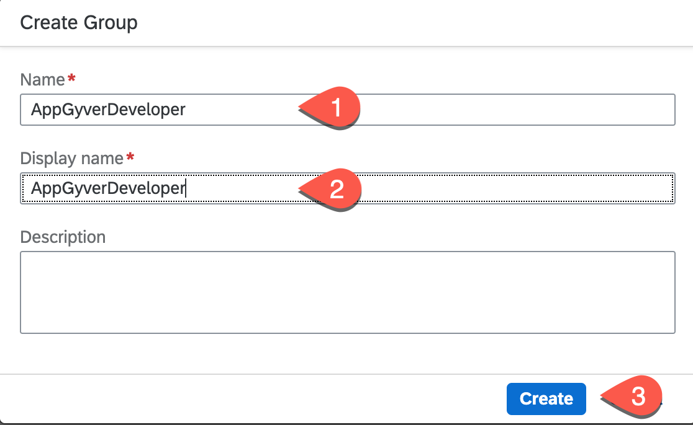

6.  Create an AppGyver Administrator group. Same steps as before.
     * Select **Create**
     * Set **Name** = AppGyverAdministrator
     * Set **Display name** = AppGyverAdministrator
     * Enter a **Description**
     * Choose **Create**

7.  Map the group to all user which should have the AppGyver developer role:
    * Open User Management
    * Select your user
    * Choose **Groups**
    * Select **Assign**

      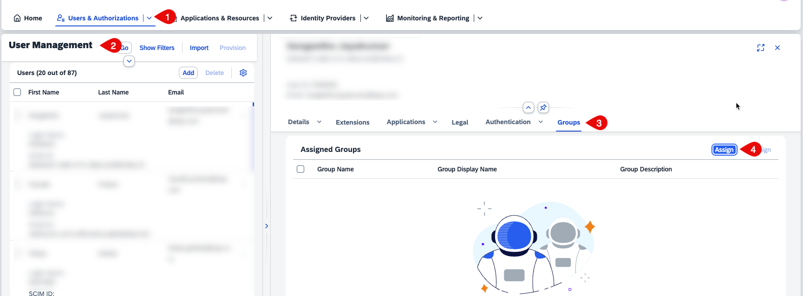

8. Check the **AppGyverDeveloper** group and choose **Save**.

   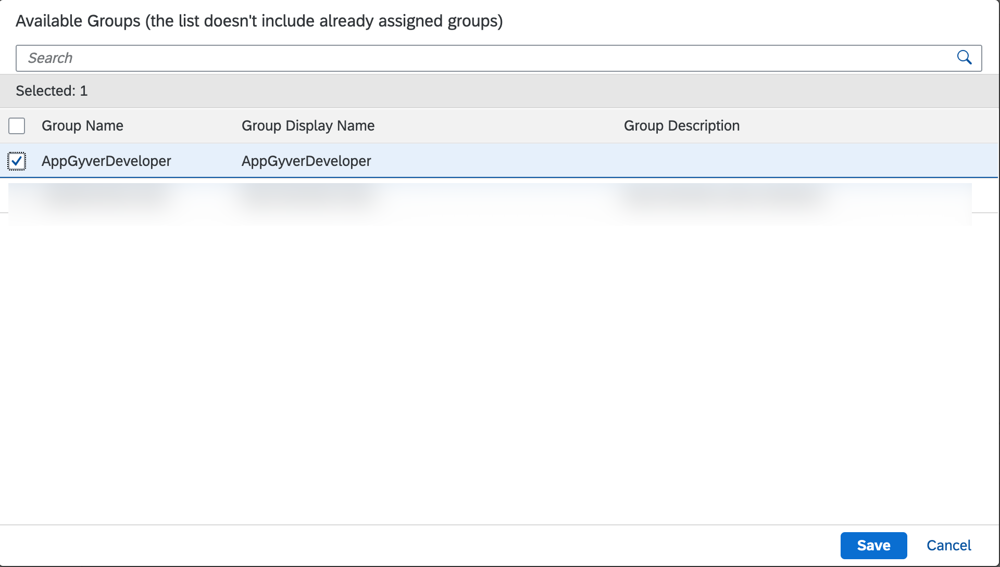

    Repeat the last two steps for all user that needs the SAP AppGyver developer privilege.

9. Repeat steps 7 & 8 by mapping the **AppGyverAdministrator** group to all users that should have the SAP AppGyver administrator role.

### Map Groups with Role Collection

1. In **SAP BTP Cockpit**, navigate to your subaccount.

2. From the left-side subaccount menu navigate from **Security** &rarr; **Trust Configuration**.

3. Now, let us disable the default SAP Identity Provider. Choose **Edit** of SAP ID Service.

4. Change **Status** to **Inactive**.

    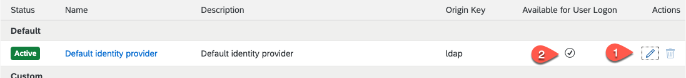

5. Choose **Save**.

6. From the left-side subaccount menu navigate from **Security** &rarr; **Role Collections** and then choose the **LCNC\_Administrator** collection.

   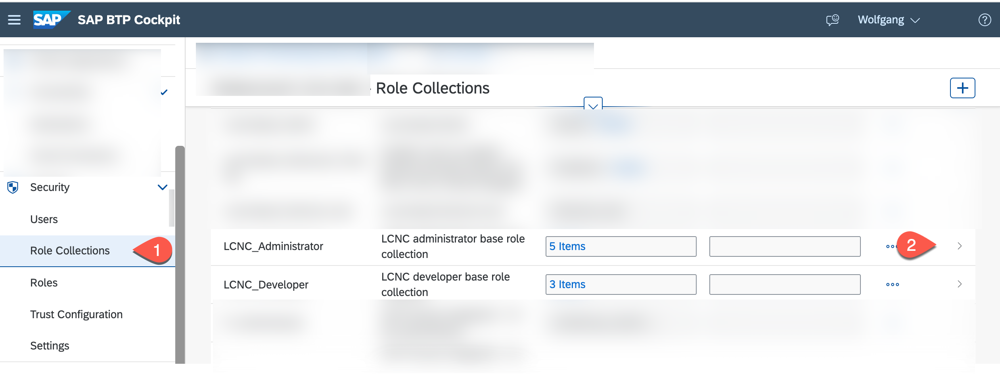

7. Select **Edit**

   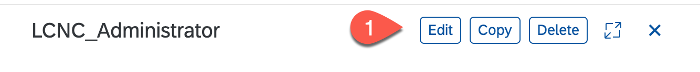

8. Select User Groups then enter the **AppGyverAdministrator** in the **Name** field and choose **Custom IAS tenant** as Identity Provider. Choose **Save**.

   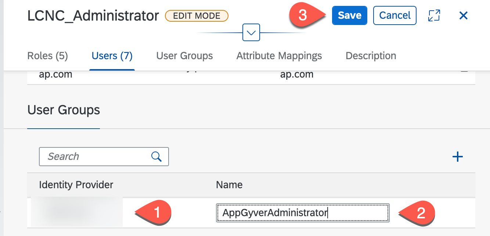

9.  Repeat steps 6-8 for the **Subaccount Administrator** and for the **Launchpad Admin** role collection.

10. Repeat steps 6-8 by selecting the **LCNC\_Developer** collection and map it to the **AppGyverDeveloper** user group.

   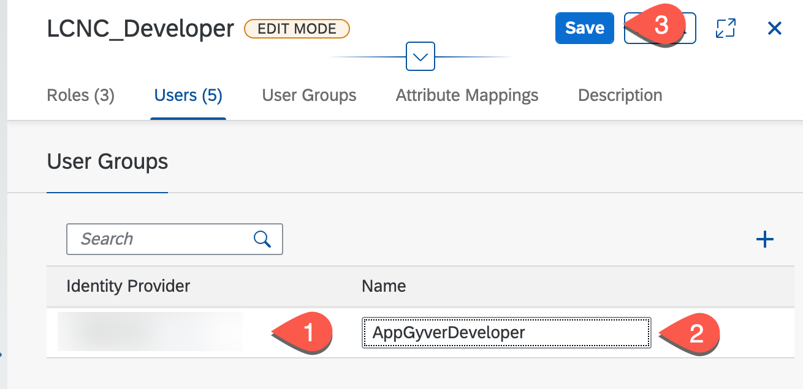

11. Repeat steps 6-8 for the **Subaccount Viewer** role collection and the **AppGyverDeveloper** user group.

12. To test your setup, open a new incognito window in your browser and check if you can log on with your Identity Authentication service to SAP BTP and SAP AppGyver.