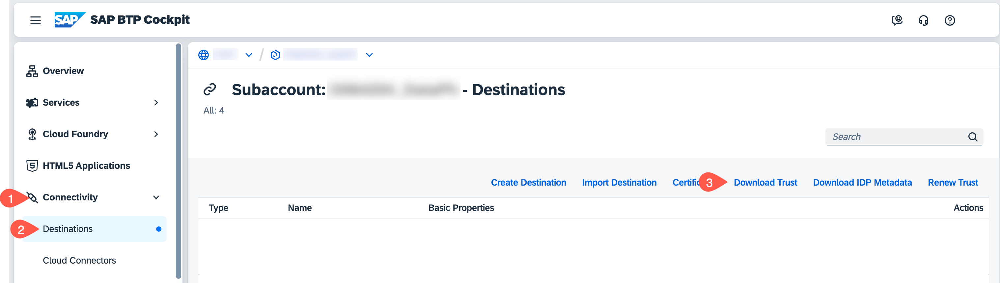
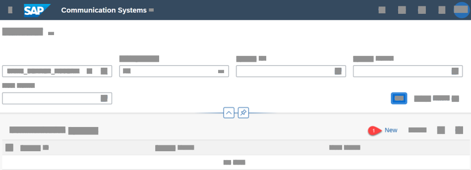
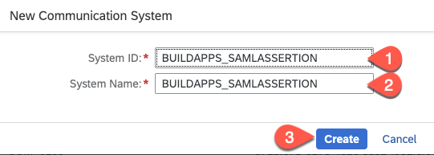
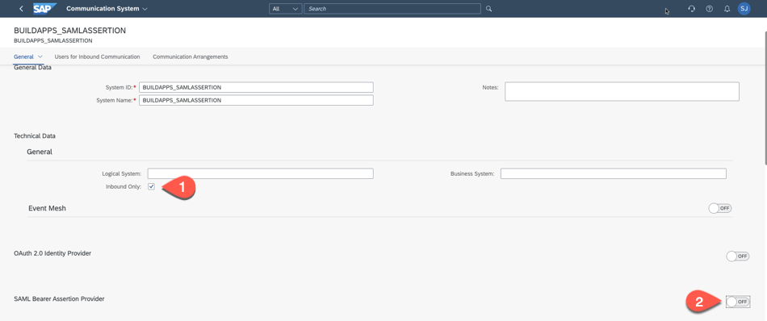
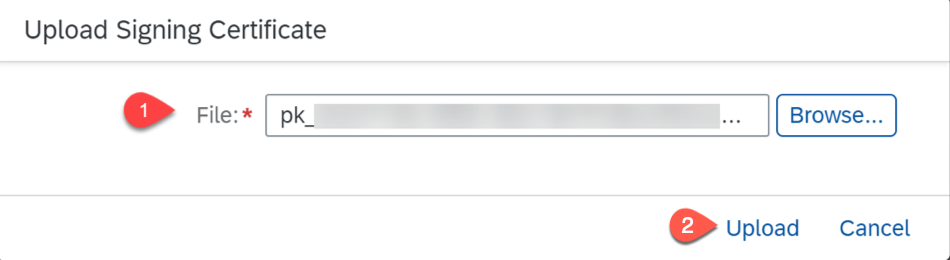
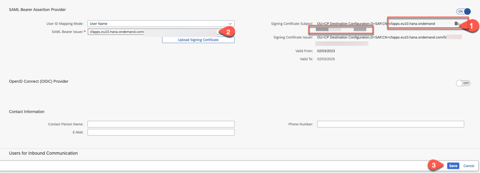

# Configure Communication Settings in SAP S/4HANA Cloud

To allow inbound communication with the SAP S/4HANA tenant, you need to explicitly allow the API's to be accessible from external systems like SAP BTP. Read about [Communication Management](https://help.sap.com/docs/SAP_S4HANA_CLOUD/0f69f8fb28ac4bf48d2b57b9637e81fa/2e84a10c430645a88bdbfaaa23ac9ff7.html?version=2302.500) for more detailed information.

In this document, we describe using the SAMLAssertion Authentication method to access the SAP S/4HANA Cloud APIs.
You can also start testing the scenario with **Basic Authentication** using a technical user, look in the section [Basic Authentication](https://help.sap.com/doc/6ce62b6bdda340ffbeae3f138c3cb71b/SHIP/en-US/Set_Up_Authentication_for_SAP_S4HANA_Cloud_Extensions.pdf). Select the communication scenario **SAP_COM_0008** when creating a communication arrangement to expose the [Business Partner API](https://api.sap.com/api/API_BUSINESS_PARTNER/overview). 

## Download SAP BTP subaccount Trust Certificate

Download the subaccount specific key certificate from your Cloud Foundry subaccount on SAP BTP which is used to connect to other remote systems. You will need this in the next step when configuring the SAP S/4HANA Cloud system.

1. In **SAP BTP Cockpit**, navigate to your subaccount.

2. From the left-side subaccount menu navigate from **Connectivity** &rarr; **Destinations**.

   

3. Choose **Download Trust**.

## Log on to the SAP S/4HANA Cloud System

1. Enter the URL of the SAP S/4HANA Cloud System in your browser, which is of format:

   `https://myXXXXXX.s4hana.ondemand.com/ui#Shell-home`

   Replace the X with your actual tenant hostname.

2. Enter your administrator **E-MAIL**.

3. Enter your administrator **Password**.

## Create Communication System

1. Choose the **Communication Systems** application tile.

   

2. Choose **New**.

3. Enter the **System ID** and a unique value for **System Name**.

   

4. Choose **Create**.

5. Navigate to **General** > **Technical Data** section and select the checkbox **Inbound Only**

6. Set the switch **SAML Bearer Assertion Provider** from **OFF** to **ON**.

   

7. Choose **Upload Signing Certificate** and select the BTP Trust certificate which you have downloaded in the previous step and choose **Upload**

   

8. Copy the **complete value** of the **CN** property from the **Signing Certificate Issuer** including the unique GUID and paste it in the **SAML Bearer Issuer** field.

    

9. Choose **Save**.

## Summary

You have configured the SAP S/4HANA Cloud system to allow the OData services associated with the communication scenario `SAP_COM_0008` to be consumed. You now need to create the corresponding destination in your SAP BTP subaccount where you use the communication user and password that you configured here.

## Related Links
If you want to OAuth2SAMLBearerAssertion authentication, see section [User Propagation from the Cloud Foundry Environment to SAP S/4HANA Cloud](https://help.sap.com/docs/CP_CONNECTIVITY/cca91383641e40ffbe03bdc78f00f681/9af03a067bf74457ba0de0221b9cc72a.html) for more details.

