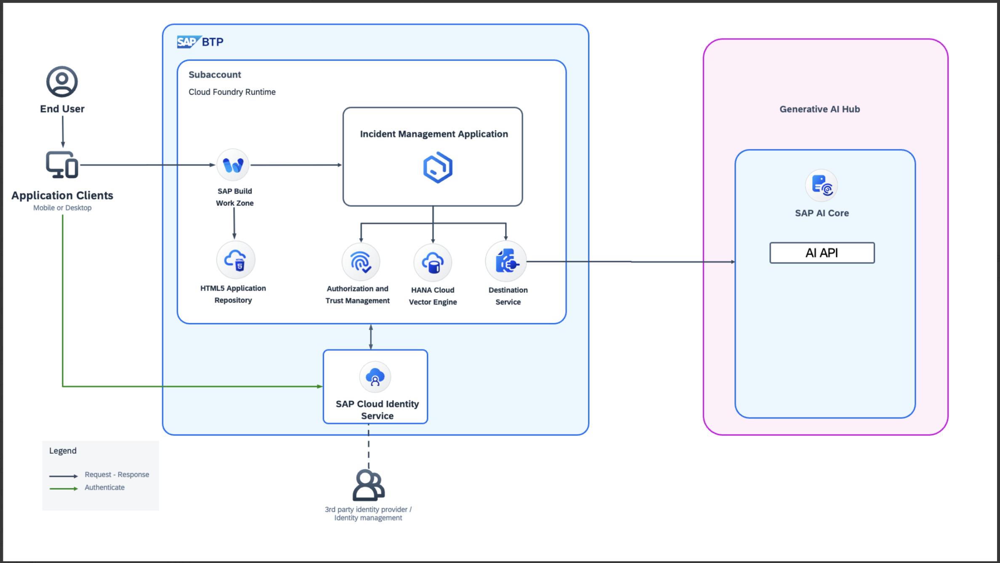

# Develop Full Stack BTP Applications powered by AI

In this hands-on exercise, you will learn how to accelerate the development of a full-stack SAP Cloud Application Programming Model (CAP)-based application and enhance it with AI capabilities.

You will integrate SAP AI Core, a cloud-native runtime for managing the lifecycle of AI assets such as machine learning models, and inference workflows. SAP AI Core provides robust orchestration, scalability, and secure access to AI workloads, enabling the seamless embedding of intelligence into business applications on SAP BTP.

# Business Scenario

In this hands-on exercise, you will build an application called Incident Management using SAP Build Code. The business scenario of the Incident Management application is the following:

ACME is a popular Electronics company. ACME hires call center support representatives to process and manage customer incidents. A call center support representative (Processor) receives a phone call from an existing customer and creates a new incident on behalf of the customer. The newly created incident is based on a customer complaint received during the phone call. The call center support representative also adds the conversation with the customer to the incident for future reference.

# Solution Diagram

# Hands-on Exercise

## Exercise 1: Develop Basic Incident Management Application

1. [Create the Project](./document/create-full-stack-project.md)

## Exercise 2: Add AI Capabilities using SAP AI SDK

1. [Add dependencies for SAP Cloud SDK for AI ](./document/prerequisites.md)
2. [Extend the Incident Management Application](./document/extend-service.md)
3. [Test the Scenario End to End](./document/e2e-testing.md)

