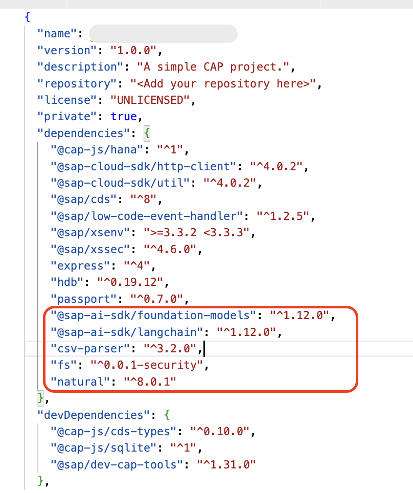
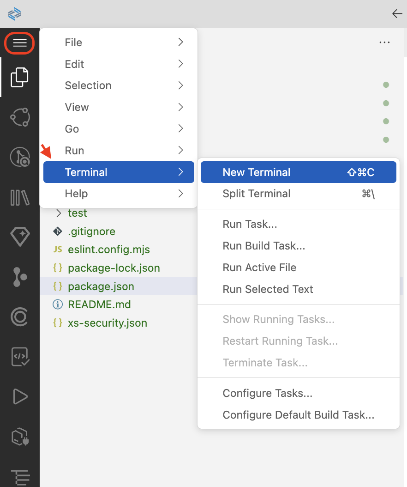
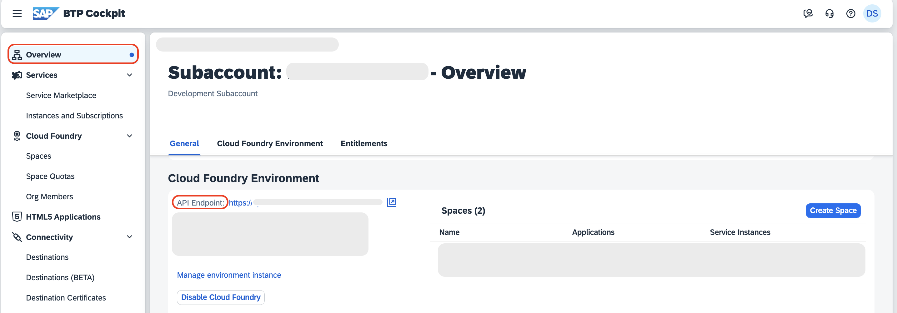
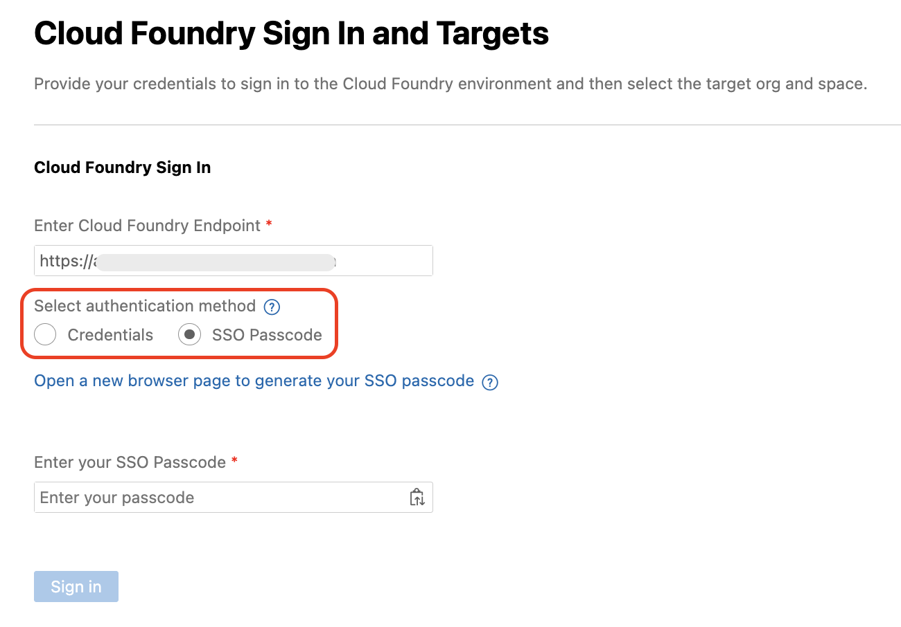
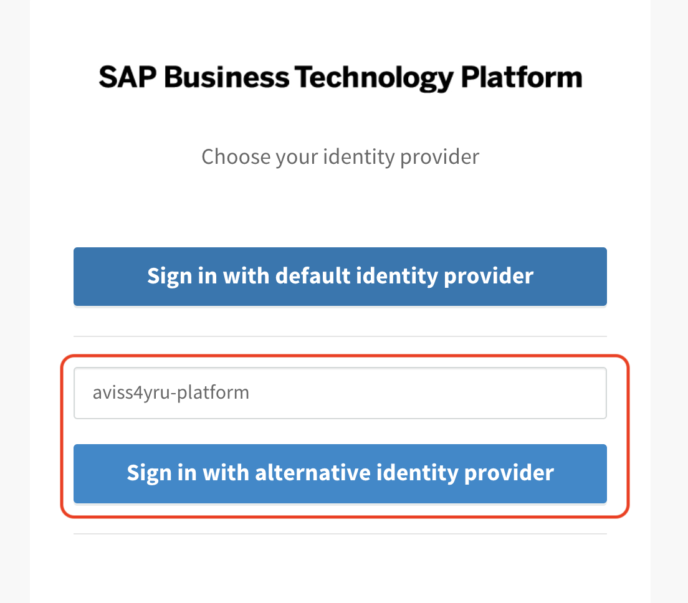
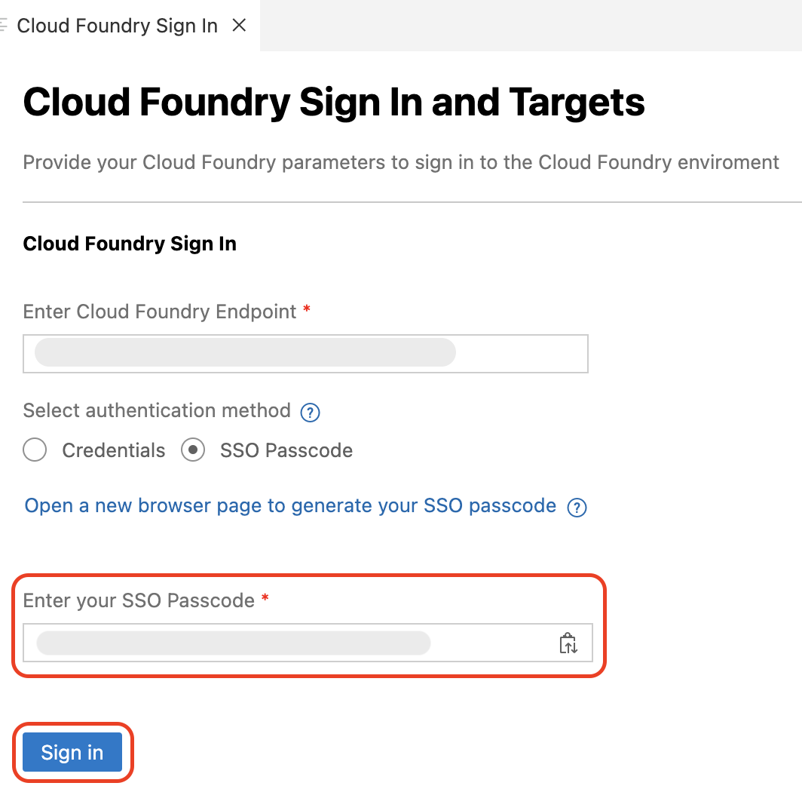
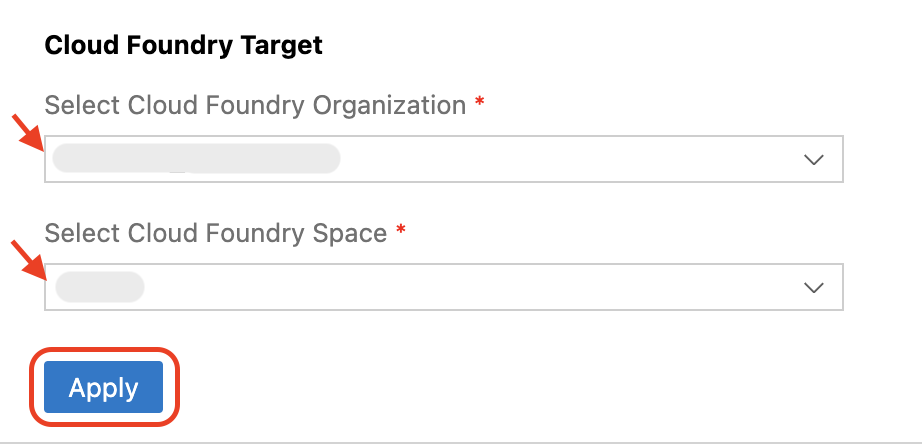
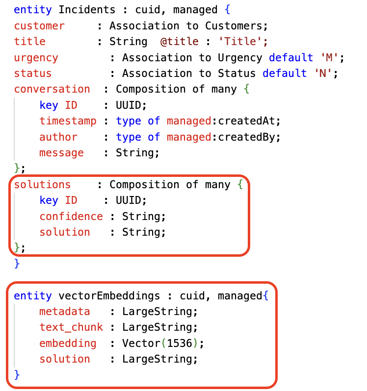
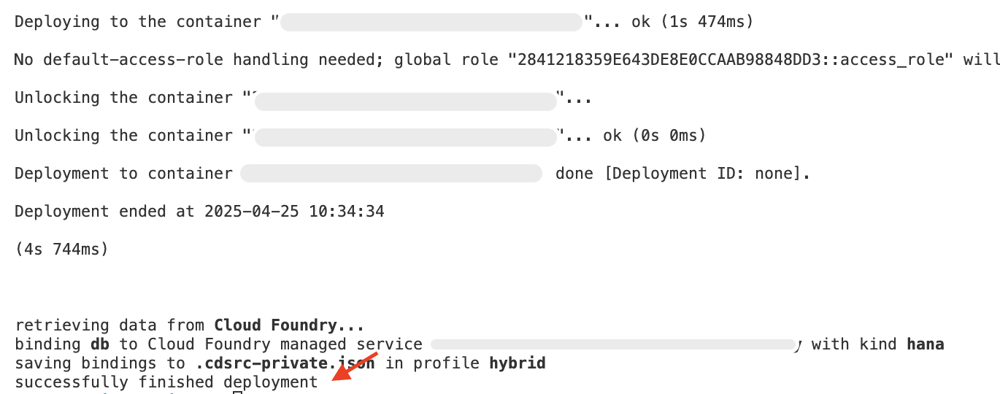

# Add dependencies for SAP Cloud SDK for AI 

## Add and Install required packages

1. Open `Package.json` and add the below dependencies

```json
"dependencies": {
    ...
    "@sap-ai-sdk/foundation-models": "^1.12.0",
    "@sap-ai-sdk/langchain": "^1.12.0",
    "csv-parser": "^3.2.0",
    "fs": "^0.0.1-security",
    "natural": "^8.0.1"
},
```

Once you have added the packages, the final package.json looks like below.


> [!Tip]
> These packages are needed to enable AI integration, text processing, and file handling within the CAP application.
> 
> **@sap-ai-sdk/foundation-models** and **@sap-ai-sdk/langchain** are used to interact with SAP AI Core services and manage AI-related workflows.
> 
> **csv-parser** helps in reading and parsing CSV files, useful for importing or processing bulk data.
> 
> **fs (File System)** is required for handling file operations like reading or writing local files.
> 
> **natural** provides basic Natural Language Processing (NLP) capabilities such as tokenization, stemming, and text similarity calculations.

2. From the root of the project, choose the burger menu, and then choose Terminal → New Terminal.

     

3. Run `npm install` to install the required dependencies.

## Login to Cloud Foundry

1. Choose the burger menu and then choose **View → Command Palette**.

> [!Note]
> You can also invoke the Command Palette quickly using the following key combination:
> For macOS: Command + Shift + P
> For Windows: Ctrl + Shift + P


2. Type **CF: Login** in the field and select this entry **CF: Login to Cloud Foundry**  from the list.
 
3. In the **Cloud Foundry Sign in** pop up, do the following: 

    1. In the **Enter Cloud Foundry Endpoint** field, enter the **API Endpoint** from SAP BTP Cockpit.

        > Note: The Cloud Foundry Endpoint can be retrived from SAP BTP Cockpit.
         

    2. Select **SSO Passcode** as an authentication method.

        

    3. Choose **Open a new browser page to generate your SSO passcode** to sign in to your subaccount in SAP BTP, which opens in a new browser.

    4. Find the text box for **Enter the origin key** and enter **aviss4yru-platform** and click on **Sign in with alternative identity provider**.

        

        > Note: When choosing **Sign in with alternative identity provider**, if your are prompted to sign in, enter your username and password.
        > If you are signed in with Default Identity, you can choose to sign in with default identity provider.

    5. Choose the **Copy** icon to get a temporary authentication code.

        
    
    6. Paste the copied code in the **Enter your SSO Passcode** field in the Cloud Foundry login page.

    7. Choose **Sign In**.

        

4. In the **Cloud Foundry Target** section, do the following:

    1. In the **Select Cloud Foundry Organization** dropdown menu, select the respective Org name.

    2. In the **Select Cloud Foundry Space** dropdown menu, select the Cloud Foundry space created in [Exercise 1 Step 1: Create Cloud Foundry Space](./create-space.md).

    3. Choose **Apply**.

        

## Enhance the Incident Management Application Data Model

In this section we will enhance the Data Model of Incident Management Application to support Vector Embeddings

1. Open `schema.cds` and add the following code snippets:

    1. Under `Incidents` entity, add the `solutions`.

        ```sh
        solutions    : Composition of many {
            key ID    : UUID;
            confidence : String;
            solution   : String;
        };
        ```

    2. Add a new entity called `vectorEmbeddings`.

        ```sh
        entity vectorEmbeddings : cuid, managed{
            metadata   : LargeString;
            text_chunk : LargeString;
            embedding  : Vector(1536);
            solution   : LargeString;
        }
        ```
    

2. The sample data generated in the previous steps, creates the **data** folder in the **test** folder. To use the data for productive usgae, move the **data** folder to the **db** folder. Open the terminal, and run the following command to move the csv files.

    ```sh
    mv test/data db/data
    ```

3. Do the productive build for your application, by running the below command in the terminal.

    ```sh
    cds build --production
    ```

4. Create a service binding to the SAP Destination Service, by running the below command in the terminal.

    ```sh
    cf create-service destination lite <destination-name>
    cds bind --to <destination-name>
    ```

5. Deploy the csv files to the hana database, by running the below command in the terminal.

    ```sh
    cds deploy --to hana
    ```
    
> [!Note]
> It might take few seconds to finish the deployment to hana, once done, you get the successful deployment message.



## Next Step

[Extend the Incident Management Application](extend-service.md)
