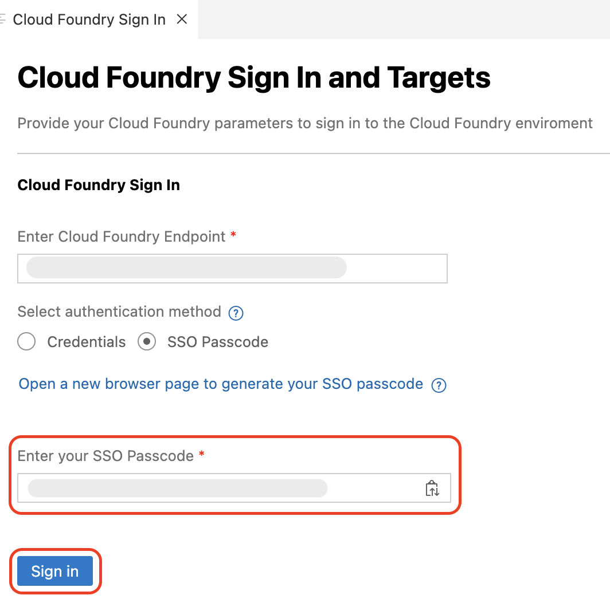

# Deploy the Application to SAP BTP, Cloud Foundry Runtime

This section describes how to deploy the application to the SAP BTP, Cloud Foundry runtime.

> [!Note]
> **To uniquely identify your deployed application in SAP BTP Cockpit, make the following changes to UI module of your application .**

1. UI Application name can be `incidentmanagement<your-initials><unique-random-number>`. For example, if your name is `John Doe`, then the project name would be **incidentmanagementjd12**, (12 is some random number). 

    1. Under **app -> incident-management -> webapp**, replace incidentmanagement with new name in below files.

        - **Component.js**
              

        - **index.html**
            

        - **manifest.json**
            

    2. Under **app -> incident-management -> ui5.yaml**, replace incidentmanagement with new name.
            

        > Note: Do Find all and replace *incidentmanagement* with *incidentmanagementjd12*. 

## Deploy the Application

The final step in SAP Build Code is to deploy the application to the SAP BTP, Cloud Foundry runtime. This process also involves the automatic creation of destinations, enabling ODATA services to be utilized by other tools such as SAP Build Apps.

1. Navigate to **Task Explorer** and run **Deploy** project name.

    

2. Check if the task has been launched in the terminal.

    

> [!Note]
> During the deployment, if a new page pops up for sign in to Cloud Foundry Runtime, follow steps 3 - 6. Else, proceed with the **Assign the User Roles**.

3. In the Cloud Foundry Sign in pop up, do the following: 

    1. In the **Enter Cloud Foundry Endpoint** field, enter the **API Endpoint** from SAP BTP Cockpit.

        > Note: The Cloud Foundry Endpoint can be retrived from SAP BTP Cockpit.
         

    2. Select **SSO Passcode** as an authentication method.

        

    3. Choose **Open a new browser page to generate your SSO passcode** to sign in to your subaccount in SAP BTP, which opens in a new browser.

    4. Find the text box for **Enter the origin key** and click on **Sign in with alternative identity provider**.

        > Note: Ask the instructor for the origin key

        

        > Note: When choosing **Sign in with alternative identity provider**, if your are prompted to sign in, enter your username and password.
        > If you are signed in with Default Identity, you can choose to sign in with default identity provider.

    5. Choose the **Copy** icon to get a temporary authentication code.

        
    
    6. Paste the copied code in the **Enter your SSO Passcode** field in the Cloud Foundry login page.

    7. Choose **Sign In**.

        

4. In the **Cloud Foundry Target** section, do the following:

    1. In the **Select Cloud Foundry Organization** dropdown menu, select the respective Org name.

    2. In the **Select Cloud Foundry Space** dropdown menu, select the created dev space in the prerequisite step. 

    3. Choose **Apply**.

        

5. Check the terminal for the deployment progress. 

6. Once the deployment is completed, the application is started log and you can see the Overview URL.

    

## Assign the User Roles

### Create a Role Collection and Add a Role

1. Open the SAP BTP cockpit and navigate to your subaccount.

2. Choose **Security** > **Role Collections**.

    

3. In the **Search** field, type your project name. For example, project name is **Incidentsjd12**, and choose **incidentsjd12-Support-dev**.

    

4. Choose **Edit**.

    > Make sure the **Support** role is already listed in the **Roles** tab.

    

5. In the **Users** tab:

    1. Type your username in the **ID** field, and select your username from the suggestions.

    2. Select **...accounts.ondemand.com(business users)** from the **Identity Provider** dropdown.

    > **Note:** Make sure you are selecting the Identity Provider with (business users).

    

6. Choose **Save**.

## Next Steps

[Testing End to end](./e2e-testing-cf.md)
