## Test the Incident Management Application

## Prerequisite

[Deploy to Cloud Foundry Runtime](./deploy-cf.md)

## Access the application.

1. Open SAP BTP Cockpit.

2. Click on HTML5 Applications in the left navigation bar.

    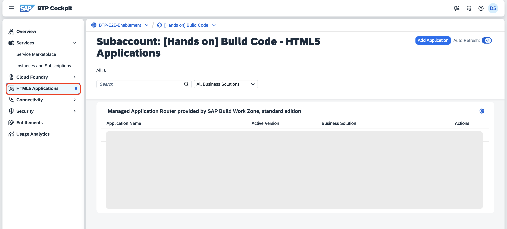

3. Click on the application which is having your Business Solution. 

## Testing end to end.

1. Once you open the application, click on the URL under **Web Applications**.

    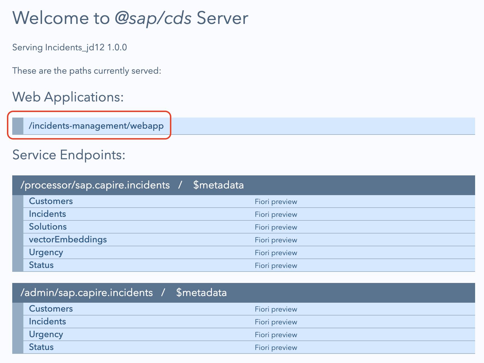

2. Click on **Go**, which loads all the incidents.

    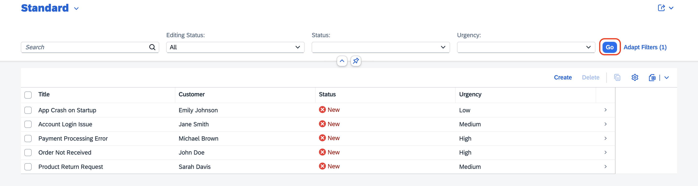

3. Click on **Create**.

    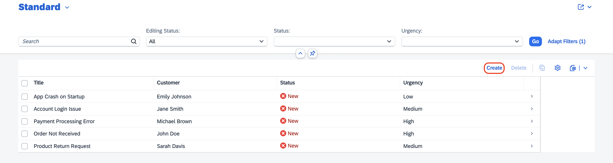

4. Fill in the incident details:

    1. In the **Title** field, enter **Laptop issue**.
    
    2. In the **Customer** dropdown menu, select a customer of your choice.

        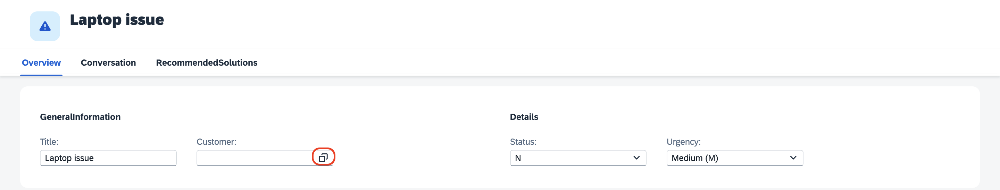

    3. Leave the **Status** and **Urgency** fields with its default value.

    4. Under **Conversation**, click on **Create**.

        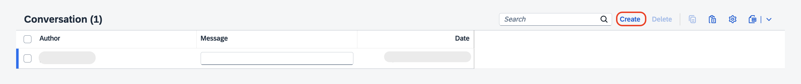

    5. Enter the Message as **Laptop is too slow**.

    6. Click on **Create**.

        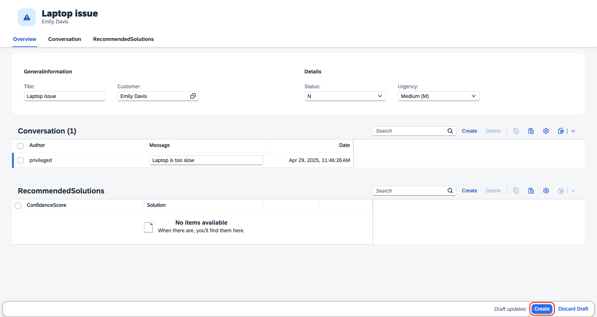

5. Under **Recommended Solutions**, you will be able to see the solutions with the confidence score.

    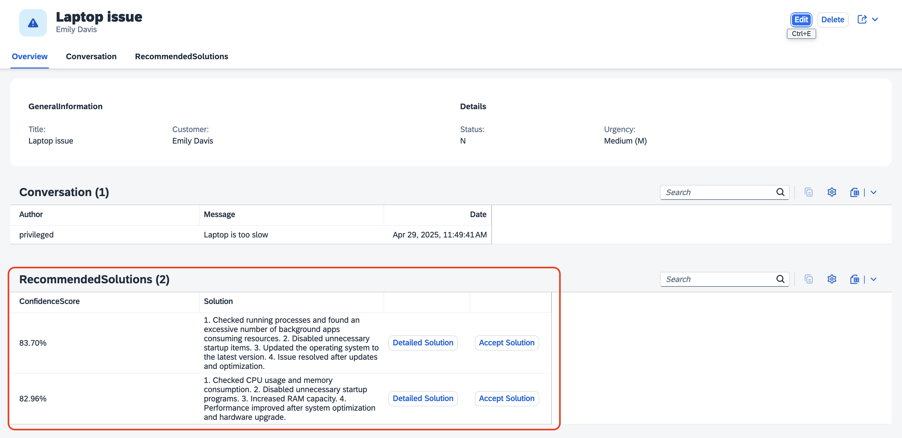

6. Click on **Accept Solution** which you find meaningful and with highest Confidence Score.

    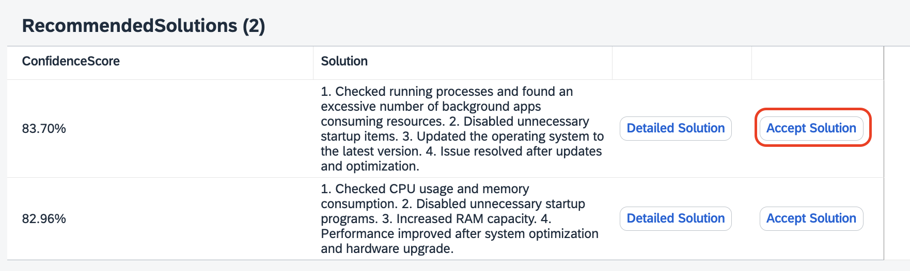

7. In the dropdown, click on **Yes**, if the recommended solution worked. And click on **Accept Solution** again.

    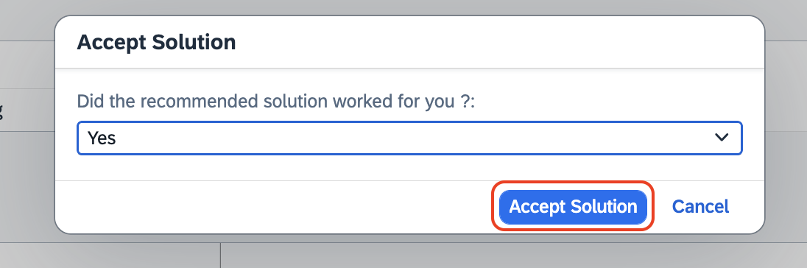

8. You will get a notification as **Data added successfully!**

    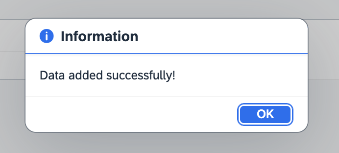

9. If you want to check the detailed solution, click on **Detailed Solution**, which gives a detailed step by step solution for the issue.

    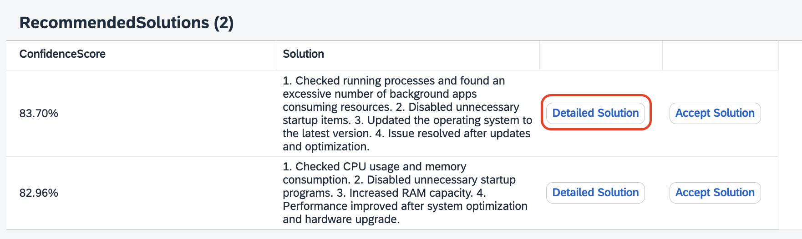
