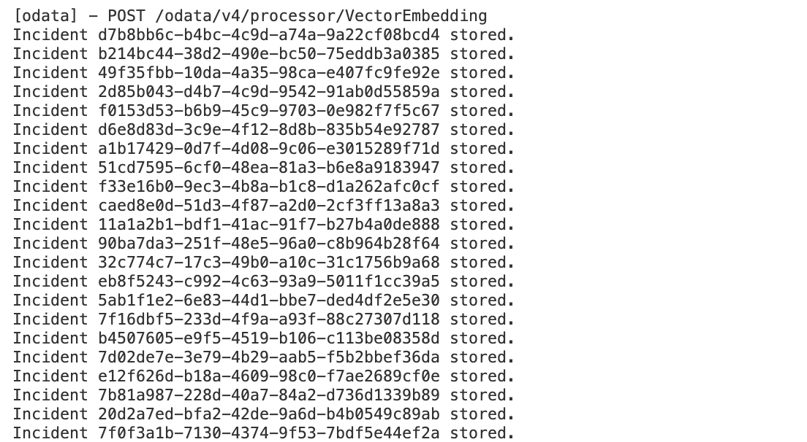
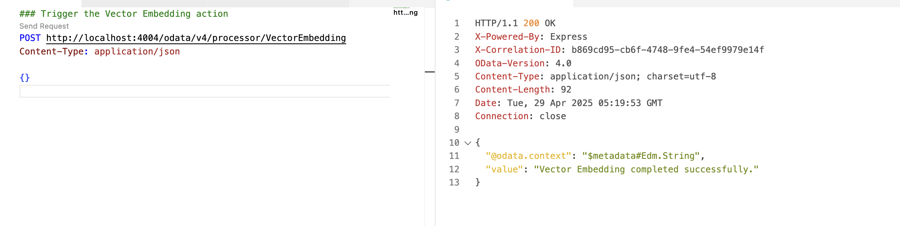
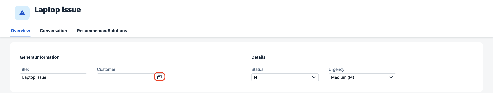
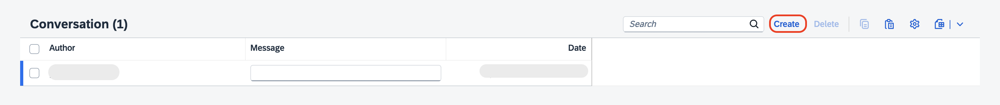
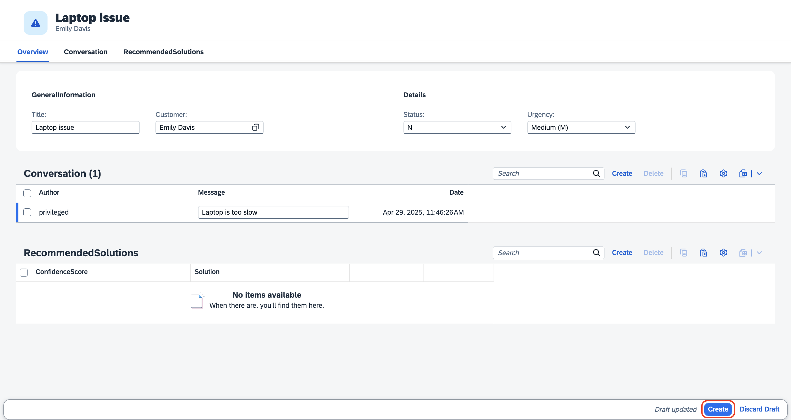
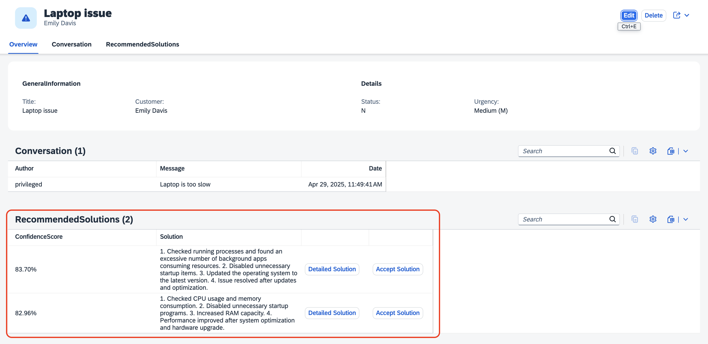
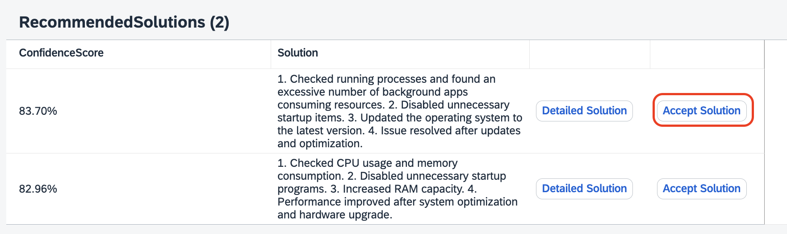
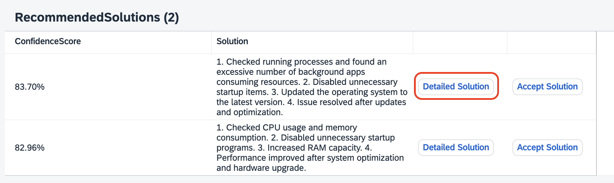

## Test the Incident Management Application

## Prerequisite

[Extend the Incident Management Application](./extend-service.md)

## Feed the data 

1. Open the terminal, and start the application by following the below command:

```sh
cds watch --profile hybrid
```

2. Open the `request.http` file and click on **Send Request**.

    

> In the terminal, you can see the data from `Incidents.csv` file is getting stored. Please wait for sometime, until all the data gets stored.


3. Once its completed, you will get the Response as **200**.

    

4. In the terminal, scroll up to find the application running details. Click on the url where the localhost is running to access the application.

    

> [!Tip]
> Open the URL in the browser, by following
>
> For windows, Ctrl + click on the URL
>
> For Mac, command + click on the URL

## Testing end to end.

1. Once you open the application, click on the URL under **Web Applications**.

    

2. Click on **Go**, which loads all the incidents.

    

3. Click on **Create**.

    

4. Fill in the incident details:

    1. In the **Title** field, enter **Laptop issue**.
    
    2. In the **Customer** dropdown menu, select a customer of your choice.

        

    3. Leave the **Status** and **Urgency** fields with its default value.

    4. Under **Conversation**, click on **Create**.

        

    5. Enter the Message as **Laptop is too slow**.

    6. Click on **Create**.

        

5. Under **Recommended Solutions**, you will be able to see the solutions with the confidence score.

    

6. Click on **Accept Solution** which you find meaningful and with highest Confidence Score.

    

7. In the dropdown, click on **Yes**, if the recommended solution worked. And click on **Accept Solution** again.

    

8. You will get a notification as **Data added successfully!**

    

9. If you want to check the detailed solution, click on **Detailed Solution**, which gives a detailed step by step solution for the issue.

    

## Go back to the [Home Page](../../build-code-with-ai-capability/README.md#optional-exercise-3-deploy-in-sap-btp-cloud-foundry-runtime) to deploy to the Cloud Foundry Runtime.