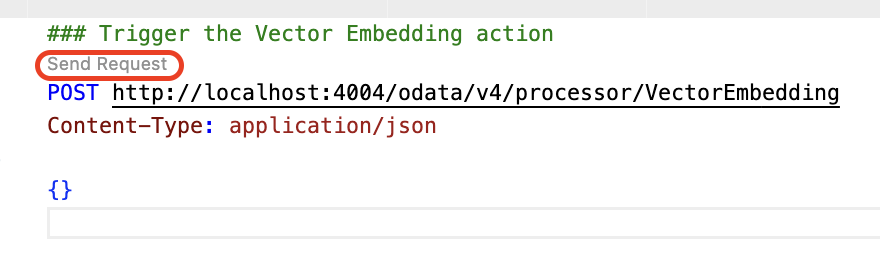

## Test the Incident Management Application

## Prerequisite

[Extend the Incident Management Application](./extend-service.md)

## Feed the data 

1. Open the terminal, and start the application by following the below command:

```sh
cds watch --profile hybrid
```

2. Open the `request.http` file and click on **Send Request**.

    

> In the terminal, you can see the data from Incidents.csv file is getting trained, please wait for sometime. you will see the Response as 200. 

3. Once completed, you will see the Response as 200.

    

4. Go back to the terminal where the application is running, click on the url where the localhost is running

    

> [!Tip]
> Open the URL in the browser, by following
>
> For windows, Ctrl + click on the URL
>
> For Mac, command + click on the URL

## Testing end to end.

1. Once you open the application, click on the URL under **Web Applications**.

    

2. Click on **Go**, which loads all the incidents.

    

3. Fill in the incident details:

    1. In the **Title** field, enter **Printer not working**.
    
    2. In the **Customer ID** dropdown menu, select a customer of your choice.

        image

    3. Leave the **urgency_code** and **status_code** fields.

    4. Choose **Create**.

        

