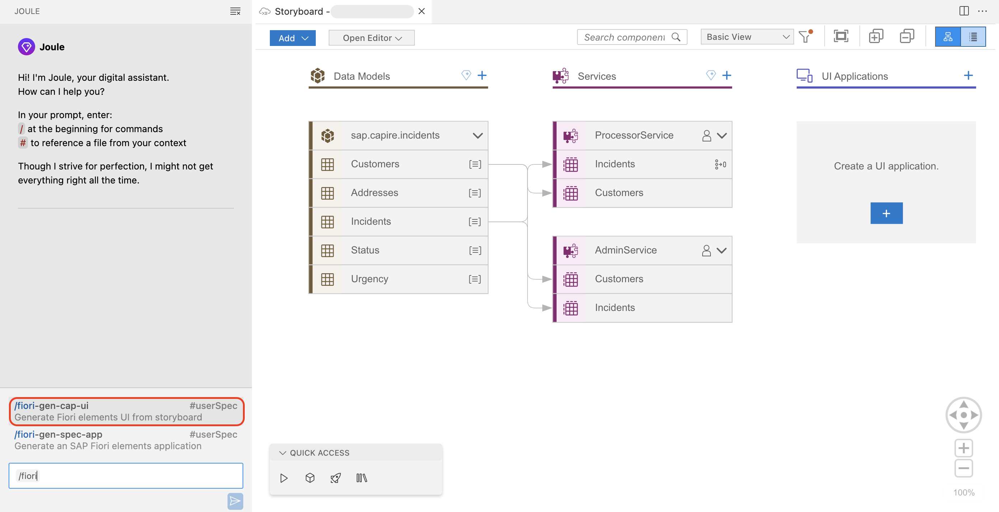
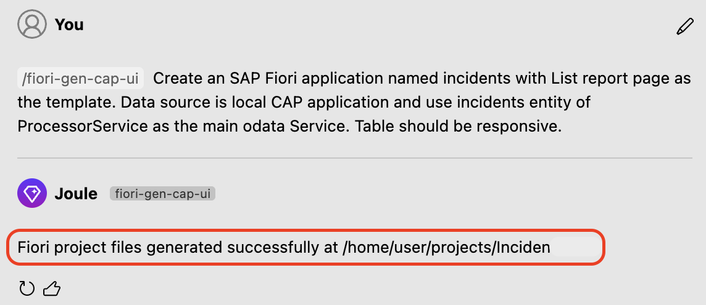
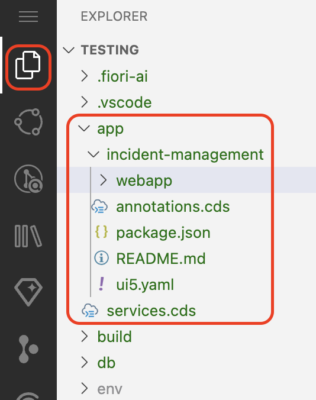

## Create a SAP Fiori UI with Joule

This section describes how to create a UI application using a Joule prompt.

## Prerequisites

You have created custom logic following the steps at [Create Backend Logic with Joule](custom-logic.md).

## Generate an SAP Fiori UI

1. In Joule, start typing ```/fiori``` and select **/fiori-gen-cap-ui** from the suggestions.

> [!Note]
> If you are not able to find the `/fiori-gen-cap-ui`, please refresh the page.



2. Use the following prompt to create a user interface.

    ```
    Create an SAP Fiori application named incidents with List report page as the template.
    Data source is local CAP application and use incidents entity of ProcessorService as the main odata Service.
    Table should be responsive.
    ```

    > The prompt asks Joule to create an SAP Fiori application with List report as the SAP Fiori template. Because there might be many services, mention which service you want to be mapped with the UI application. In this case, ProcessorService is the OData service and incidents is the main entity in it. 

3. Joule responds with `files generated successfully`.

    

> [!Note]
> If you want to create a SAP Fiori Application manually using the SAP Fiori Elements Template
> Follow [Generate the UI with an SAP Fiori Elements Template](../../build-code/document/generate-ui.md)

4. Joule creates a  SAP Fiori application using the List Report template in SAP Fiori Elements, with a local CAP  service as the data source

5. Go to **Explorer**. In the **app** folder, check that the following folder structure is generated.

    

6. From the root of the project, choose the burger menu, and then choose Terminal → New Terminal.

     

7. Run `cds watch` in the terminal.

8. Click on the url where the localhost is running to access the application.

    

> [!Tip]
> Open the URL in the browser, by following
>
> For windows, Ctrl + click on the URL
>
> For Mac, command + click on the URL

9. Once you open the application, click on the URL under **Web Applications**.

    

10. Click on **Go**, which loads all the incidents.

    

> [!Note]
> If you want to stop the application, click `Ctrl + C`.

## Go back to the [Home Page](../../build-code-with-ai-capability/README.md#exercise-2-add-ai-capabilities-using-sap-ai-sdk) to continue with Exercise 2 on adding AI capabilities using SAP AI SDK
