# Integrate Your Application with SAP Build Work Zone, Standard Edition

This tutorial shows you how to subscribe to the SAP Build Work Zone, standard edition.

## Prerequisite

Deploy your application in SAP BTP, Cloud Foundry and test using [Deploy in SAP BTP, Cloud Foundry Runtime](deploy-cf.md)

#### Update content

1. Open SAP Build Work Zone.

2. Click on **Channel Manager** from the left navigation bar. 

3. Choose the refresh icon to fetch the updated content.

    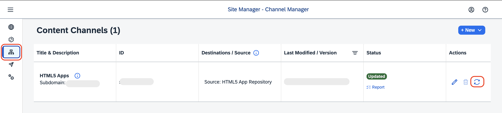

#### Add application to Content Explorer

1. Choose **Content Manager** icon in the menu on the left and choose the **Content Explorer** button.

    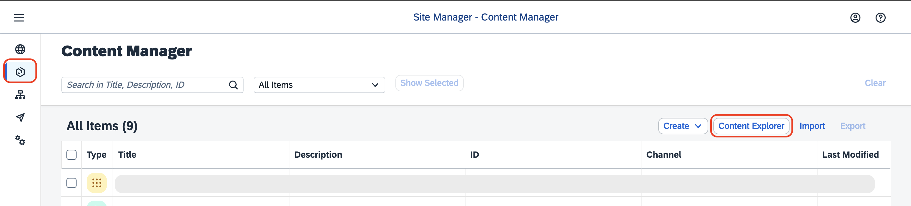

2. Select the tile HTML5 Apps with your respective subdomain name.

    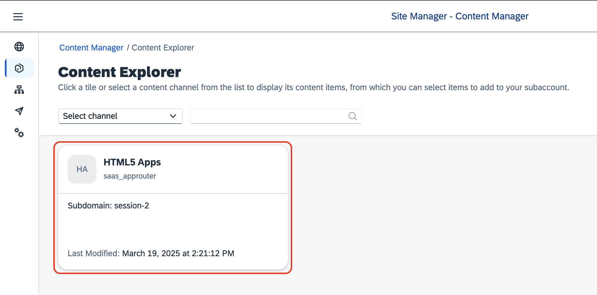

3. In the items table, set checkmark for the application Incidents and choose the button Add.

>[!Note]
> While clicking on the checkmark, make sure you are selecting the application with the ID you have created

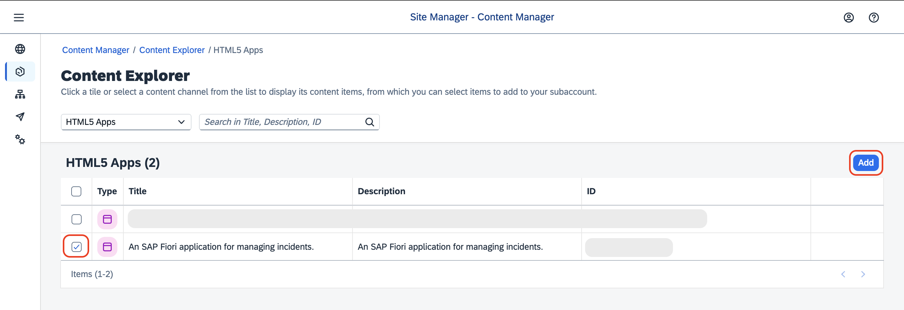

#### Create a group

1. Go back to the **Content Manager**, choose Create → Group.

    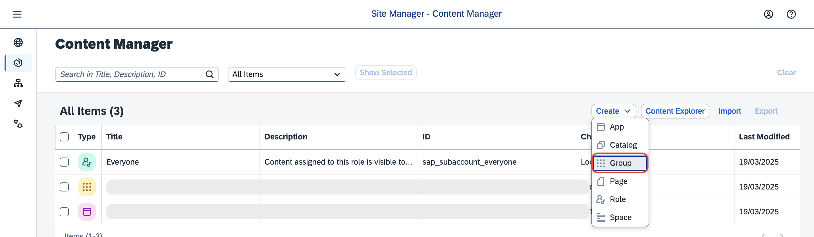

2. Add the title `Incident Management Group <your-initials><unique-random-number>`. For example, title would be **Incident Management Group JD12**.

3. In the Assignment Status, choose the slider to assign the Incident-Management app to the group.

>[!Note]
> While clicking on the slider, make sure you are selecting the application with the ID you have created

4. Choose Save.
    
    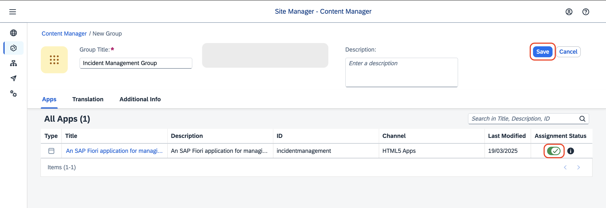

#### Add application to the Everyone role
1. Back in the Content Manager, choose role Everyone and choose Edit.

    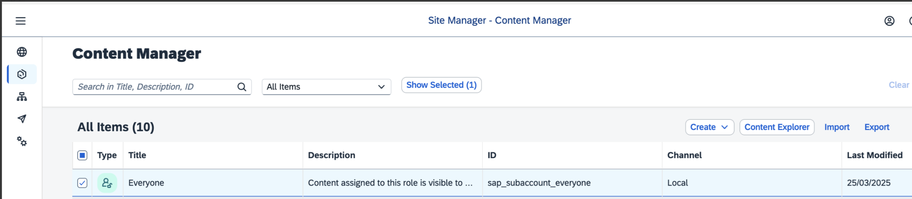

2. In the Assignment Status, choose the slider to assign the Incident-Management app to the role.

3. Choose Save.

    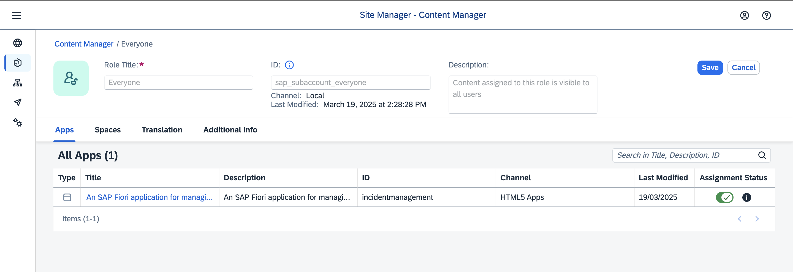

#### Create site

1. Navigate to Site Directory and choose **Create Site**.

    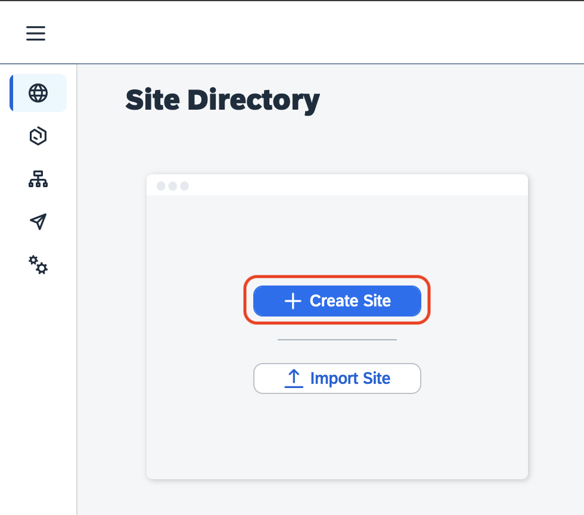

2. Enter the site name as `Incident Management Site <your-initials><unique-random-number>` and choose **Create**.

    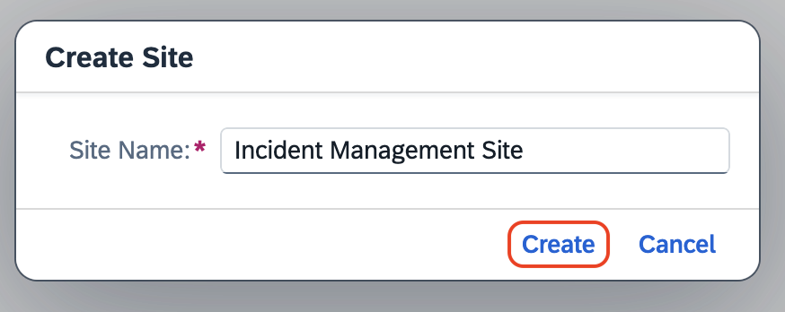

3. Now, you are forwarded to your created site.

#### Test your site

1. Navigate to Site Directory and find your site.

    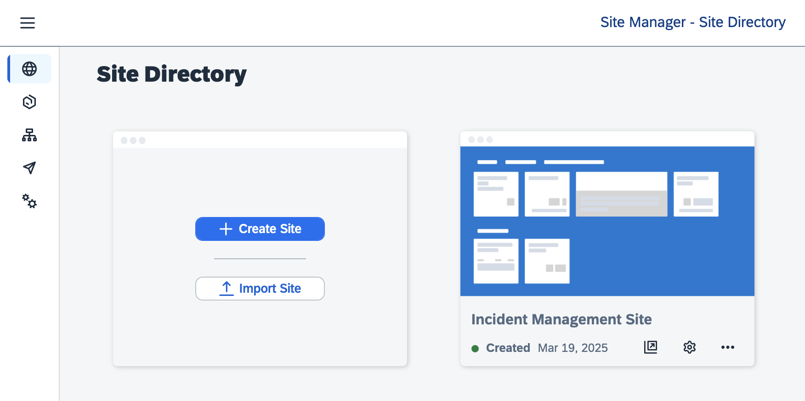

2. Choose **Go to site**.

    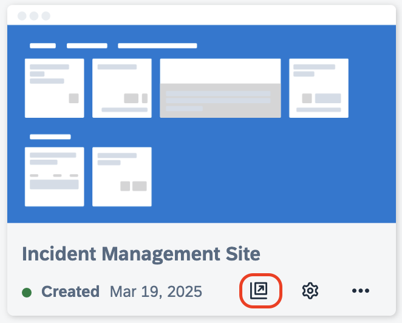

3. Choose the Incident Management application from the launch page.

    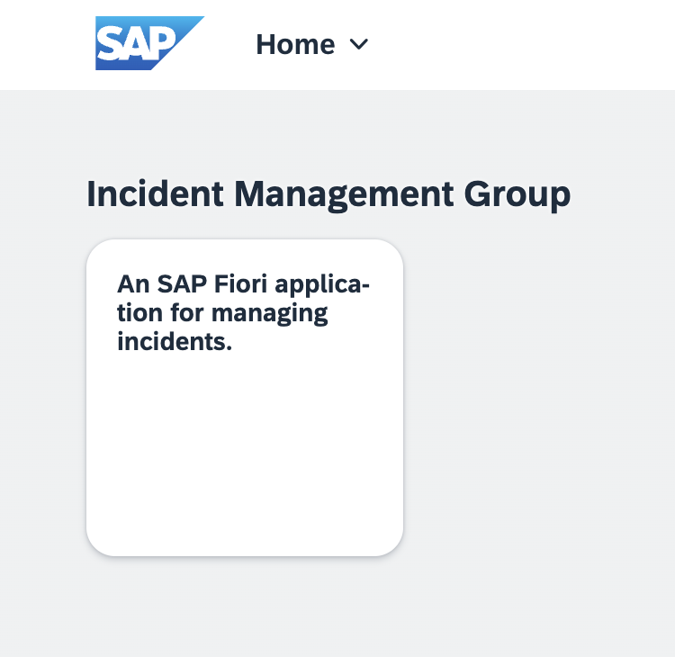

    You should be able to see the list report page.

    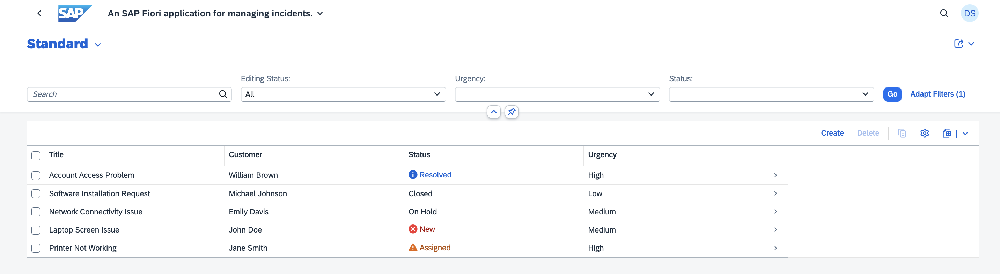

## Next Step

Test the flow end to end by following the steps at [Test the Application End to End](e2e-testing-cf.md).

