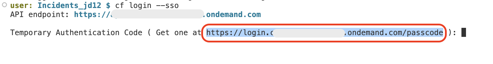

# Add dependencies for SAP Cloud SDK for AI 

## Add and Install required packages

1. Open Package.json and add the below dependencies

```json
"dependencies": {
    ...
    "@sap-ai-sdk/foundation-models": "^1.12.0",
    "@sap-ai-sdk/langchain": "^1.12.0",
    "csv-parser": "^3.2.0",
    "fs": "^0.0.1-security",
    "natural": "^8.0.1"
},
```

> [!Note]
> These packages are needed for 

2. From the root of the project, choose the burger menu, and then choose Terminal → New Terminal.

     

3. Run `npm install` to install the required dependencies.

## Login to Cloud Foundry

1. In the terminal, log in to your subaccount in SAP BTP by following the below commands:

```sh
cf api <API-ENDPOINT>
cf login --sso
```

> [!Note]
> You can find the API endpoint in the Overview section of your subaccount in the SAP BTP cockpit.
 

2. Copy the URL to get the Temporary Authentication Code and paste it in new tab.

    

3. Find the text box for **Enter the origin key** and click on **Sign in with alternative identity provider**.

    > Note: Ask the instructor for the origin key

    

    > Note: When choosing **Sign in with alternative identity provider**, if your are prompted to sign in, enter your username and password.
    > If you are signed in with Default Identity, you can choose to sign in with default identity provider.

4. Choose the **Copy** icon to get a temporary authentication code.

    

5. Paste the copied code in the terminal and click the enter key.

6. Select the relevant org and enter.

7. Select the created space and enter.

## Setup initial data for Incident Management Application

1. Open `schema.cds` and add the following code snippets:

    1. Under `Incidents` entity, add the `solutions`.

        ```sh
        solutions    : Composition of many {
            key ID    : UUID;
            confidence : String;
            solution   : String;
        };
        ```

    2. Add a new entity called `vectorEmbeddings`.

        ```sh
        entity vectorEmbeddings : cuid, managed{
            metadata   : LargeString;
            text_chunk : LargeString;
            embedding  : Vector(1536);
            solution   : LargeString;
        }
        ```

2. The sample data generated in the previous steps, creates the **data** folder in the **test** folder. To use the data for productive usgae, move the **data** folder to the **db** folder. Open the terminal, and run the following command to move the csv files.

    ```sh
    mv test/data db/data
    ```

3. Do the productive build for your application, by running the below command in the terminal.

    ```sh
    cds build --production
    ```

4. Deploy the csv files to the hana database, by running the below command in the terminal.

    ```sh
    cds deploy --to hana
    ```
 
    > [!Note]
    > It might take few seconds to finish the deployment to hana, once done, you get the successful deployment message.
    

## Create service binding to SAP Destination Service

1. Create the instance and binding by running the below commands in the terminal.

```sh
cf create-service destination lite <destination-name>
cds bind --to <destination-name>
```

## Next Step

[Extend the Incident Management Application](extend-service.md)
