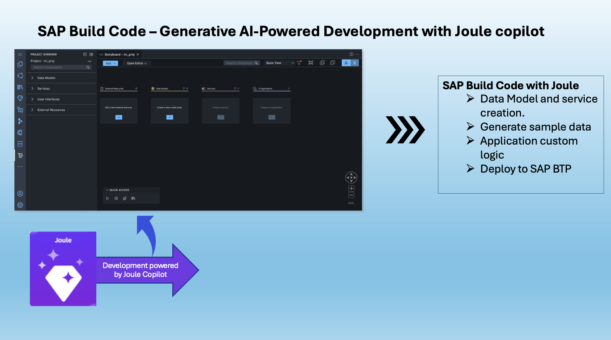
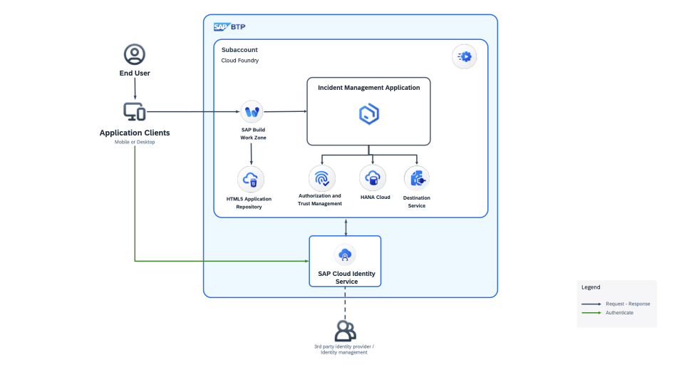

# Develop Full Stack BTP CAP Applications Using SAP Build Code With Joule

In this hands-on exercise, you will learn how to jumpstart your application development of a full-stack SAP Cloud Application Programming Model (CAP)-based application using SAP Build Code powered by Joule, which is the AI copilot that understands your business and can interact with your SAP business systems.

## Key Capabilities of SAP Build Code

SAP Build Code offers an AI-powered cloud development environment specifically tailored for SAP Cloud Application Programming Model (CAP), SAP Fiori, mobile, and SAPUI5 developers. SAP Buid Code:
- Enables developers to code faster and smarter, generates code from natural language descriptions using generative AI.
- Builds extension applications, and integrates them with SAP and non-SAP systems.
- Uses the centralized Lobby for fusion development.

## SAP Build Code Powered by Joule

By seamlessly integrating coding, testing, and application management, SAP Build Code streamlines the application development process on SAP BTP. It combines SAP Business Application Studio with the most essential services and SDKs on SAP BTP.

With the integration of Joule, the innovative AI copilot of SAP, SAP Build Code enables automatic generation of application code, data models, services, and sample data. Using SAP Build Code ensures adherence to the best practices and guidance outlined in the [SAP BTP Developer's Guide](https://help.sap.com/docs/btp/btp-developers-guide/btp-developers-guide?version=Cloud).

# Business Scenario

In this hands-on exercise, you will build an application called Incident Management using SAP Build Code. The business scenario of the Incident Management application is the following:

ACME is a popular Electronics company. ACME hires call center support representatives to process and manage customer incidents. A call center support representative (Processor) receives a phone call from an existing customer and creates a new incident on behalf of the customer. The newly created incident is based on a customer complaint received during the phone call. The call center support representative also adds the conversation with the customer to the incident for future reference.

# Solution Diagram

## Important Links

[SAP Build Lobby](https://handson-workshop.eu10.build.cloud.sap/lobby)

[SAP BTP Subaccount](https://emea.cockpit.btp.cloud.sap/cockpit/?idp=pesworkshops.accounts.ondemand.com#/globalaccount/a9030b2a-ed51-438e-9166-241ce6c0291d/subaccount/4a9f366b-1fda-44b1-b44f-b4cad2a04b1d&//detail/7f6a71ba-a54c-4c87-b5d6-f6a0322670a1/?layout=TwoColumnsMidExpanded)

## Exercise 1: Develop Basic Incident Management Application using SAP Build Code CAP

1. [Create the Project](./document/create-full-stack-project.md)
2. [Create Data Entities](./document/create-data-entities.md)
3. [Add Sample Data](./document/enhance-sample-data.md)
4. [Add CDS Services](./document/generate-service.md)
5. [Add Business Logic with Joule](./document/custom-logic.md)
6. [Add Fiori UI Using Joule](./document/fiori-ui.md)
7. [[Optional] Extend the Fiori UI](./document/extend-fiori-ui.md)
8. [Add Test Cases](./document/testcase.md)

## Exercise 2: Deploy in SAP BTP, Cloud Foundry Runtime

1. [Create Space in SAP BTP](./document/create-space.md)
2. [Deploy to SAP BTP, Cloud Foundry Runtime](./document/deploy-cf.md)
3. [Integrate Your Application with SAP Build Work Zone, Standard Edition](./document/integrate-workzone.md) 
4. [Test the Scenario End to End](./document/e2e-testing.md)

