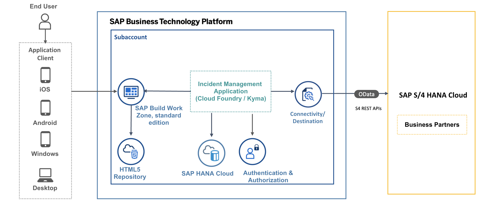

# Introduction
SAP BTP Applications need to connect to SAP systems to fetch and and process data. 

You can find the APIs exposed by an SAP system that you need to complete your extension scenario in [SAP Business Accelerator Hub](https://api.sap.com/).  
SAP BTP Connectivity allows SAP BTP applications to securely access APIs that run on the Internet or on-premise. 
To allow applications running on SAP BTP to consume SAP S/4HANA Cloud APIs, you need to create a service instance of the [SAP S/4HANA Cloud Extensibility service](https://help.sap.com/docs/btp/sap-business-technology-platform/create-service-instance-to-consume-sap-s-4hana-cloud-apis?locale=en-USstate%3DPRODUCTION).

# Business Scenario

In this tutorial, we will integrate SAP S/4 HANA Public Cloud Business Partner API to the Incident Management application.

The Incident Management application helps call center support representatives process and manage customer incidents. A support representative (processor) receives a phone call from an existing customer and creates a new incident on behalf of the customer.

When a new incident is created by the processor, they have to assign the incident to the respective customer. The option to choose a customer will be given as a value help and the list of customers in the value help will be fetched from the SAP S/4HANA Public Cloud system. 

# Solution Diagram

  

# Next Step

[Extend the Incident Management аpplication](./extend-app-cf.md)