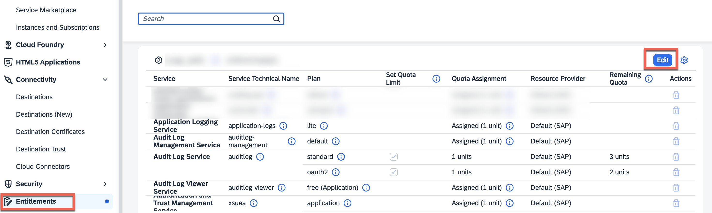
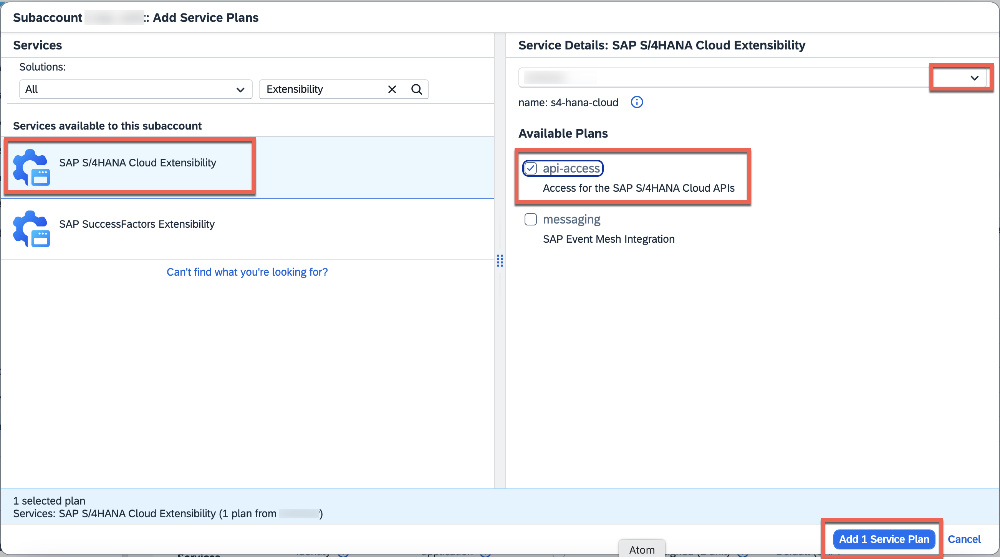
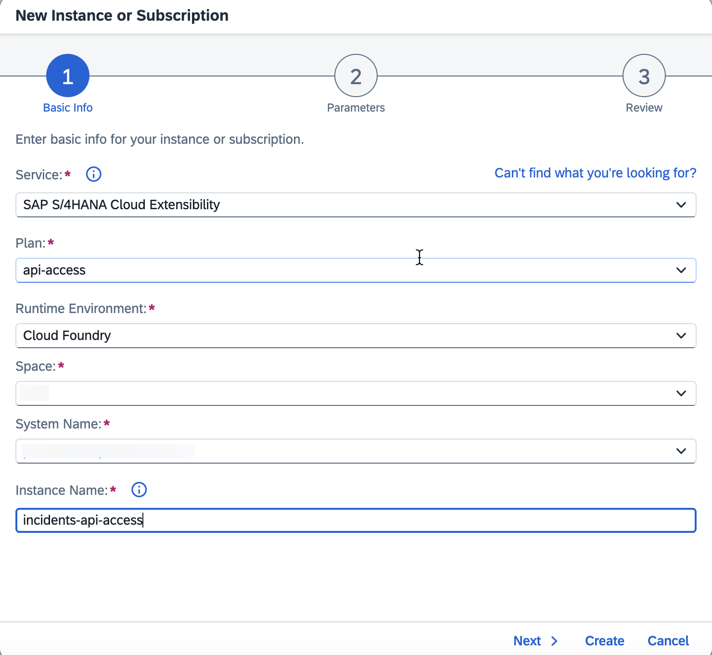

# Prepare the Project for Production

## Usage Scenario

To use the SAP S/4HANA Cloud Extensibility service to access the Business Partner API, you need some additional configurations.


## Prerequisites

You have set up the connection to an SAP S/4HANA Cloud system. See [Configure the connectivity between SAP S/4HANA Cloud and SAP BTP](./s4hana-cloud-to-btp-connectivity.md). 

## Add Entitlement for SAP S/4HANA Cloud Extensibility

1. Navigate to the Subaccount where you want to add the entitlement.

2. Choose `Entitlements`, then select `Edit`.

    

3. Choose `Add Service Plans`.

4. Search for SAP S/4HANA Cloud Extensibility Service, select the system from the dropdown and select service plan api-access and choose `Add 1 Service Plan`.

    

5. Choose `Save`.

## Create a Service Instance for SAP S/4HANA Cloud Extensibility

1. In the Subaccount, navigate to `Instances and Subscriptions`.

2. Choose Create, and in the dropdown, search for and select SAP S/4HANA Cloud Extensibility.

3. Choose the Service Plan you added in the entitlement step.
4. Select the Runtime Environment (e.g. Cloud Foundry).
5. Provide a meaningful Instance Name and Choose `Next`.
     


6. Copy the below content and paste it in the Instance parameters. 

    ```json
    {
        "systemName": "<SYSTEM_NAME>",
        "communicationArrangement": {
            "communicationArrangementName": "<COMM_NAME>",
            "scenarioId": "SAP_COM_0008",
            "inboundAuthentication": "BasicAuthentication",
            "outboundAuthentication": "BasicAuthentication",
            "outboundServices": [
                {
                    "name": "Replicate Customers from S/4 System to Client",
                    "isServiceActive": false
                },
                {
                    "name": "Replicate Suppliers from S/4 System to Client",
                    "isServiceActive": false
                },
                {
                    "name": "Replicate Company Addresses from S/4 System to Client",
                    "isServiceActive": false
                },
                {
                    "name": "Replicate Workplace Addresses from S/4 System to Client",
                    "isServiceActive": false
                },
                {
                    "name": "Replicate Personal Addresses from S/4 System to Client",
                    "isServiceActive": false
                },
                {
                    "name": "Business Partner - Replicate from SAP S/4HANA Cloud to Client",
                    "isServiceActive": false
                },
                {
                    "name": "Business Partner Relationship - Replicate from SAP S/4HANA Cloud to Client",
                    "isServiceActive": false
                },
                {
                    "name": "Business Partner - Send Confirmation from SAP S/4HANA Cloud to Client",
                    "isServiceActive": false
                },
                {
                    "name": "BP Relationship - Send Confirmation from SAP S/4HANA Cloud to Client",
                    "isServiceActive": false
                }
            ],
            "communicationSystem": {
                "communicationSystemHostname": "default.com",
                "outboundCommunicationUser": {
                    "username": "DefaultUser",
                    "password": "DefaultPassword"
                }
            }
        }
    }
    ```

- Enter the name of your registered SAP S/4HANA Cloud system, we have already registered the system in SAP SAP Business Technology Platform (BTP) account for this handson.
- For **communicationArrangementName**, enter a speaking name for your communication arrangement (e.g. INCIDENT_MANAGEMENT_0008).

For more information, see [Communication Arrangement JSON/YAML File - Properties](https://help.sap.com/viewer/65de2977205c403bbc107264b8eccf4b/Cloud/en-US/553a4c6b98be4c1ba7d1dfa0e9df8669.html).

7. Choose `Create`.
