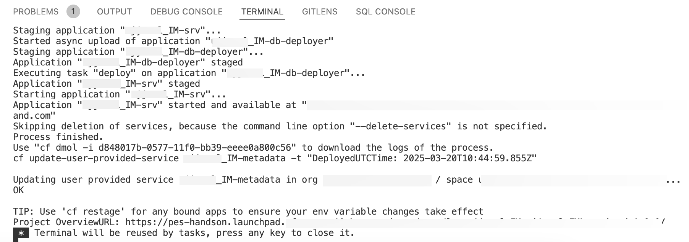

# Deploy and Run the Application on Cloud Foundry with SAP S/4HANA Cloud Backend

## Usage Scenario

Deploy the project to Cloud Foundry using the MTA build file.

## Prerequisites

You have prepared the project for productive usage in [previous exercise]((./prep-for-prod.md)).

## Content

In this section you will extend the existing MTA build file with the settings for SAP S/4HANA Cloud extension service.

## Deploy the Application

1. Add SAP S/4HANA Cloud API access service. Open *mta.yaml* file which you can find in root folder.

2. Add the following code snippet to the *resources* section

    ```yaml
      - name: <SERVICE-NAME>
        type: org.cloudfoundry.managed-service  
        parameters:
          path: ./bupa.json
          service: s4-hana-cloud
          service-plan: api-access
          system-name: <SYSTEM-NAME>
    ```

- Enter **pes-workshop-s4hana-cloud** as the *systemName* of your registered SAP S/4HANA Cloud system, we have already registered the system in SAP SAP Business Technology Platform (BTP) account for this handson.

- Replace *SERVICE-NAME* with `incidents<your-initials><unique-random-number>-api-access`. For example, if your name is `John Doe`, then the service-name would be **incidentsjd12-api-access**, (12 is unique random number)

3. Navigate to **Task Explorer** and run **Enable Discovery and Deploy**.

    

> [!Note]
> Make sure you have already logged in into Cloud Foundry in [previous exercise](../deploy-cf.md#deploy-the-application)  

4. Once deployment is successful you will get confirmation message in terminal

   

Before you can access the application, make sure you have [Assign Application Roles](../deploy-cf.md#assign-the-user-roles) in previous exercise.

Make sure in previous exercise you have [Integrate with SAP Build Workzone](../integrate-workzone.md) to access the application in launchpad.

## Next Step

[Test the end to end flow](./test-the-app.md)