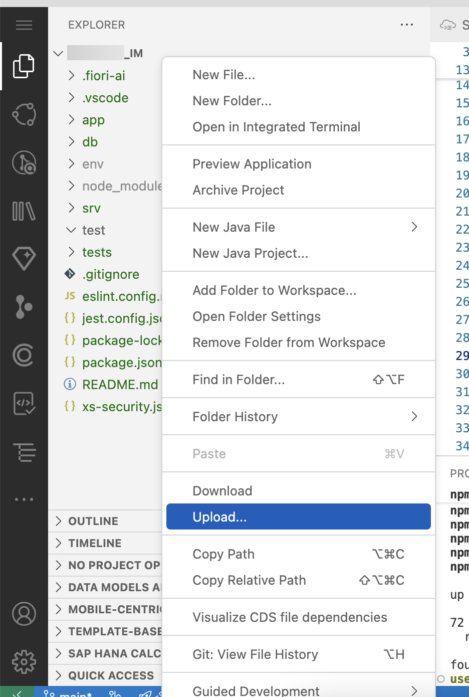

# Extend the Incident Management Application

1. Open SAP Build Code.

2. Navigate to the project's root folder of the Incident Management application. 

3. Open the a new Terminal 

4. Undeploy the old version of Application. 
  - Run the command `cf mtas`. This will display all the MTA applications which are listed. Copy the name of your MTA Application which will be like `Incidents<Initial><unique number>` e.g IncidentsJD12
  - Undeploy the application by running the command cf undeploy IncidentsJD12 --delete-services --delete-service-keys

5. Wait a few minutes untill the application is fully undeployed and the successmessage is displayed
   
6. Add some additional libraries to the *package.json* for the communication with external systems. In the terminal, go to the project's root folder of the Incident Management application and run the following command:  
   
   ```bash
   npm add @sap-cloud-sdk/http-client@3.x @sap-cloud-sdk/util@3.x @sap-cloud-sdk/connectivity@3.x @sap-cloud-sdk/resilience@3.x
   ```

7. Import the Business Partner API to your project by following the below steps

   * In the project explorer, right-click on the empty space under root folder and select **Upload...**

     

   * Select the *API_BUSINESS_PARTNER.edmx* file and upload it to your project folder.
   * In the terminal, run the following command:
  
      ```bash
      cds import API_BUSINESS_PARTNER.edmx --as cds
      ```
   * You can find two new files `API_BUSINESS_PARTNER.cds` and `API_BUSINESS_PARTNER.edmx` will be generated under the **srv/external** folder.

8. Change the conditions for the relationships between some of the entities. Open **srv/external/API_BUSINESS_PARTNER.cds**. Search for **entity API_BUSINESS_PARTNER.A_BusinessPartner**. Scroll down to the **to_BusinessPartnerAddress** section and replace it with the following:

    ```js
    to_BusinessPartnerAddress : Composition of many API_BUSINESS_PARTNER.A_BusinessPartnerAddress on to_BusinessPartnerAddress.BusinessPartner = BusinessPartner;
    ```

9. Search for **entity API_BUSINESS_PARTNER.A_BusinessPartnerAddress**. Scroll down to the **to_EmailAddress** section and replace the associations for email address with the following.

    ```js
    to_EmailAddress : Composition of many API_BUSINESS_PARTNER.A_AddressEmailAddress on to_EmailAddress.AddressID = AddressID;
    ```

10. Scroll down to the **to_PhoneNumber** section under **entity API_BUSINESS_PARTNER.A_BusinessPartnerAddress** and replace the associations for phone number with the following.

    ```js
    to_PhoneNumber : Composition of many API_BUSINESS_PARTNER.A_AddressPhoneNumber on to_PhoneNumber.AddressID = AddressID;
    ```

11. Create a new file *remote.cds* in the *srv* folder.

    

12. Copy the snippet to the newly created *remote.cds* file:

    ```js
    using { API_BUSINESS_PARTNER as S4 } from './external/API_BUSINESS_PARTNER';

    service RemoteService {
      entity BusinessPartner as projection on S4.A_BusinessPartner {
        key BusinessPartner as ID,
        FirstName as firstName,
        LastName as lastName,
        BusinessPartnerName as name,
        to_BusinessPartnerAddress as addresses
      }
      entity BusinessPartnerAddress as projection on S4.A_BusinessPartnerAddress {
                BusinessPartner as ID,
                AddressID as addressId,
                to_EmailAddress as email,
                to_PhoneNumber as phoneNumber
      }
      entity EmailAddress as projection on S4.A_AddressEmailAddress {
          key AddressID as addressId,
          EmailAddress as email
      }

      entity PhoneNumber as projection on S4.A_AddressPhoneNumber {
          key AddressID as addressId,
          PhoneNumber as phone
      }
    }
    ```

13. Add some buisness logic for reading and saving a business partner. 
   * Open the **srv/service.js** file. 
   * Make sure `init` method is set to `async`:
  
      ```js
      async init() {
        this.before("UPDATE", "Incidents", (req) => this.onUpdate(req));
        this.before(["CREATE", "UPDATE"], "Incidents", (req) => this.changeUrgencyDueToSubject(req.data));

        return super.init();
      }
      ```
   * Add a custom handler for READ of customers in the init() method:
      
      ```js
      this.on('READ', 'Customers', (req) => this.onCustomerRead(req));
      ```

   * Add the custom handler implementation after the *init* method:
  
      ```
      async onCustomerRead(req) {
        console.log('>> delegating to S4 service...', req.query);
        const top = parseInt(req._queryOptions?.$top) || 100;
        const skip = parseInt(req._queryOptions?.$skip) || 0;
        
        const { BusinessPartner } = this.remoteService.entities;

        // Expands are required as the runtime does not support path expressions for remote services
        let result = await this.S4bupa.run(SELECT.from(BusinessPartner, bp => {
          bp('*'),
            bp.addresses(address => {
              address('email'),
                address.email(emails => {
                  emails('email');
                });
            })
        }).limit(top, skip));
        
        result = result.map((bp) => ({
          ID: bp.ID,
          name: bp.name,
          email: bp.addresses[0]?.email[0]?.email
        }));

        // Explicitly set $count so the values show up in the value help in the UI
        result.$count = 1000;
        console.log("after result", result);
        return result;
      }  
		
      ```

   *  Add a custom handler for CREATE, UPDATE, DELETE of incidents. Add this code snippet to the *init* method:

      ```js
      this.on(['CREATE','UPDATE'], 'Incidents', (req, next) => this.onCustomerCache(req, next));
      this.S4bupa = await cds.connect.to('API_BUSINESS_PARTNER');
      this.remoteService = await cds.connect.to('RemoteService');
      ```
    
   * Add the custom handler after the *onCustomerRead* method created in above step:  

      ```
      async onCustomerCache(req, next) {
        const { Customers } = this.entities;
        const newCustomerId = req.data.customer_ID;
        const result = await next();
        const { BusinessPartner } = this.remoteService.entities;
        if (newCustomerId && (newCustomerId !== "") && ((req.event == "CREATE") || (req.event == "UPDATE"))) {
          console.log('>> CREATE or UPDATE customer!');

          // Expands are required as the runtime does not support path expressions for remote services
          const customer = await this.S4bupa.run(SELECT.one(BusinessPartner, bp => {
            bp('*'),
              bp.addresses(address => {
                address('email', 'phoneNumber'),
                  address.email(emails => {
                    emails('email')
                  }),
                  address.phoneNumber(phoneNumber => {
                    phoneNumber('phone')
                  })
              })
          }).where({ ID: newCustomerId }));
                                                                                        
          if(customer) {
            customer.email = customer.addresses[0]?.email[0]?.email;
            customer.phone = customer.addresses[0]?.phoneNumber[0]?.phone;
            delete customer.addresses;
            delete customer.name;
            await UPSERT.into(Customers).entries(customer);
          }
        }
        return result;
        }
        ```

    

14. To execute the tests, created in [add testcase exercise](../testcase.md) run following command: 

    ```sh
    npm run test
    ```

 ## Result
 You have integrated the Business Partner API into your project and business logic to read the data from the backend system. New or changed customer data would be stored in your application database.

# Next

[Run a developer test with mock data](./test-with-mock.md)
