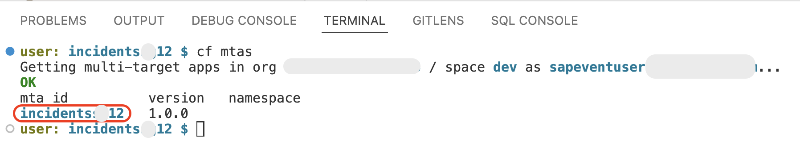
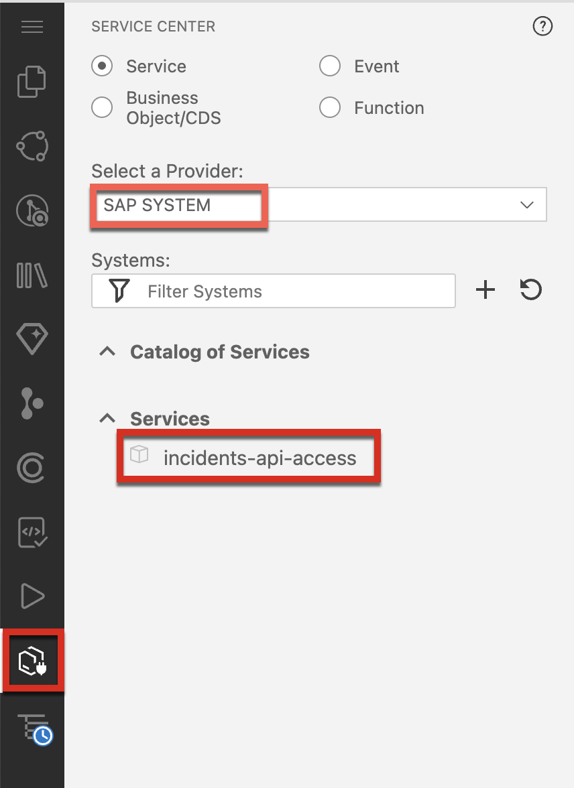
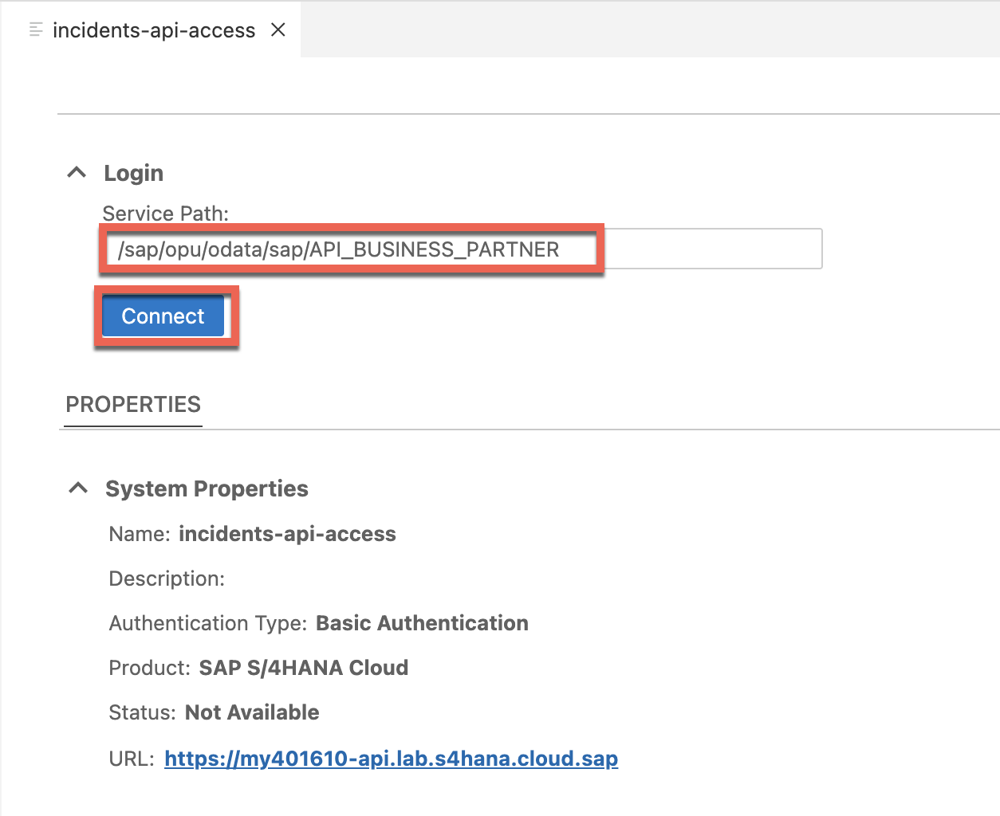
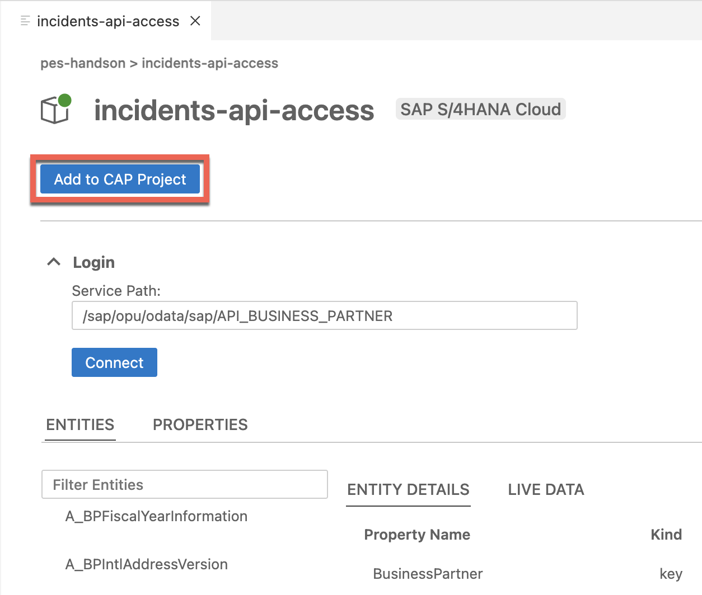
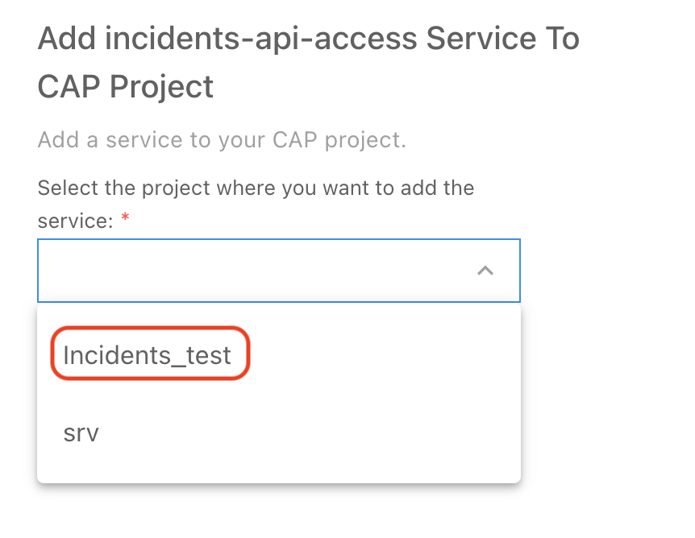
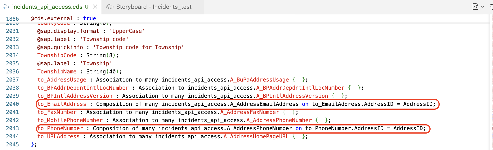
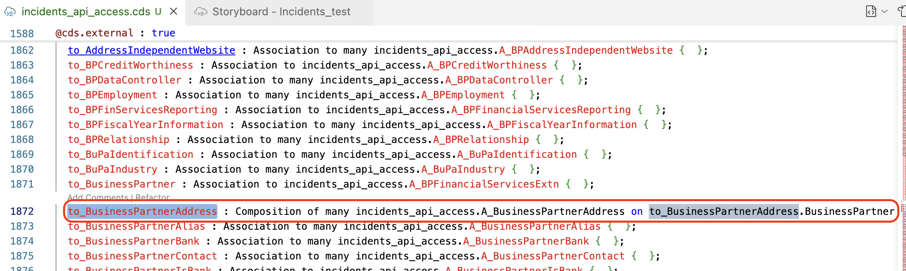
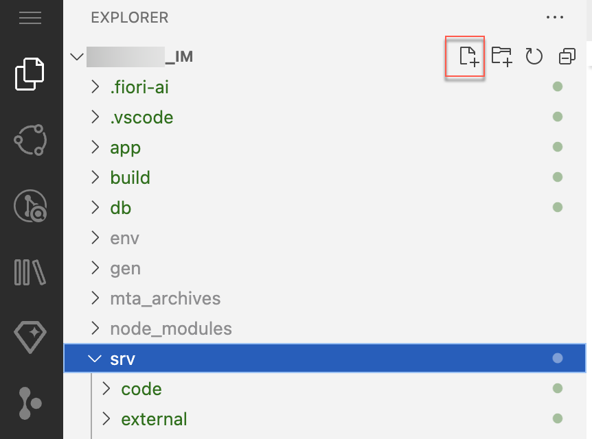

# Extend the Incident Management Application

## Clean Up the Cloud Foundry Space

1. Open your project space.

2. Open the terminal and type the following command. Then, get the mta_id from the output of the command.

    ```sh
      cf mtas
    ```

    

    > **Note:** You run `cf mtas` command to get the MTA ID.

3. To undeploy the application, use the following command:

    ```sh
      cf undeploy <mta_id> --delete-service-keys --delete-services
    ```

    If its asks for confirmation, type **y**.

    

    > **Note:** The mta_id is the same you got from Step 1.

> [!Note]
> Wait for a few minutes until the application is fully undeployed and you get the success message.

## Extend the Incident Management Application

1. Choose Service Center and select `incidents-api-access`.
    
    

2. Enter the Serivce path `/sap/opu/odata/sap/API_BUSINESS_PARTNER` and choose `connect`.

    

3. Choose the `Add to CAP Project`.  
    
    

> [!Note]
> If it asks for which project to select, choose your project name, which you have created earlier. And click on **Add**.


6. In the SAP Build Code
   - Click on Service Center(on left navigation shown in screenshot below)
   - Set `Select a Provider` as **SAP SYSTEM**
   - select `Service`  **incidents-api-access**.
  

8. Enter the Serivce path `/sap/opu/odata/sap/API_BUSINESS_PARTNER` and choose `connect`.
  

9. Choose the `Add to CAP Project`.  
  

9. Select the CAP Project `Incidents<Initial><Uniquid>` if prompted in the UI.

10. Click on Explorer in the left navigation


4. Change the conditions for the relationships between some of the entities. Open **srv/external/incidents_api_access.cds**. Search for **entity incidents_api_access.A_BusinessPartner**. Scroll down to the **to_BusinessPartnerAddress** section and replace it with the following:

    ```js
    to_BusinessPartnerAddress : Composition of many incidents_api_access.A_BusinessPartnerAddress on to_BusinessPartnerAddress.BusinessPartner = BusinessPartner;
    ```

    

5. Search for **entity incidents_api_access.A_BusinessPartnerAddress**. Scroll down to the **to_EmailAddress** section and replace the associations for email address with the following.

    ```js
    to_EmailAddress : Composition of many incidents_api_access.A_AddressEmailAddress on to_EmailAddress.AddressID = AddressID;
    ```

6. Scroll down to the **to_PhoneNumber** section under **entity incidents_api_access.A_BusinessPartnerAddress** and replace the associations for phone number with the following.

    ```js
    to_PhoneNumber : Composition of many incidents_api_access.A_AddressPhoneNumber on to_PhoneNumber.AddressID = AddressID;
    ```
    

7. Create a new file *remote.cds* in the *srv* folder.

    

8. Copy the snippet to the newly created *remote.cds* file:

    ```js
    using { incidents_api_access as S4 } from './external/incidents_api_access';

    service RemoteService {
      entity BusinessPartner as projection on S4.A_BusinessPartner {
        key BusinessPartner as ID,
        FirstName as firstName,
        LastName as lastName,
        BusinessPartnerName as name,
        to_BusinessPartnerAddress as addresses
      }
      entity BusinessPartnerAddress as projection on S4.A_BusinessPartnerAddress {
                BusinessPartner as ID,
                AddressID as addressId,
                to_EmailAddress as email,
                to_PhoneNumber as phoneNumber
      }
      entity EmailAddress as projection on S4.A_AddressEmailAddress {
          key AddressID as addressId,
          EmailAddress as email
      }

      entity PhoneNumber as projection on S4.A_AddressPhoneNumber {
          key AddressID as addressId,
          PhoneNumber as phone
      }
    }
    ```

9. Add some buisness logic for reading and saving a business partner. 
   * Open the **srv/service.js** file. 
   * Make sure `init` method is set to `async`:
  
      ```js
      async init() {
        this.before("UPDATE", "Incidents", (req) => this.onUpdate(req));
        this.before(["CREATE", "UPDATE"], "Incidents", (req) => this.changeUrgencyDueToSubject(req.data));

        return super.init();
      }
      ```
   * Add a custom handler for READ of customers in the init() method:
      
      ```js
      this.on('READ', 'Customers', (req) => this.onCustomerRead(req));
      ```

   * Add the custom handler implementation after the *init* method:
  
      ```js
      async onCustomerRead(req) {
        console.log('>> delegating to S4 service...', req.query);
        const top = parseInt(req._queryOptions?.$top) || 100;
        const skip = parseInt(req._queryOptions?.$skip) || 0;
        
        const { BusinessPartner } = this.remoteService.entities;

        // Expands are required as the runtime does not support path expressions for remote services
        let result = await this.S4bupa.run(SELECT.from(BusinessPartner, bp => {
          bp('*'),
            bp.addresses(address => {
              address('email'),
                address.email(emails => {
                  emails('email');
                });
            })
        }).limit(top, skip));
        
        result = result.map((bp) => ({
          ID: bp.ID,
          name: bp.name,
          email: bp.addresses[0]?.email[0]?.email
        }));

        // Explicitly set $count so the values show up in the value help in the UI
        result.$count = 1000;
        console.log("after result", result);
        return result;
      }  
		
      ```

   *  Add a custom handler for CREATE, UPDATE, DELETE of incidents. Add this code snippet to the *init* method:

      ```js
      this.on(['CREATE','UPDATE'], 'Incidents', (req, next) => this.onCustomerCache(req, next));
      this.S4bupa = await cds.connect.to('incidents_api_access');
      this.remoteService = await cds.connect.to('RemoteService');
      ```
    
   * Add the custom handler after the *onCustomerRead* method created in above step:  

      ```js
      async onCustomerCache(req, next) {
        const { Customers } = this.entities;
        const newCustomerId = req.data.customer_ID;
        const result = await next();
        const { BusinessPartner } = this.remoteService.entities;
        if (newCustomerId && (newCustomerId !== "") && ((req.event == "CREATE") || (req.event == "UPDATE"))) {
          console.log('>> CREATE or UPDATE customer!');

          // Expands are required as the runtime does not support path expressions for remote services
          const customer = await this.S4bupa.run(SELECT.one(BusinessPartner, bp => {
            bp('*'),
              bp.addresses(address => {
                address('email', 'phoneNumber'),
                  address.email(emails => {
                    emails('email')
                  }),
                  address.phoneNumber(phoneNumber => {
                    phoneNumber('phone')
                  })
              })
          }).where({ ID: newCustomerId }));
                                                                                        
          if(customer) {
            customer.email = customer.addresses[0]?.email[0]?.email;
            customer.phone = customer.addresses[0]?.phoneNumber[0]?.phone;
            delete customer.addresses;
            delete customer.name;
            await UPSERT.into(Customers).entries(customer);
          }
        }
        return result;
        }
        ```

## Result
You have integrated the Business Partner API into your project and business logic to read the data from the backend system. New or changed customer data would be stored in your application database.

## Next Step

[Run a developer test Locally](./test-with-mock.md)
