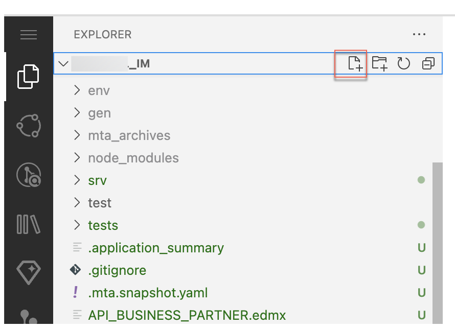

# Prepare the Project for Production

## Usage Scenario

To use the SAP S/4HANA Cloud Extensibility service to access the Business Partner API, you need some additional configurations.


## Prerequisites

You have set up the connection to an SAP S/4HANA Cloud system. See [Configure the connectivity between SAP S/4HANA Cloud and SAP BTP](./s4hana-cloud-to-btp-connectivity.md). 

## Content

1. Create a new file **bupa.json** in the root folder of the project. 

    

2. Copy the below content in *bupa.json* file created in above step. 

    ```json
    {
        "systemName": "<SYSTEM_NAME>",
        "communicationArrangement": {
            "communicationArrangementName": "<COMM_NAME>",
            "scenarioId": "SAP_COM_0008",
            "inboundAuthentication": "BasicAuthentication",
            "outboundAuthentication": "BasicAuthentication",
            "outboundServices": [
                {
                    "name": "Replicate Customers from S/4 System to Client",
                    "isServiceActive": false
                },
                {
                    "name": "Replicate Suppliers from S/4 System to Client",
                    "isServiceActive": false
                },
                {
                    "name": "Replicate Company Addresses from S/4 System to Client",
                    "isServiceActive": false
                },
                {
                    "name": "Replicate Workplace Addresses from S/4 System to Client",
                    "isServiceActive": false
                },
                {
                    "name": "Replicate Personal Addresses from S/4 System to Client",
                    "isServiceActive": false
                },
                {
                    "name": "Business Partner - Replicate from SAP S/4HANA Cloud to Client",
                    "isServiceActive": false
                },
                {
                    "name": "Business Partner Relationship - Replicate from SAP S/4HANA Cloud to Client",
                    "isServiceActive": false
                },
                {
                    "name": "Business Partner - Send Confirmation from SAP S/4HANA Cloud to Client",
                    "isServiceActive": false
                },
                {
                    "name": "BP Relationship - Send Confirmation from SAP S/4HANA Cloud to Client",
                    "isServiceActive": false
                }
            ],
            "communicationSystem": {
                "communicationSystemHostname": "default.com",
                "outboundCommunicationUser": {
                    "username": "DefaultUser",
                    "password": "DefaultPassword"
                }
            }
        }
    }
    ```

- Enter **pes-workshop-s4hana-cloud** as the *systemName* of your registered SAP S/4HANA Cloud system, we have already registered the system in SAP SAP Business Technology Platform (BTP) account for this handson.
- For **communicationArrangementName**, enter a speaking name for your communication arrangement (e.g. INCIDENT_MANAGEMENT_0008).

For more information, see [Communication Arrangement JSON/YAML File - Properties](https://help.sap.com/viewer/65de2977205c403bbc107264b8eccf4b/Cloud/en-US/553a4c6b98be4c1ba7d1dfa0e9df8669.html).

3.  Navigate to the *package.json* file in the root folder of the application. Replace the settings for **API_BUSINESS_PARTNER** with the following code snippet:
  
    ```json
    "API_BUSINESS_PARTNER": {
        "kind": "odata-v2",
        "model": "srv/external/API_BUSINESS_PARTNER",
        "[production]": {
            "credentials": {
                "destination": "<DESTINATION_NAME>",
                "path": "/sap/opu/odata/sap/API_BUSINESS_PARTNER"
            }
        }
    }
    ```
    
> If you are deploying to Cloud Foundry, the **DESTINATION_NAME** should be replaced with `incidents-api-access`.

# Next

[Deploy to SAP BTP Cloud Foundry runtime with SAP S/4HANA Cloud](./deploy-to-cf.md)