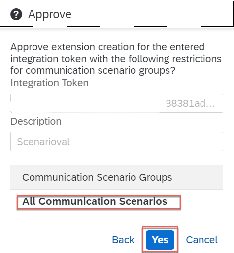

# Configure the Connectivity Between SAP S/4HANA Cloud and SAP BTP

## Introduction

You can use SAP BTP to extend standard SAP solutions without disrupting their performance and core processes. When building extension applications, you can also benefit from the automation of the integration between SAP BTP and the extended SAP solutions.

SAP BTP provides a standard way for extending SAP solutions and developing event-driven extensions and applications. This framework includes:
- Simplified, standardized and unified extensibility and configuration for the SAP solutions.

- Central catalog per customer for all connected SAP systems where data such as APIs, events, credentials and other is stored. You can benefit from business services and actionable events across end-to-end business processes.

SAP S/4HANA Cloud supports automated integration with SAP BTP

## Usage Scenario

To connect to an SAP S/4HANA Cloud system using service binding, you have to register the system in your SAP SAP Business Technology Platform (BTP) account.

## Prerequisites
You need a user with administrator access for the SAP BTP global account and the SAP S/4HANA Cloud system.

### SAP Business Technology Platform

1. In **SAP BTP cockpit**, open your global account and choose
**System Landscape**.

2. In the **System Landscape** screen, choose **Systems** and then **Add System**.

   

3. In the **Register System** dialog box, enter a name for the SAP S/4HANA Cloud system you want to connect.

- Recommendation: use a name that uniquely identifies this system, for example, system ID.
- Example: **S/4HANA Cloud DEV System**

4. In the **Type** dropdown list, choose **SAP S/4HANA Cloud**.

5. Choose **Add**.

   

6. Configure the communication flow. In the **Communication Scenario Groups** dropdown menu, select **All Communication Scenarios**.

   

7. Choose **Get Token**.
   SAP BTP generates an integration token so the SAP S/4HANA Cloud system administrator can configure integration with SAP BTP from your SAP S/4HANA Cloud system. 

   

9. Copy the generated token and close the dialog box.
    You will need the token in the following procedure.

  

### SAP S/4HANA Cloud

1. Log on to your SAP S/4HANA Cloud tenant.

2. Navigate to **Home -> Communication Management** tab and choose the tile **Maintain Extensions on SAP BTP**.

   

3. On the **Maintain Extensions on SAP BTP** screen in the **Integration section**, choose **New**.

   

4. In the **Integration Token** field, paste the integration token previously generated and copied in the SAP BTP Cockpit.

      

5. Enter a description for your system integration token.

- Recommendation: use the same name you entered in SAP BTP cockpit when you generated the token.
- Example: >S/4HANA Cloud system name<

6. Choose **Save**.

- A new entry is displayed for your system in the table with status **Enabling**.
- Wait for a few seconds.
- After the automated integration, the status of your system integration changes to **Enabled**.
- The same takes place on the SAP BTP side. You will see the system as **Registered** – potentially after a refresh.

   

See also: [Register an SAP S/4HANA Cloud System in a Global Account in SAP BTP](https://help.sap.com/viewer/65de2977205c403bbc107264b8eccf4b/Cloud/en-US/28171b629f3549af8c1d66d7c8de5e18.html).

# Next

[Get the Business Partner API](./explore-apis-and-events.md)