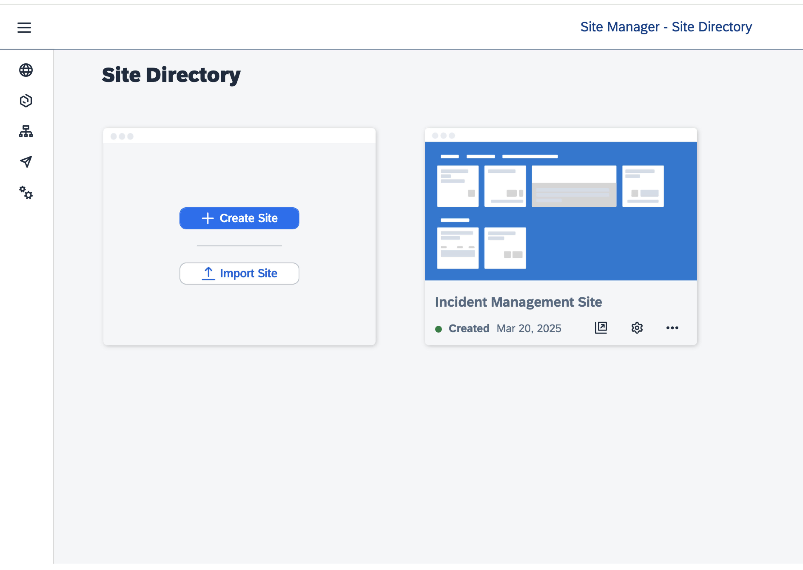
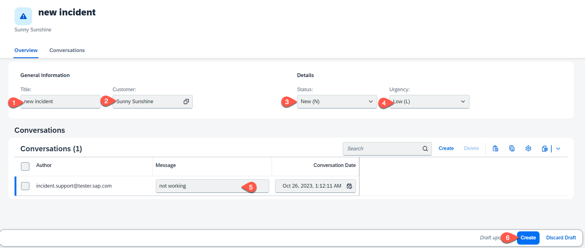

# Test the flow end-to-end

## Run and Test the Applicaion

1. Open [SAP Build Work Zone](https://pes-handson.dt.launchpad.cfapps.eu10.hana.ondemand.com/sites#Site-Directory).

2. Under the Site Directory, find your site created earlier.

   

3. Access your application via launchpad.
   
   

4. While creating a new incident, the value help for customers loads data from the integrated remote service.
  
   *  Choose **Create**
  
      
   
   * Set **Title**, **Customer**, **Status** and **Urgency**. 
   * The value help for **Customer** fetches data from the remote server.
   * Create a conversation.
   * Choose **Create** to save the settings.
     
      

> [!Note]
> If you have not done the enhance Fiori UI chapter, creating conversations will not be visible in the UI.

## Congratulations! 

You have successfully completed the exercise!
