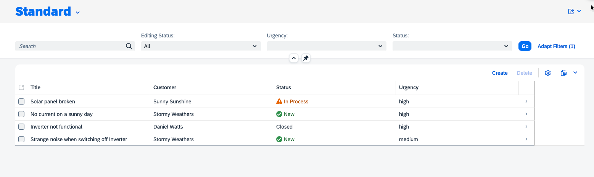

# Test the flow end-to-end

## Prerequisites

- You have sucessfully deployed the application to your SAP BTP Runtime.
- You have assigned application roles before accessing the application. See [User Role Assignment](../deploy-cf.md#assign-the-user-roles).
- You have integrated your application with SAP Build Work Zone and accessed it via launchpad. See [Integrate Your Application with SAP Build Workzone](../integrate-workzone.md).

## Run and Test the Applicaion

1. Open *SAP Build Work Zone, Standard edition*.

   

2. You should see the *launchpad* create in [integrate workzone](../integrate-workzone.md). 

   

3. Access your application via launchpad.
   
   

4. While creating a new incident, the value help for customers loads data from the integrated remote service.
  
   *  Choose **Create**
  
      
   
   * Set **Title**, **Customer**, **Status** and **Urgency**. 
   * The value help for **Customer** fetches data from the remote server.
   * Create a conversation.
   * Choose **Create** to save the settings.
     
      

## Congratulations! 

You have successfully completed the exercise!

Learn more about SAP BTP Developer’s Guide in [GitHub](https://help.sap.com/docs/btp/btp-developers-guide/btp-developers-guide) or in [SAP Help Portal](https://help.sap.com/docs/btp/btp-developers-guide/btp-developers-guide?version=Cloud) or scan the QR code on the screen to bookmark it for future reference.
