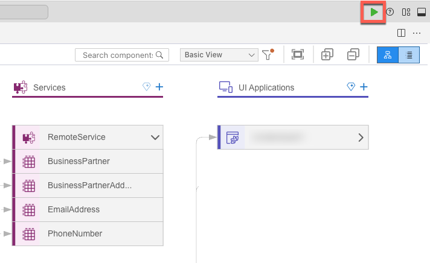
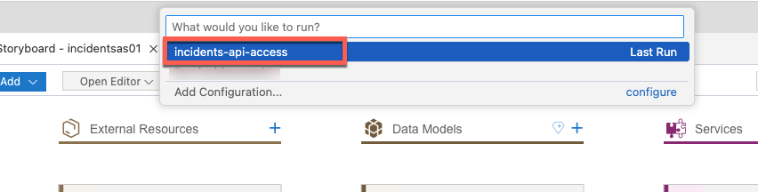
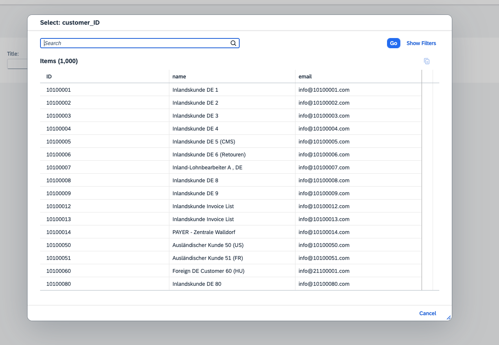
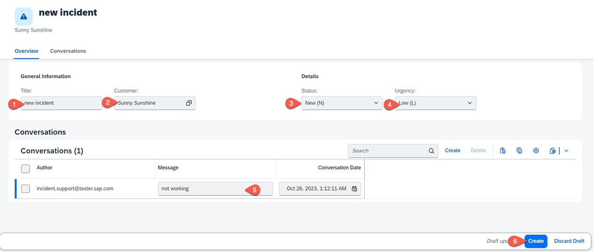

# Test the Incident Management Application Locally

## Scenario

To increase your development speed, it is helpful to run and test your implementation in a local environment. In this section you will learn how to test the incident management applicaiton locally.

## Content

### Run the Incident Management Application

1. Choose the `Run and Debug` icon to run the application locally.

   

2. Select `incidents-api-access` in the popup.

   

8. Testing the scenario - while creating a new incident, the value help for customers loads data from the SAP S/4HANA Cloud.
   * Open the Incident Management application.
  
   *  Choose **Create**.
  
      
   
   * Set **Title**, **Customer**, **Status** and **Urgency**. 
   * The value help for **Customer** fetches data from the SAP S/4HANA Cloud.
   
   * Create a conversation.
   * Choose **Create** to save the settings.
     
      
   

## Summary
By using a mock server you can easily test your implementation in a local environment. You find more details in the documentation for [Local Mocking](https://cap.cloud.sap/docs/guides/using-services#local-mocking)

# Next 

[Prepare the app for production](./prep-for-prod.md)
