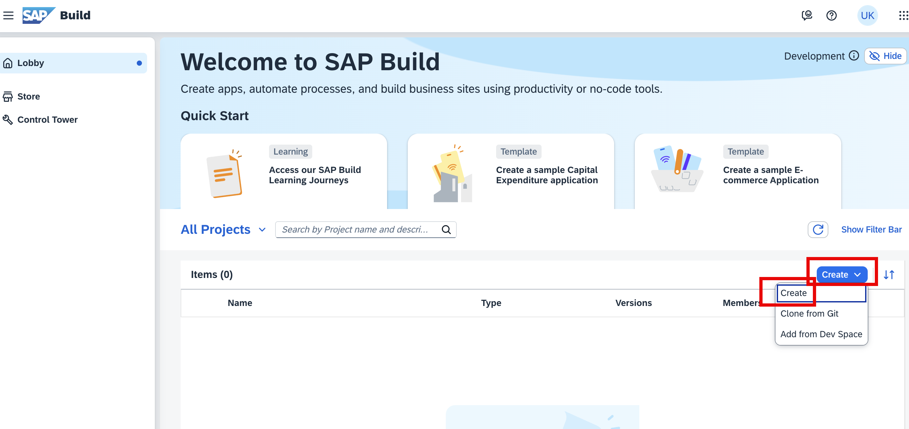
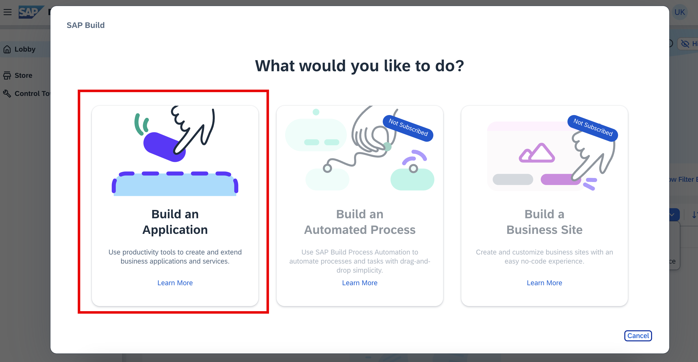
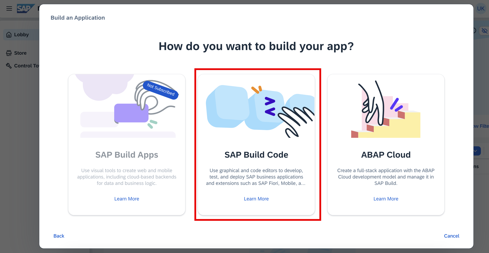
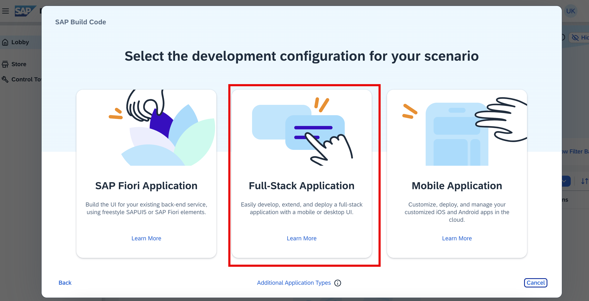
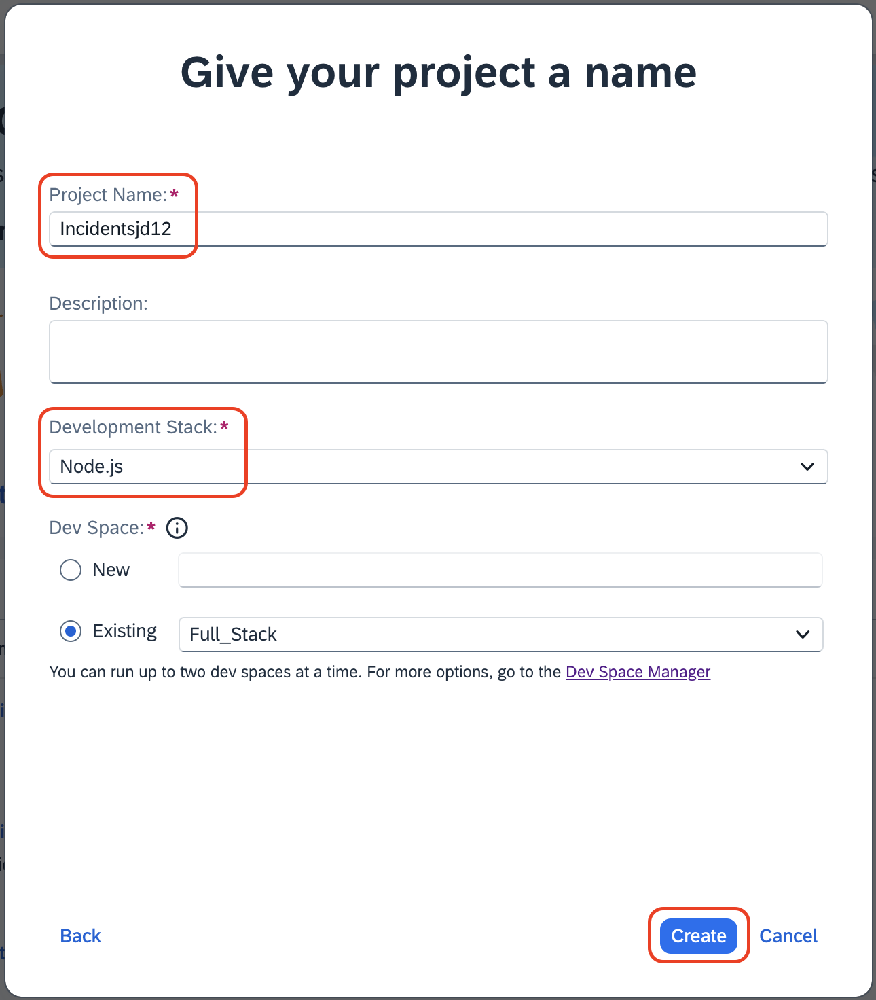
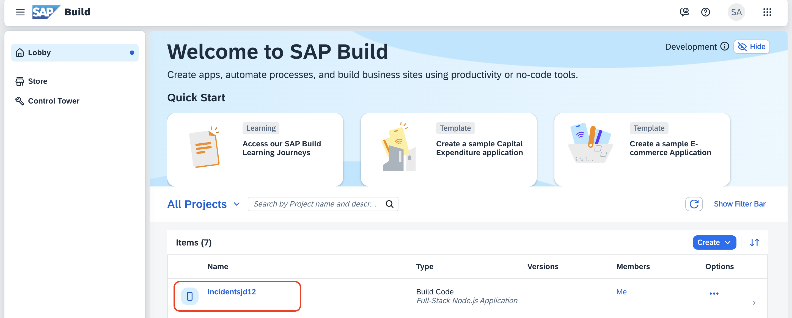

# Prerequisites

1. You will need to create Cloud Foundry space in SAP BTP Cockpit, which is required for deploying the developed application to Cloud Foundry Runtime. Follow [Create Space in SAP BTP](./create-space.md).

# Create a Full-Stack Application

This section explains how to access the SAP Build lobby and create a full-stack application using SAP Build Code.

> The Joule prompt is designed to generate the complete code required for successfully developing a full-stack application in SAP Build Code powered by Joule. These prompts are specifically crafted to align with the hands-on tutorial flow, ensuring that each step can be executed sequentially and seamlessly.

1. Open the SAP Build Lobby.

2. To create a new project, choose **Create**.

    

3. Select the **Build an Application** tile.
    
    

4. Select **SAP Build Code**.

    

5. Select **Full-Stack Application**.

    

6. Specify the following project details:

    1. Enter `Incidents<your-initials><unique-random-number>` in the **Project Name** field. For example, if your name is `John Doe`, then the project name would be **Incidentsjd12**, (12 is some random number).

        > **Note:** The project name should be unique to identify your project during deployment and also to avoid a duplication error.

    2. Select **Node.js** from the **Development stack** dropdown.
    3. You can use the existing Dev Space instead of creating a new one. Let **Full_Stack** be the default Dev Space.
    4. Choose **Create**.

        

7. Wait for the project to get created. Once it's created, click the project, which opens in a new tab.

    

## Next Step

[Create Data Entities](create-data-entities.md)
