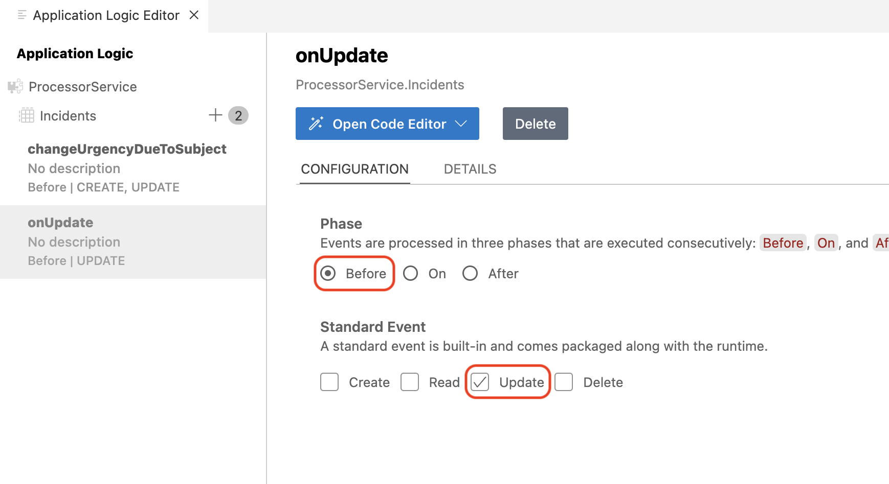
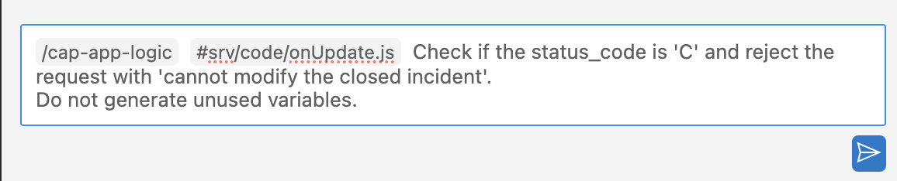

# Add Business Logic with Joule

In this section, with the help of Joule, you will generate business logic before creating and updating incidents in the ProcessorService service generated in the previous section.

## Prerequisite

You have created CDS Services following the steps at [Add CDS Services](generate-service.md).

## Business Logic for the ProcessorService

1. Navigate to **Storyboard**.

    

2. In the **Services** section, choose the **Incidents** entity under **ProcessorService** and then choose **Add Logic**.

    

3. The **Application Logic Editor** appears.

### 1: Change Urgency Due To Subject
Using Joule we will define an event handler that automatically sets the urgency level of an incident to High ('H') if the title contains the word 'urgent'.The function **changeUrgencyDueToSubject** is triggered before CREATE or UPDATE operations on the ProcessorService.Incidents entity. 
1. In the **Application Logic Editor**, change the value of the **Name** field to **changeUrgencyDueToSubject** and choose **Add**.

    

2. In the **Phase** area, select **Before** and in the **Standard Event**, select **Create** and **Update**.

    

    > This logic will be automatically executed before creating or updating a particular incident.

3. Choose **Open Code Editor** > **Application Logic**.

    

4. This will open Joule to create logic for **changeUrgencyDueToSubject**.

    

    > In the Joule prompt, **/cap-app-logic** is used for creating custom backend logic for the created services. Once Joule generates the code, **#srv/code/changeUrgencyDueToSubject.js** tells which file to fill the generated code.

5. The Joule prompt will be prefilled with `/cap-app-logic #srv/code/changeUrgencyDueToSubject.js`. After the prefilled command, use the following prompt to create the business logic.

    ```
    Check the title of the incident is having urgent keyword and update the urgency_code field to High.
    Ensure the data is array or wrap in an array.
    Do not generate unused variables.
    ```
    
6. Choose the **Send** icon.

    

7. Once Joule responds with the code, check the implementation and accept it. 

    

> [!Note]
> Joule may generate a different code for this backend logic. Please make sure the final `#srv/code/changeUrgencyDueToSubject.js` file looks like this: 


    module.exports = async function(request) {
        const { Incidents } = cds.entities;
        
        // Ensure the data is an array or wrap it in an array
        const data = Array.isArray(request.data) ? request.data : [request.data];

        for (const incident of data) {
            if (incident.title && incident.title.toLowerCase().includes('urgent')) {
            incident.urgency_code = 'H'; // Set urgency to High
            }
        }
    }


### 2: Prevent updates to closed incidents
This event handler prevents updates to incidents that are already closed (status_code = 'C'). This function runs before an UPDATE operation on ProcessorService.Incidents and ensures that validation happens before the database update.

1. Go back to the **Application Logic Editor**, and choose **+**.

    

2. Change the value of the **Name** field to **onUpdate** and choose **Add**.

    

3. In the **Phase** area, select **Before** and in the **Standard Event**, select **Update**.

    

    > This logic will be automatically executed before updating a particular incident.

4. Choose **Open Code Editor** > **Application Logic**.

    

5. This will open Joule to create logic for **onUpdate**.

    

    > In the Joule prompt, `/cap-app-logic` is used for creating custom backend logic for the created services. Once Joule generates the code, **#srv/code/onUpdate.js** tells which file to fill the generated code.

6. The Joule prompt will be prefilled with `/cap-app-logic #srv/code/onUpdate.js`. After the prefilled command, use the following prompt to create the business logic.

    ```
    For already closed incident, check if the status_code is 'C' and reject the request with 'cannot modify the closed incident'. 
    Do not generate unused variables.
    ```
    
7. Choose the **Send** icon.

    

8. Once Joule responds with the code, check the implementation and accept it. 

    

> [!Note]
> Joule may generate a different code for this backend logic. Open the file explorer, Please make sure the final `#srv/code/onUpdate.js.js` file looks like this: 


    module.exports = async function(request) {
        const { Incidents } = cds.entities;
        const { ID } = request.data;

        if (!ID) return; // Ensure ID is provided

        const incident = await SELECT.one.from(Incidents).where({ ID });

        if (incident && incident.status_code === 'C') {
            request.reject(400, 'Cannot modify the closed incident');
        }
    }

## Next Step

[Create SAP Fiori UI with Joule](./fiori-ui.md)


