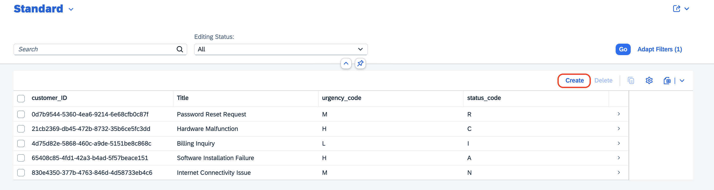
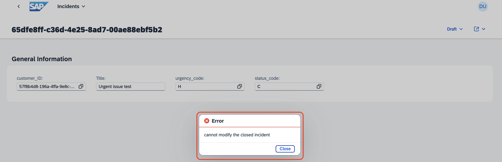

## Test the Incident Management Application

## Prerequisite

Integrate Your Application with SAP Build Work Zone by following the steps at [Integrate with SAP Build Work Zone](integrate-workzone.md)

> [!NOTE]
> The UI screenshots given here are from the basic SAP Fiori UI application without any enhancements. If you have followed the **Enhance UI** tutorial, then screenshots would be bit different.**   

## Validate the Custom Logic 1

Update the **Urgency** from *Low/Medium* to *High*, if it encounters ```urgent``` keyword in the title.

1. Choose **Create**, to create a new incident.

    

2. Fill in the incident details:

    1. In the **Customer ID** dropdown menu, select a customer of your choice.

        

    2. In the **Title** field, enter **Urgent issue**.

    3. Leave the **urgency_code** and **status_code** fields.

    4. Choose **Create**.

        

3. Once the incident has been created, you see that the **urgency_code** field is automatically changed to from **M** (Medium) to **H** (High).

    

## Validate the Custom Logic 2

Cannot update the closed incident.

1. Close one of the incidents. 

2. The **status_code** changes to **C** (Closed). Choose **Edit**.

    

3. Change the value in the **Title** field, and choose **Save**.

4. It will throw the error saying `cannot modify the closed incident`.

    

## Clean Up the Cloud Foundry Space

1. Go back to the **Dev** space, open the terminal and type the following command. Then, get the mta_id from the output of the command.

    ```sh
        cf mtas
    ```

    

    > **Note:** You run `cf mtas` command to get the MTA ID.

2. To undeploy the application, use the following command:

    ```sh
        cf undeploy <mta_id> --delete-service-keys --delete-services
    ```

    If its asks for confirmation, type **y**.

    

    > **Note:** The mta_id is the same you got from Step 1.
