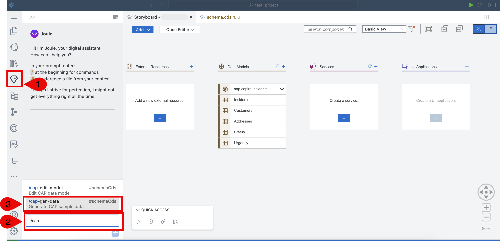
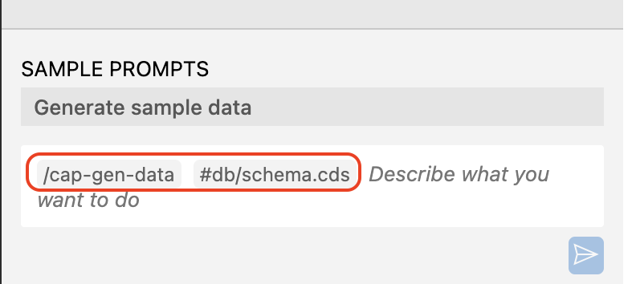
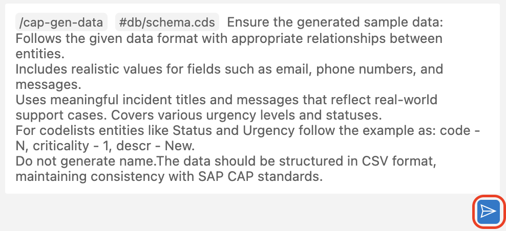
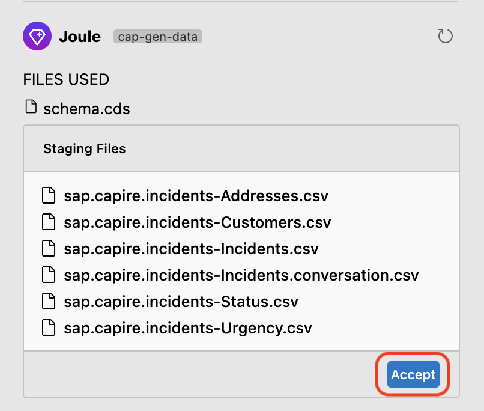
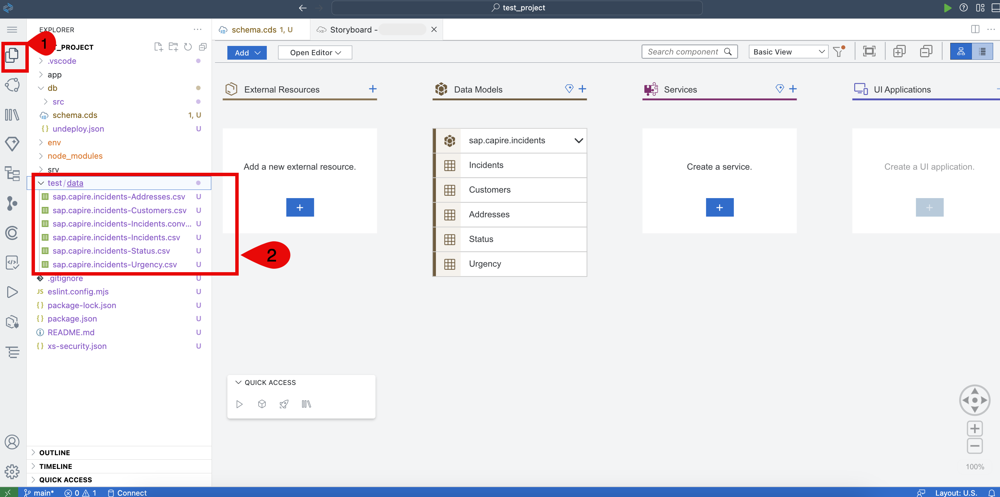

# Add the Sample Data Using Joule

## Prerequisites

You have created the data model following the steps at [Create Entities](create-data-entities.md).

## Add the Sample Data

Data entities have been defined in the previous step. Using Joule, let's create some sample data which can be used for local testing of the application.

1. Choose the **Joule** icon. Start typing ```/cap``` in text box and then choose **/cap-gen-data**. 

    

    > **Note:** By default, **/cap-gen-data #db/schema.cds** should be displayed in a text box.

    

2. The Joule prompt will be prefilled with **/cap-gen-data #db/schema.cds**. Paste the following prompt to generate the sample data. 

```
Ensure the generated sample data: Follows the given data format with appropriate relationships between entities.
Includes realistic values for fields such as email, phone numbers, and messages. 
Uses meaningful incident titles and messages that reflect real-world support cases. Covers various urgency levels and statuses. 
For codelists entities like Status and Urgency follow the example as: code - N, criticality - 1, descr - New.
Do not generate name.The data should be structured in CSV format, maintaining consistency with SAP CAP standards.
```

3. Choose the **Send** icon.

    

4. Joule will create list of .csv files that contain sample data as per the provided schema. Choose **Accept**.

    

5. All the generated .csv files will be saved in the **test/data** folder of your project.

    

> [!Note]
> If you want to learn how to configure data manually, please follow [Add Initial Data](./add-initial-data-manually.md)

## Next Step

[Add CDS Services](generate-service.md)
