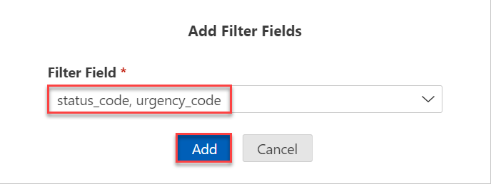
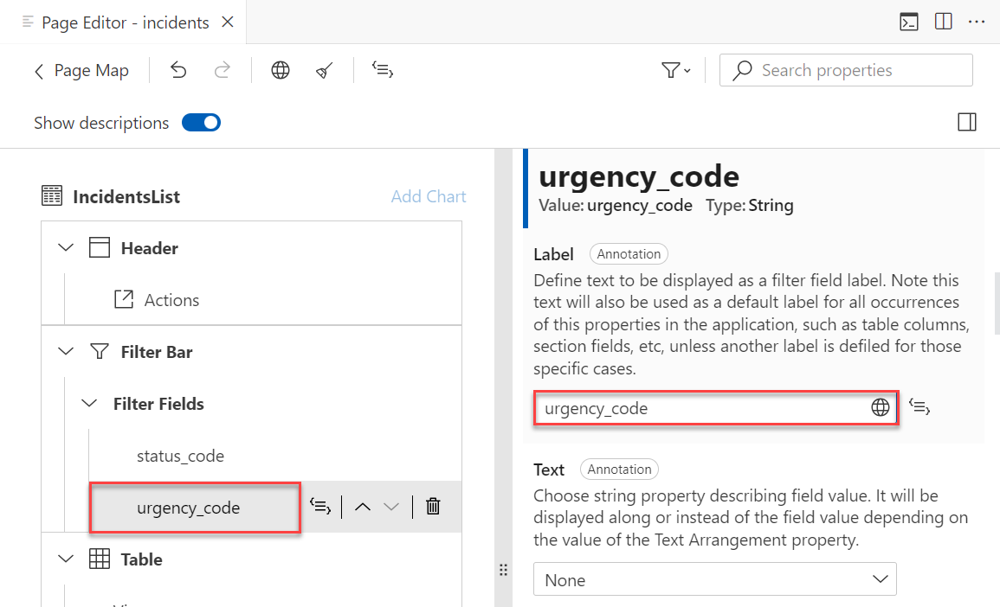
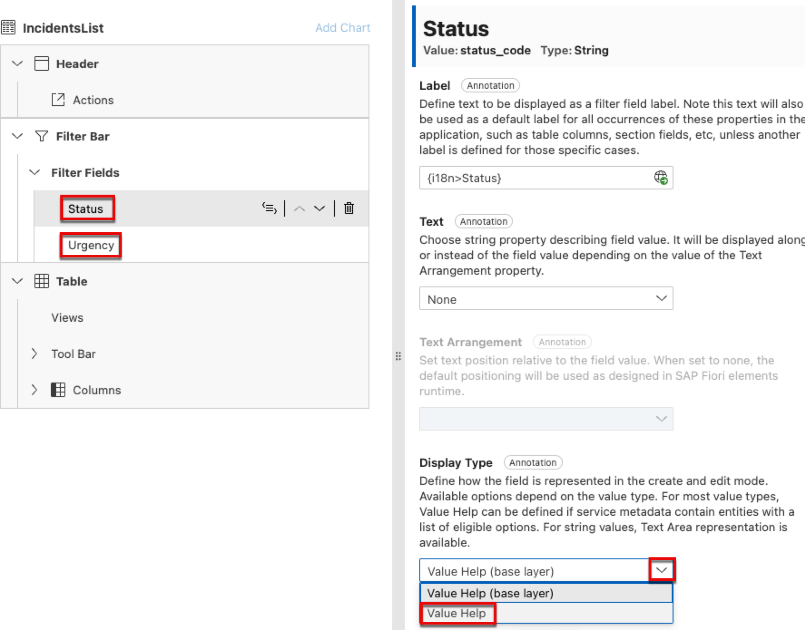
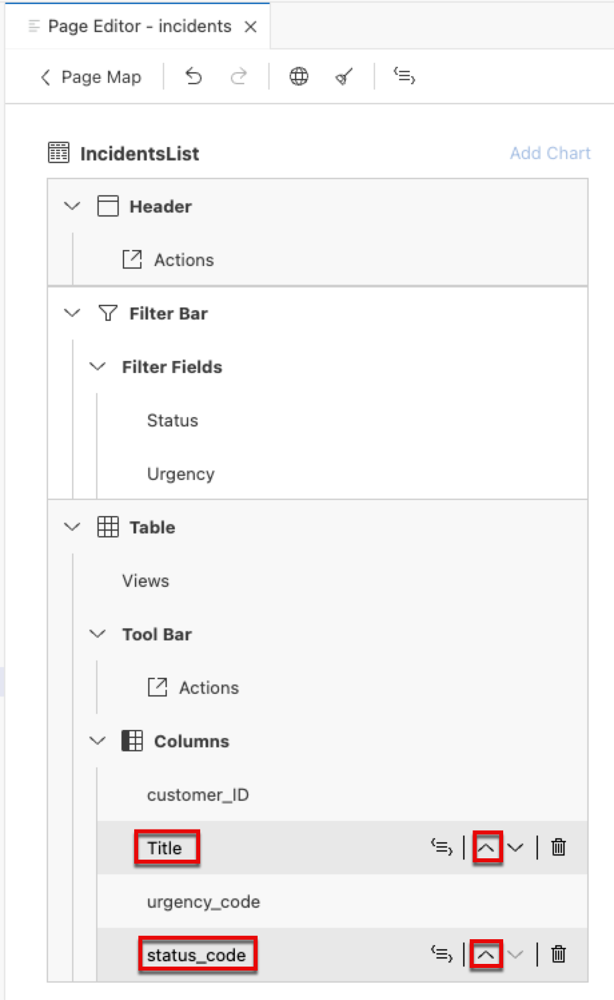
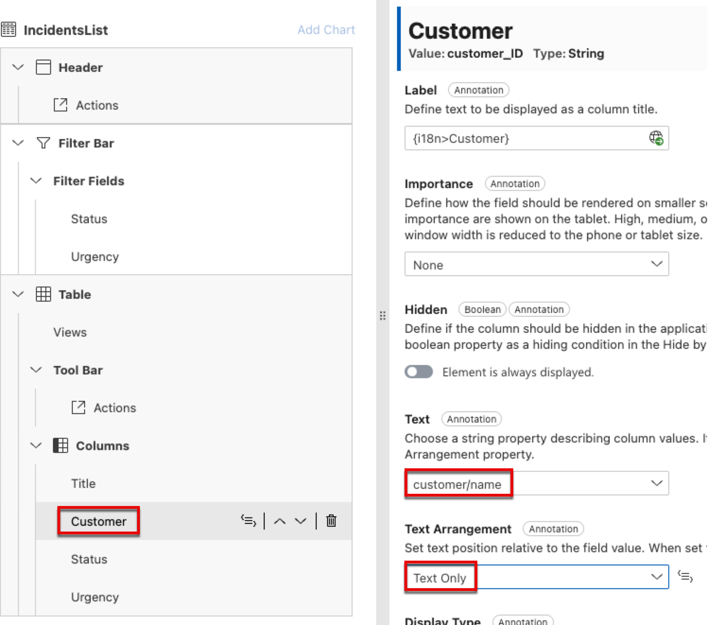
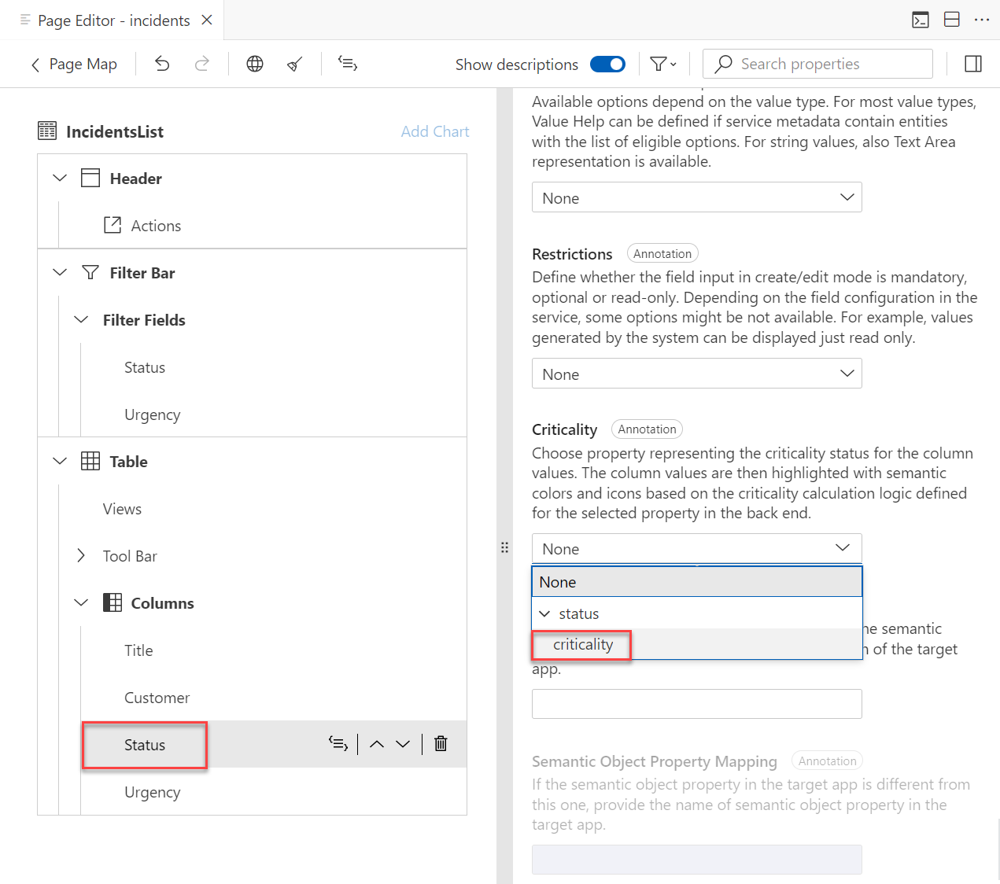
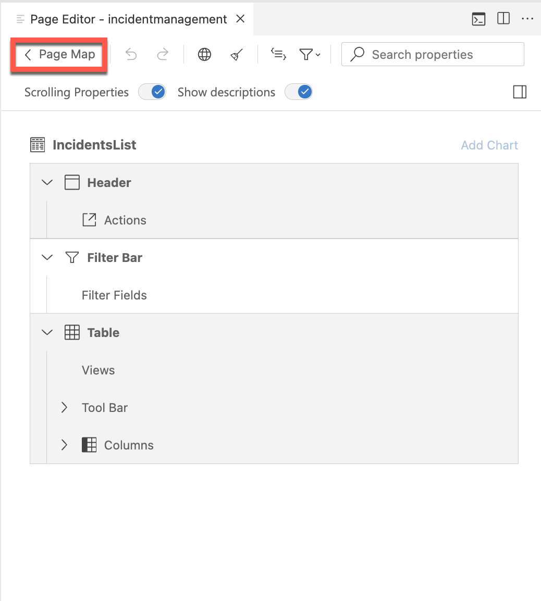

# Extend Fiori UI

In this chapter we will extend/customize the generated Fiori UI using SAP Fiori Tooling.

## Prerequisites

You have created the basic UI application using [Create UI with Joule](fiori-ui.md)

### Add filter fields

1. Navigate to **Storyboard**.

2. In the **UI Applications** section, click on your UI app **incidentmanagement<your-initials><unique-random-number>** and then choose **Open in Page Map**

    

3.  The page map of the **incidents** application opens in a new tab within SAP Build code. You will see the properties on the right side of the page map. You can edit these properties to update the UI of the application.

    

    > In case the **Application Info - incidents** tab is closed: 
    >
    >1. Invoke the Command Palette - **View** &rarr; **Command Palette** or <kbd>Command</kbd> + <kbd>Shift</kbd> + <kbd>P</kbd> for macOS / <kbd>Ctrl</kbd> + <kbd>Shift</kbd> + <kbd>P</kbd> for Windows. 
    >2. Select **Fiori: Open Application Info**.

4. In the **List Report** tile, click the **Pencil** icon next to the title. The page editor is opened.

    

5. In the **Filter Bar** section of the page editor, select **Filter Fields** and then click the **Plus** icon to add filter fields. Then, select **Add Filter Fields** in the dropdown menu.

    

6. In the **Add Filter Fields** dialog:

    - Select the **status_code** and **urgency_code** checkboxes in the **Filter Field** dropdown menu.
    - Click **Add**. Your application will be updated to show the new filters.

    

    > This is how you define which properties are exposed as search fields in the header bar above the list.

### Edit filter fields

5. Select filter field **urgency_code**. In the **Label** field, change the value to **Urgency**.
 
    

6. Click the **Globe** icon to generate a translatable text key and click **Apply**.

    

    > The filter labels are text strings. It's a good idea to update them so they are compliant with internationalization standards (i18n).

    > Learn more about how internationalization works for the backend part in [Where to Place Text Bundles?](https://cap.cloud.sap/docs/guides/i18n#where-to-place-text-bundles) in the CAP documentation.

7. Select the **status_code** filter. In the **Label** field, change the value to **Status**.
8. Click the **Globe** icon to generate a translatable text key and click **Apply**.

    Both filter value helps currently show the corresponding code values when opened. We want to display a descriptive text instead.

    
 
9. For both the **Status** and **Urgency** filters, in the **Display Type** dropdown menu, select **Value Help**. A dialog shows up. 

    

10. In the **Define Value Help Properties for Urgency/Status** dialog:

    - Open the dropdown menu in the **Value Description Property** field and select **descr**
    - Open the dropdown menu for **Text Arrangement** and select **Text Only**
    - Choose **Apply**

    

11. Switch back to the app preview browser tab and open the filter fields. They now show the descriptive text instead of the code value.

### Edit columns

In the List Report, we can see the titles of the table columns shown as **customer_ID**, **urgency_code** and **status_code**. Furthermore, the column values are displaying the identifier and code values. We want to show a descriptive value instead.
 

Let's start by rearranging the column order.

12. Select column **Title** and click **^** to move the column up to the top of the list.
13. Select column **status_code** and click **^** to place it before column **urgency_code**.

    

14.  Select the **Title** column. Field **Label** contains string **Title** which was automatically set during app generation. Click the **Globe** icon in the **Label** field to generate a translatable text key for it, and apply the changes.

15. For each of the columns **customer_ID**, **status_code** and **urgency_code**:
    - In the **Label** field, change the value to **Customer**, **Status**, and **Urgency**, respectively.
    - Choose the **Globe** icon in the **Label** field to generate a translatable text key.

    

16. We will now configure the **display text** and the **text arrangement** for columns **Customer**, **Status** and **Urgency** in order to show a descriptive text instead of the identifier/code.

    - Select column **Customer**
    - Click the drop-down box of property **Text** and select entry **customer/name**
    - Click the drop-down box of the now active property **Text Arrangement** and select **Text Only**
      
      

17.  Select text property for columns **Status** (select **status/descr** ) and **Urgency** (select **urgency/descr**) and also set **Text Arrangement** to **Text Only**
18.  Switch back to the app preview to see the effect.

### Configure the Table

When starting the app, per default the user has to press the
**Go** button in order to trigger the selection.\
This allows defining filters before the query is executed.\
The default behaviour can be changed in a way that selection is immediately
triggered when the app is started.

19. Select **Table** in the left pane of the page editor. In the **Initial Load** dropdown menu, select **Enabled** to load the data automatically.

    

It is considered as best practice providing a **criticality color** for status information displayed on the UI.

20. Select **Table** &rarr; **Columns** &rarr; **Status**. In the **Criticality** dropdown menu, select **status/criticality**.

    

### Check the result

21. The list page of the Incident Management application should look like this:

    

22. Navigate back to the page editor and choose **Page Map** in the top left. This takes you back to the overview of the **incidents** application.

    

## Next Steps

[Configure the Object Page](configure-object-page.md)

