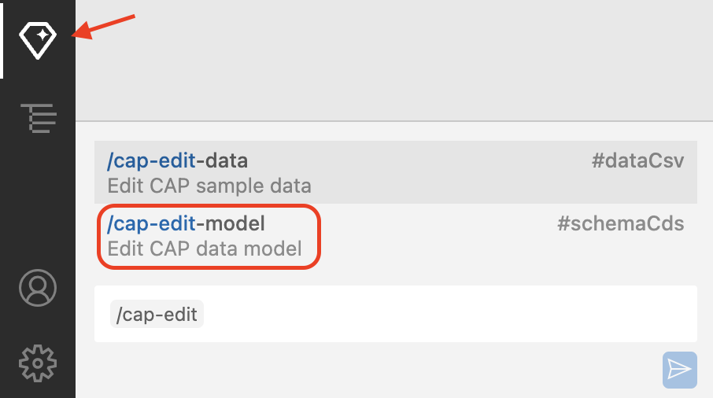
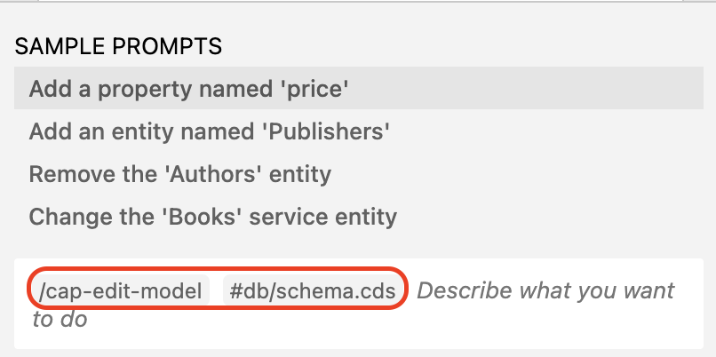
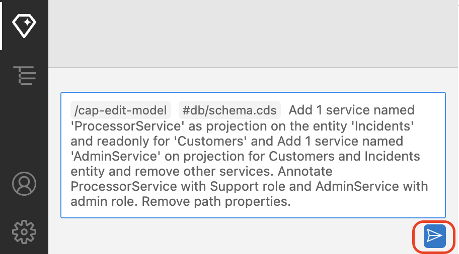
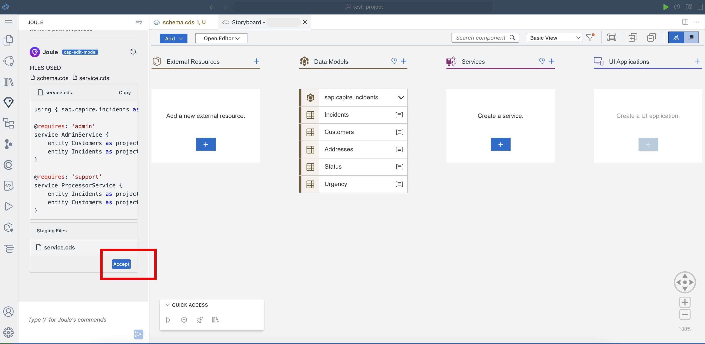
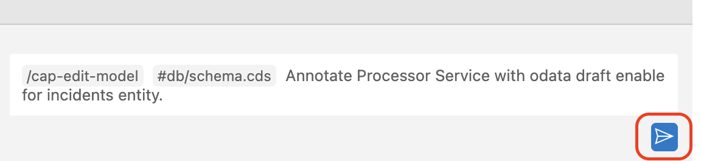
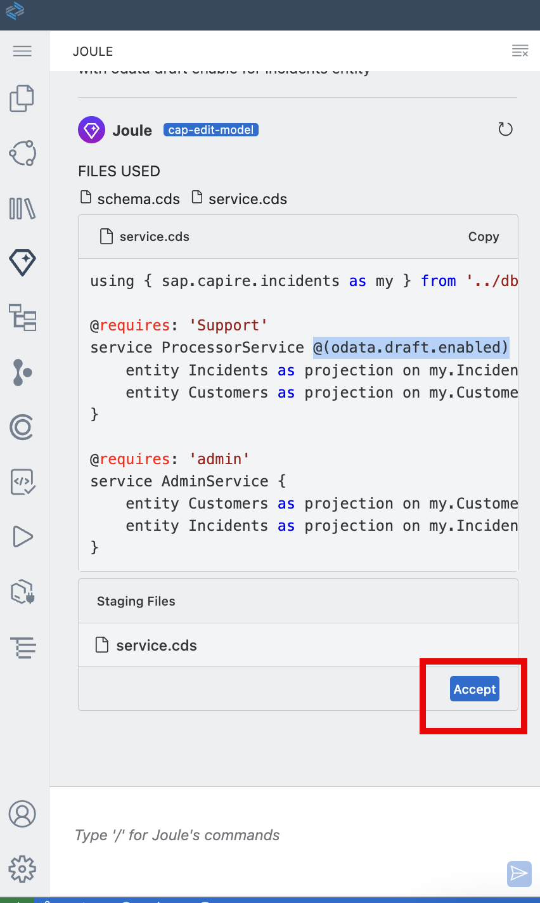
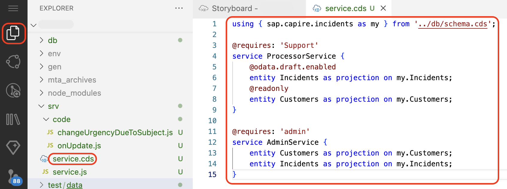
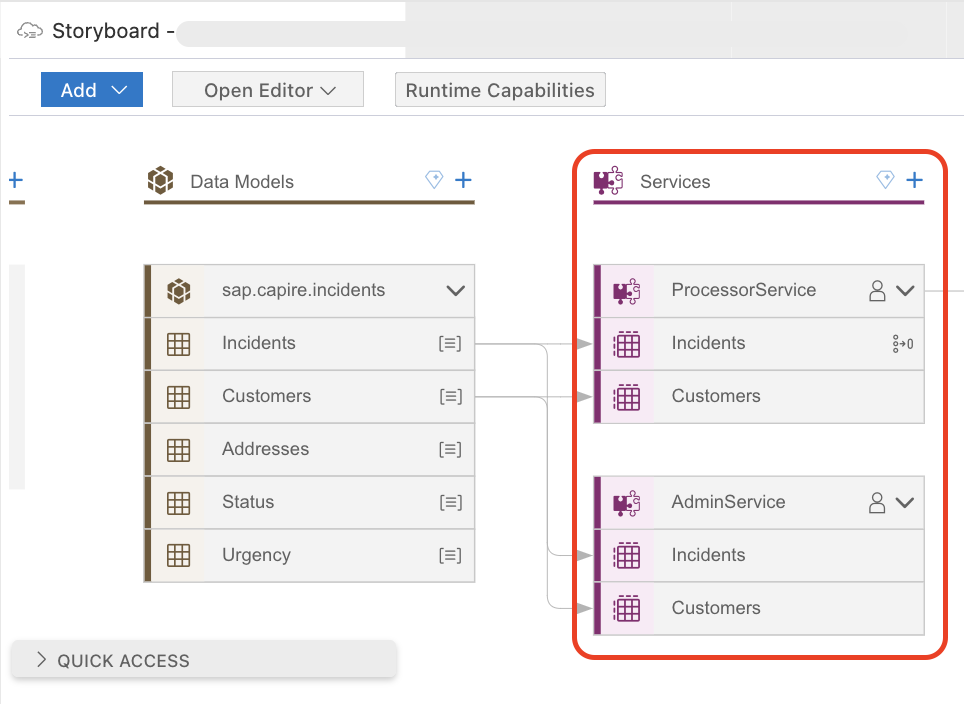

# Add Services Using Joule

This section describes how to generate services using Joule.

## Prerequisite

You have enhanced the sample data following the steps at [Enhance Sample Data](enhance-sample-data.md).

## Add Services

1. Choose the **Joule** icon. Start typing ```/cap-edit``` in the Joule prompt and select **/cap-edit-model** from the suggestions to create a service.

    

    > **Note:** By default, **/cap-edit-model #db/schema.cds** should be displayed in a text box.

    

2. The Joule prompt will be prefilled with **/cap-edit-model #db/schema.cds**. Paste the following prompt to generate a service:

    ```html
    Add 1 service named 'ProcessorService' as projection on the entity 'Incidents' and readonly for 'Customers' and Add 1 service named 'AdminService' on projection for Customers and Incidents entity and remove other services. Annotate ProcessorService with Support role and AdminService with admin role. Remove path properties.
    ```

3. Choose the **Send** icon.

    

4. Choose **Accept**.

    

- CDS service definition exposes entities from the database schema (schema.cds) as part of  service layers with role-based access to services.
    
-  Modular Service Definitions - Services (ProcessorService and AdminService) allow controlled access to data.

- Role-Based Access 

    - ProcessorService → Support staff can manage incidents and customers.

    - AdminService → Admin users have full access.

- Projections on Entities - The original database entities are not directly exposed, only projected versions are. This allows customization, filtering, or restricting access to certain fields (if needed in the future).


5. For OData draft enabling, use the following prompt to make ProcessorService to draft enable. Start typing `/cap-edit`, and select **/cap-edit-model** from the suggestions.

    ```
    Annotate Processor Service with odata draft enable for incidents entity.
    ```
> [!Info]
>  OData draft enablement in CAP allows users to save work-in-progress data before final submission. This is especially useful in SAP Fiori applications, where users may enter data in multiple steps and want to avoid losing changes.


6. Choose the **Send** icon.

    

7. Choose **Accept**.

    

8. Open **service.cds** in the project explorer and validate the generated service. 

    

9. Go to **Storyboard**. In the **Services** section, make sure **ProcessorService** and **AdminService** have been created.

    

10. Check for the @readonly annotation, if its missing please add as per the below code.

```
using { sap.capire.incidents as my } from '../db/schema.cds';

@requires: 'Support'
service ProcessorService {
    @odata.draft.enabled
    entity Incidents as projection on my.Incidents;
    @readonly // add
    entity Customers as projection on my.Customers;
}

@requires: 'admin'
service AdminService {
    entity Customers as projection on my.Customers;
    entity Incidents as projection on my.Incidents;
}
```

> [!Note]
> If Joule has generated a different code for the service than the sample above, then provide this one instead of the one generated by Joule.

## Next Step

[Add Business Logic with Joule](custom-logic.md)
