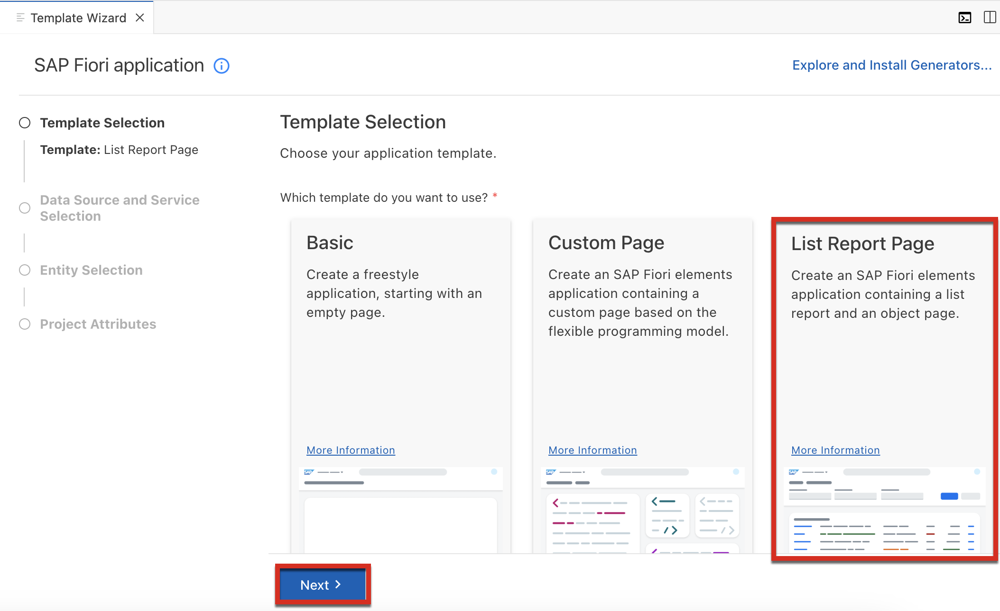
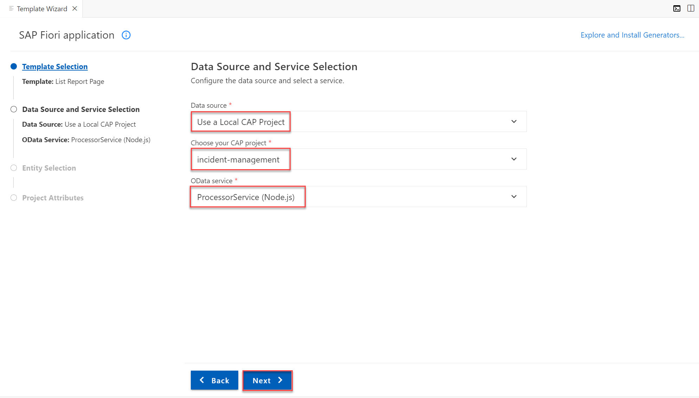
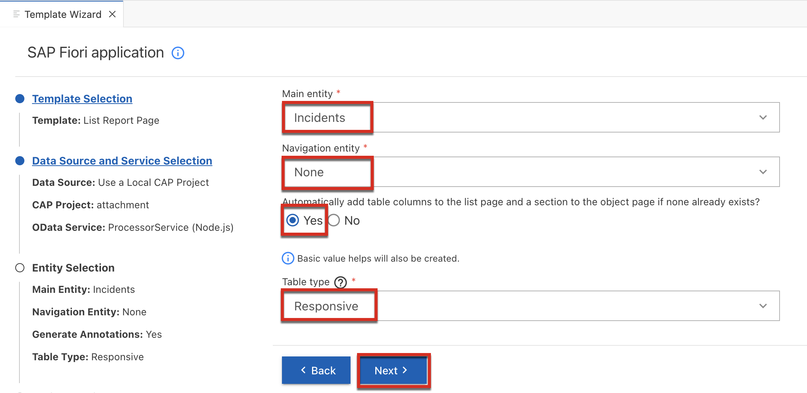
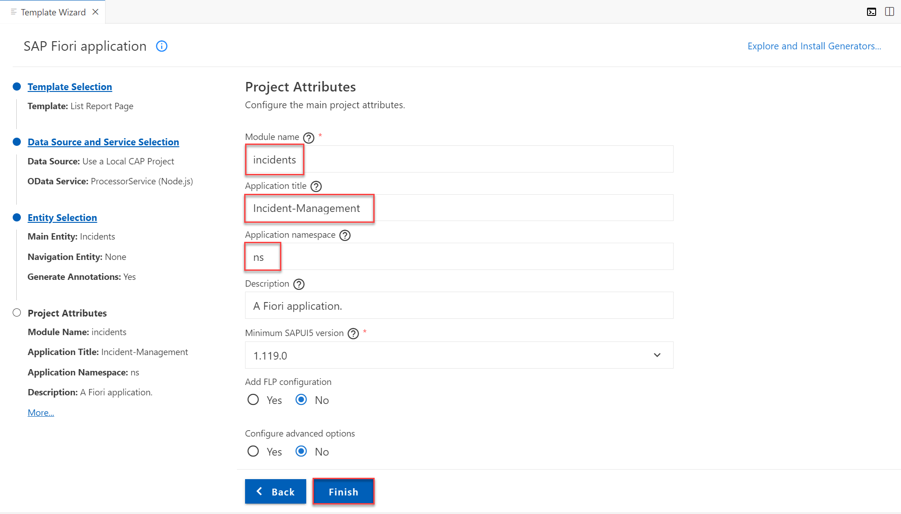

# Generate the UI with an SAP Fiori Elements Template

1. Choose the burger menu and then choose **View** &rarr; **Command Palette**.

    > You can also invoke the Command Palette quickly using the following key combination:
    >
    > - For macOS: <kbd>Command</kbd> + <kbd>Shift</kbd> + <kbd>P</kbd>
    > - For Windows: <kbd>Ctrl</kbd> + <kbd>Shift</kbd> + <kbd>P</kbd>

2. Type **Fiori: Open Application Generator** in the field and select this entry from the list.

3. In the **Template Selection** select the **List Report Page** template tile. Then Choose **Next**.

    <!-- border; size:540px -->
    

4. In the **Data Source and Service Selection** step:

    - In the **Data source** dropdown menu, select **Use a Local CAP Project**.

    - In the **Choose your CAP project** dropdown menu, select the **incident-management** project.

    - In the **OData service** dropdown menu, select the **ProcessorService (Node.js)**.
    
    - Choose **Next**.

        

5. In the **Entity Selection** step:

    - In the **Main entity** dropdown menu, select **Incidents**.

    - Leave the **Navigation entity** value as **none**.

    - Leave  **Yes** selected to add table columns automatically.

    - Leave the **Table Type** value as **Responsive**.   

    - Choose **Next**.

        

6. In the **Project Attributes** step:

    - In the **Module name** field, enter **incidents**.

    - In the **Application title** field, enter **Incident-Management**.

    - In the **Application namespace** field, enter **ns**.

    - Leave the default values for all the other settings and choose **Finish**.

        

The application is now generated and in a few seconds you can see the application's **incidents** folder in the **app** folder of your **incident-management** project. It contains a **webapp** folder with a **Component.js** file that is typical for an SAPUI5 application.