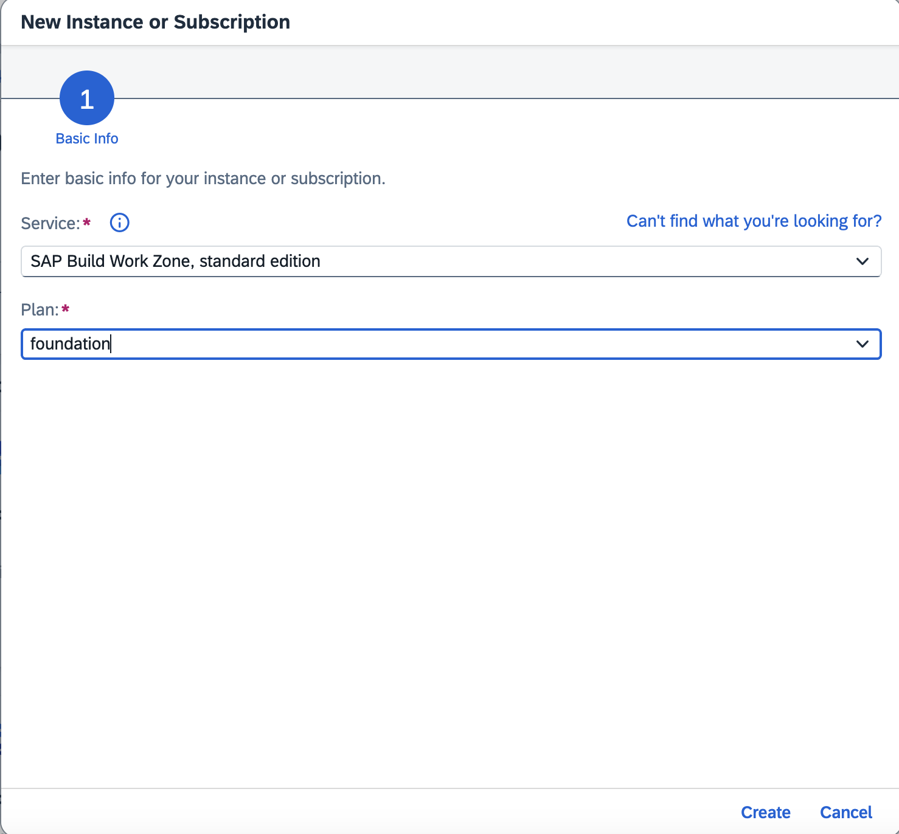

# Integrate Your Application with SAP Build Work Zone, Standard Edition

This tutorial shows you how to subscribe to the SAP Build Work Zone, standard edition.

## Prerequisite

Deploy your application in SAP BTP, Cloud Foundry and test using [Deploy in SAP BTP, Cloud Foundry Runtime](deploy-cf.md)

## Subscribe to SAP Build Work Zone, standard edition

> [!Note]
> If you have already subscribed to SAP Build Work Zone, skip the below steps and proceed with **Assign SAP Build Work Zone, standard edition role collection**

1. Navigate to your subaccount and choose **Services** &rarr; **Service Marketplace** on the left.

2. Search for the **SAP Build Work Zone, standard edition** tile and choose **Create**.

    

3. Keep the default setting for **Service** and choose **foundation** for **Plan**.

4. Choose **Create**.

    

You have now subscribed to the SAP Build Work Zone, foundation plan.

## Assign SAP Build Work Zone, standard edition role collection

You need to assign your user to the **Launchpad_Admin** role collection, so you don't get an error accessing the **SAP Build Work Zone, standard edition** site later on.

1. Choose **Security** &rarr; **Users** on the left.

2. Choose your user.

3. Under **Role Collections** on the right, choose **Assign Role Collection** and assign the **Launchpad_Admin** role collection to your user.

    

    You've assigned the **Launchpad_Admin** role collection to your user.

> You might need to log out and log back in to make sure your new role collection is taken into account.

> See section [Initial Setup](https://help.sap.com/viewer/8c8e1958338140699bd4811b37b82ece/Cloud/en-US/fd79b232967545569d1ae4d8f691016b.html) in the SAP Build Work Zone, standard edition's documentation for more details.

##  Integrate your application with SAP Build Work Zone, standard edition

#### Update content

1. Open your subaccount and navigate to **Instances and Subscriptions**.

2. Choose the application **SAP Build Work Zone, standard edition**.

    

3. In the menu on the left side, choose the icon for **Channel Manager**.

4. Choose the refresh icon to fetch the updated content.

    

#### Add application to Content Explorer

1. Choose **Content Manager** icon in the menu on the left and choose the **Content Explorer** button.

    

2. Select the tile HTML5 Apps with your respective subdomain name.

    

3. In the items table, set checkmark for the application Incidents and choose the button Add.

    

    > Note: Check the application which you have created during the project creation.

#### Create a group

1. Go back to the **Content Manager**, choose Create → Group.

    

2. Add the title Incident Management Group.

3. In the Assignment Status, choose the slider to assign the Incident-Management app to the group.

4. Choose Save.
    
    

#### Add application to the Everyone role
1. Back in the Content Manager, choose role Everyone and choose Edit.

2. In the Assignment Status, choose the slider to assign the Incident-Management app to the role.

3. Choose Save.

    

#### Create site

1. Navigate to Site Directory and choose **Create Site**.

    

2. Enter the site name as *Incident Management Site* and choose **Create**.

    

3. Now, you are forwarded to your created site.

#### Test your site

1. Navigate to Site Directory and find your site.

    

2. Choose **Go to site**.

    

3. Choose the Incident Management application from the launch page.

    

    You should be able to see the list report page.

    

## Next Step

Test the flow end to end by following the steps at [Test the Application End to End](e2e-testing.md).

