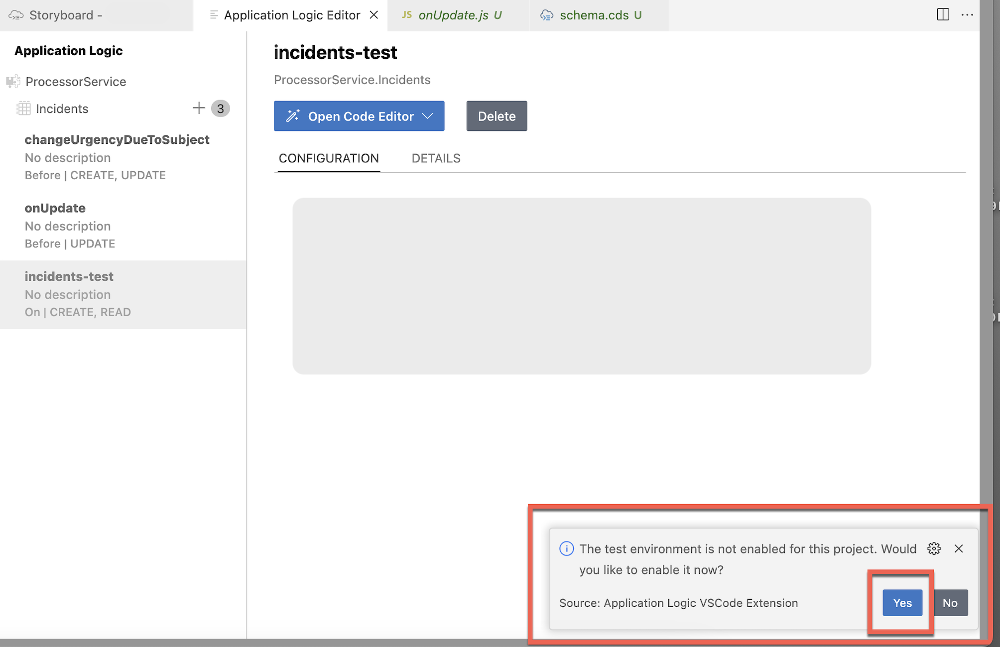

## Add Test Cases with Joule

This section describes to create few testcases using a Joule prompt.

## Prerequisite

Create a UI application using a Joule prompt following the steps at [Create SAP Fiori UI with Joule](./fiori-ui.md).

## Add Test Cases

1. Navigate to **Storyboard**.

    

2. In the **Services** section, choose the **Incidents** entity under **ProcessorService** and then choose **Add Logic**.

    

3. The **Application Logic Editor** appears.

4. In the **Application Logic Editor**, change the value of the **Name** field to **incidents-test** and choose **Add**.

    

5. In the **Phase** area, select **After** and in the **Standard Event** select **Read**.

    

6. Choose **Open Code Editor -> Application Logic**.

    

7. By default test environment is not enabled in Build Code. Click **yes** in the pop-up to enable. 

    

8. This will open Joule to create testcases.

    

    > In the Joule prompt, **/cap-unit-test** is used for writing testcases for the created services.

9. The Joule prompt will be prefilled with `/cap-unit-test #tests/code/test-incidents-test.js`. After the prefilled command, use the following prompt to create the testcase.

    ```console
    Test case to read all the incidents, check only the status code is 200. Odata endpoint is /odata/v4/processor/Incidents
    ```
    
10. Choose the **Send** icon.

    

11. Once Joule responds with the code, check the implementation and accept it. 

> [!Note]
> /cap-unit-test prompt for adding test cases still under development. If the generated code has some errors, replace with below code snippet to test a READ call for Incidents entity

```js
    const response = await GET('/odata/v4/processor/Incidents');
    expect(response.status).to.equal(200);
```

## Test the application

1. To test the application, run the following command in the terminal:

    ```sh
        npm run test
    ```
    

## Next Step

To deploy the application to SAP BTP, Cloud Foundry runtime, follow the steps at [Deploy in SAP BTP, Cloud Foundry Runtime](deploy-cf.md).