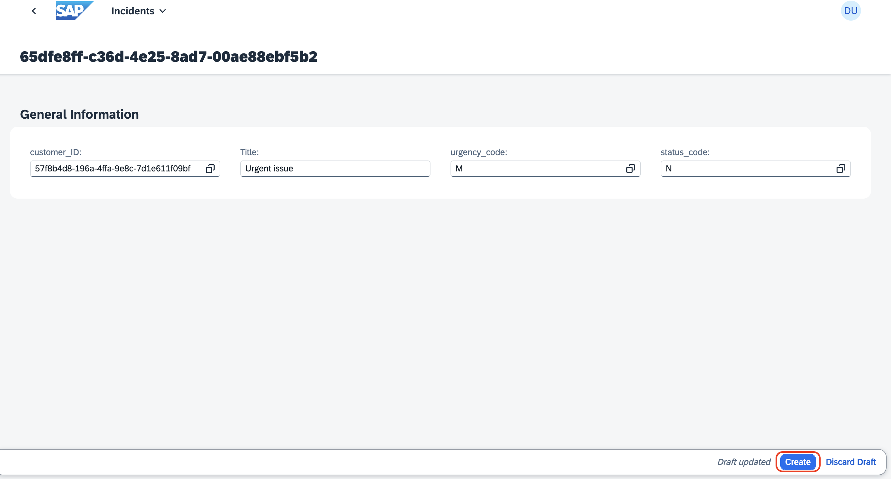

## Validate the custom logic scenario:

Update the **Urgency** from *Low/Medium* to *High*, if it encounters ```urgent``` keyword in the title.

1. Click on Create, for creating a new incident.

    

2. For creating the incident, do the following:

    - Select any one of the customer by clicking on the value help.

        

    - Give title as `Urgent issue`

    - Leave the urgency_code and status_code by default.

    - Click on **Create**.

        

3. Once the incident is created, you will observe the **urgency_code** is automatically changed to H which means High from M - Medium.

    

# **Congratulations ! You have successfully completed the exercise.**
