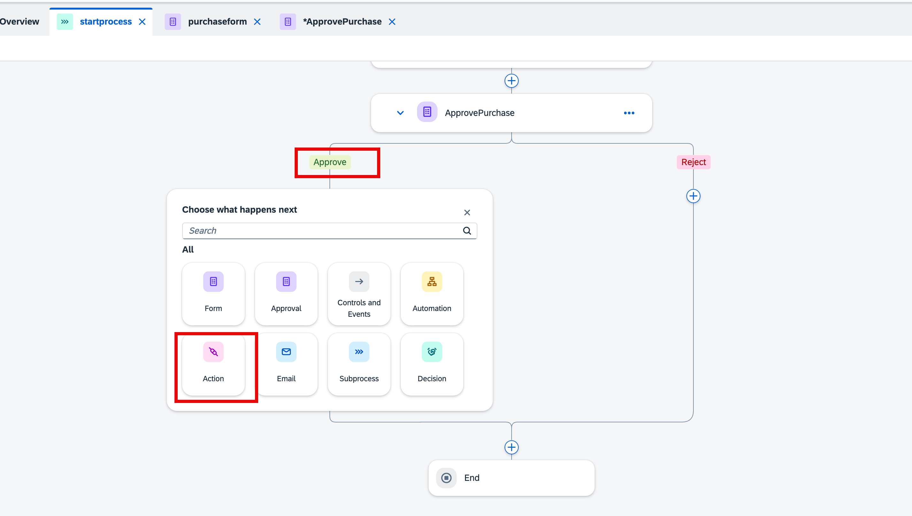
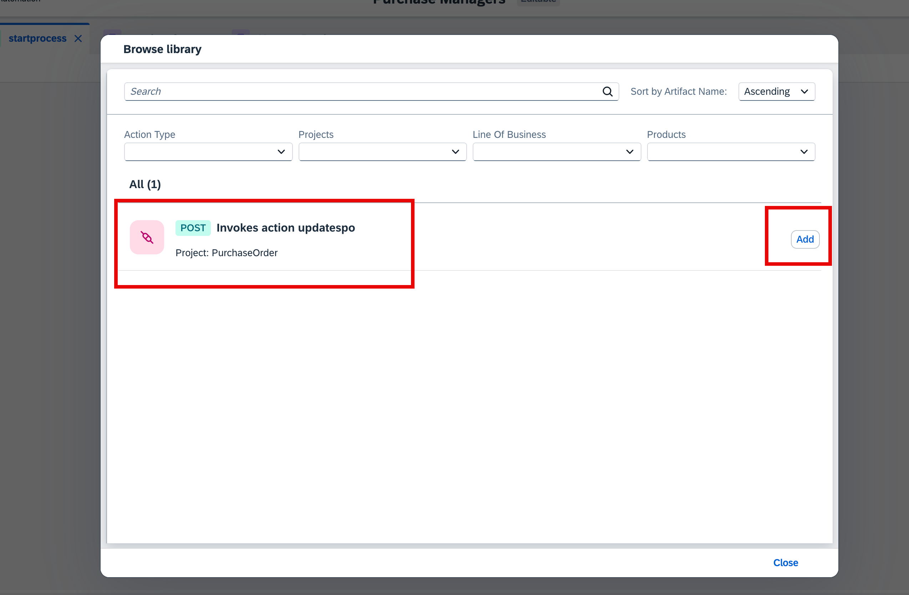
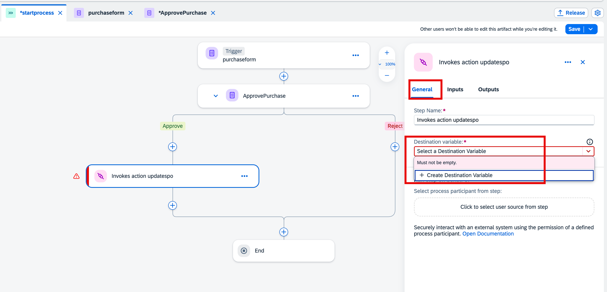
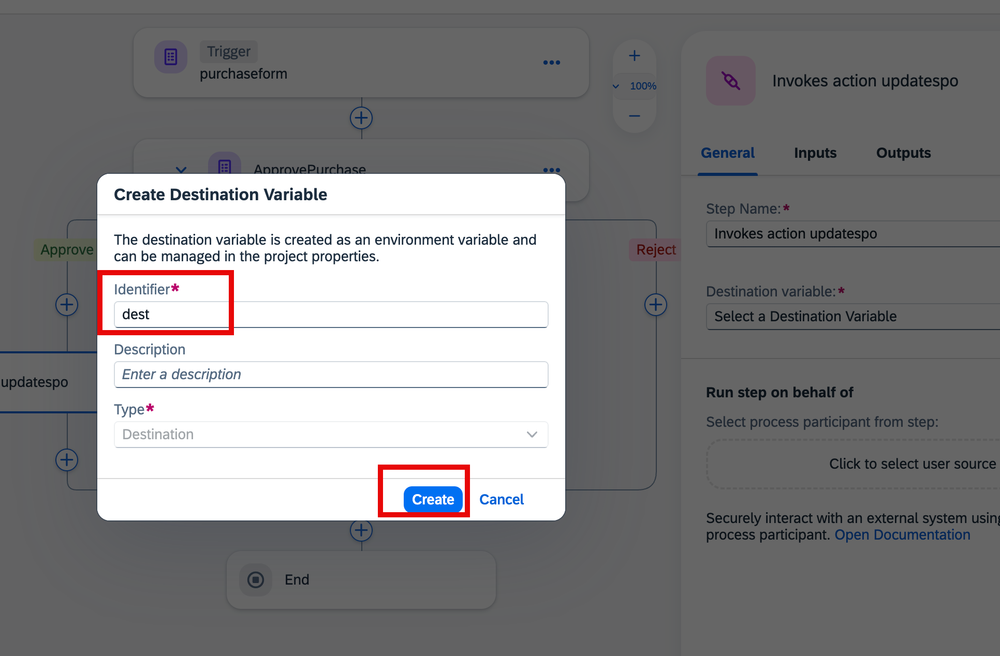

## Integrate CAP Application in SAP Build Process Automation

## Add Action to Integrate Cloud Application in SAP Build Process Automation.

1. In the Approve section of approval, choose **+**, and then choose **Action**.

    

2. Choose Action **Invokes action updatespo** and then choose **Add**.

> [!NOTE]
> If the action mentioned is not available, click on Browse All Actions.

    

3. In the action, choose **General**.

    1. Choose **+ Create Destination Variable** 
        
        

    2. In the Create Destination Variable popup, enter **dest** as the identifier and then choose **Create**.
        
        

4. In the action, under **inputs** tab do the following:

    1. In the **po**, choose **Purchase Order** from *purchaseform(Trigger)*.

    2. In the **status**, choose **Status with Comment** from *ApprovePurchase*.

    3. Choose **Save**

        

**You have Successfully integrated the Actions.** 

## Next Step

[Release and Deploy the Project](../deploy/README.md)

