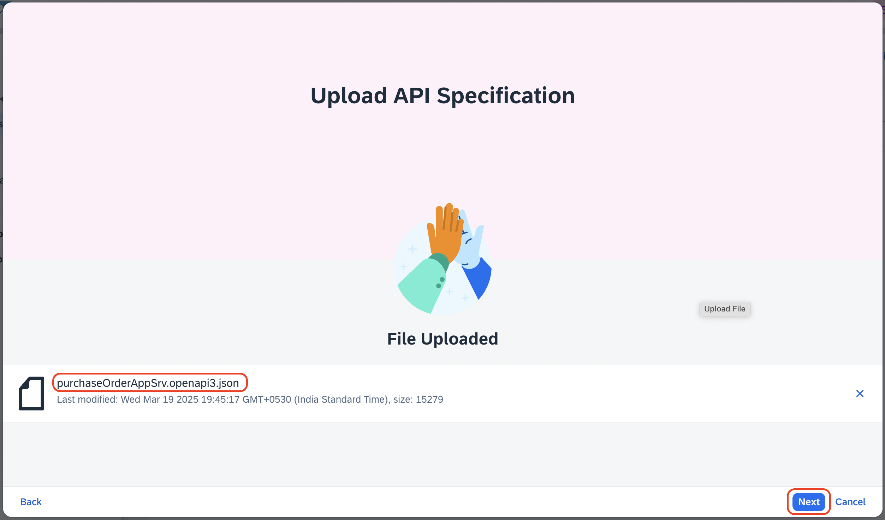
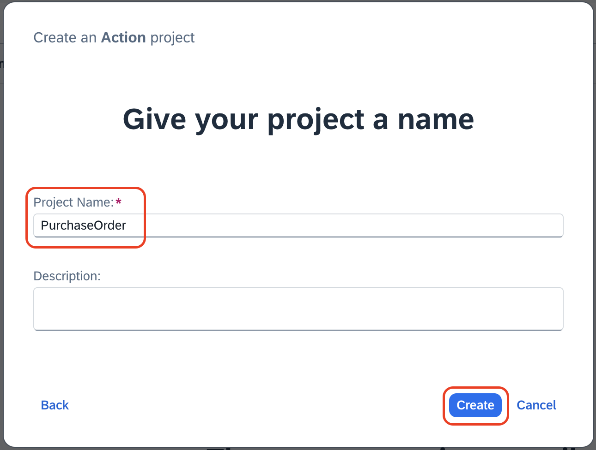
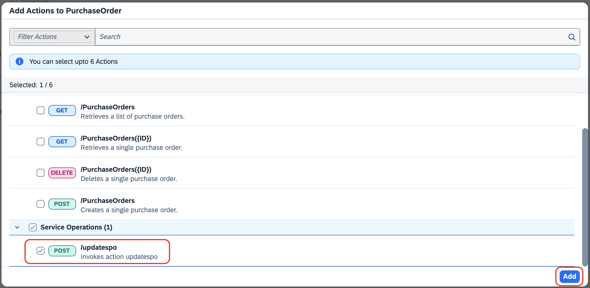
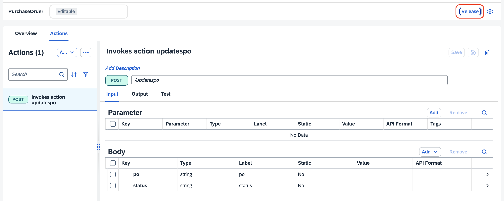
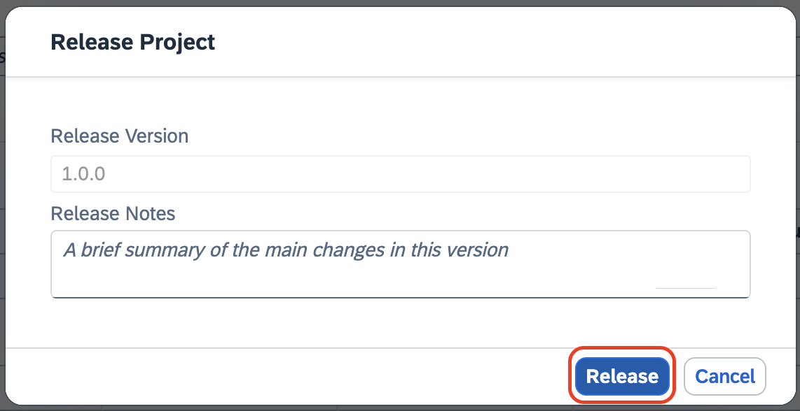
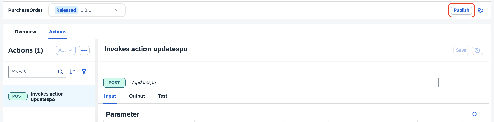

# Create Action for CAP Application using SAP Build

Action is one of the feature in SAP Process Automation. Action is a mean to connect processes with external systems, be it SAP or non-SAP systems. This is an important piece of the puzzle especially if you want to automate or extend your business processes for any available line of business like SAP S/4HANA, SAP Ariba, SAP SuccessFactors and many more. These extensions can be easily build using SAP Process Automation, and using Actions you can connect to any SAP System and can do any kind of operation like GET, POST, PATCH and other calls.


## Generate the OpenAPI specification

1. The openAPI specification for this CAP Application is already generated. Click on [open api specification](https://github.com/SAP-samples/s4hana-cloud-extension-process-automation/blob/purchase/docs/purchaseOrderAppSrv.openapi3.json) and download the file.

> [!NOTE]  
> If you want to generate manually, open the terminal and run the below command to generate open api specification.
> ```sh
>    cds compile srv --service all -o docs --to openapi
> ```

## Create action project

1. Open SAP Build Lobby, under **Connectors**, select **Actions**.

    

2. Choose **Create**.

    

3. In the Choose an **API Source** popup, under **API Specification**, select **Upload API Specification.**

    

4. Drag and drop or click Browse Files to upload open specification file downloaded in step above.

    

5. Choose **Next**.

6. In the Create an **Action project** popup:

    1. Specify the name as **PurchaseOrder**

    2. Click **Create**

        

7. Once the action project is created, the action editor will automatically open. 

8. In the popup, click on the checkmark for */updatespo* under **Service Operations**.

9. Click on **Add**.

    

Your Action Project will contain the actions for the CAP service.

## Release and Publish to the Library

1. Click on **Release**.

    

2. Click on **Release** again.

    

3. Click on **Publish**.

    

4. Click on **Publish** again.

    


**You have successfully created action project for CAP Application.**

## Next Step

[Create Project in SAP Build Lobby](../createprocess/README.md)
